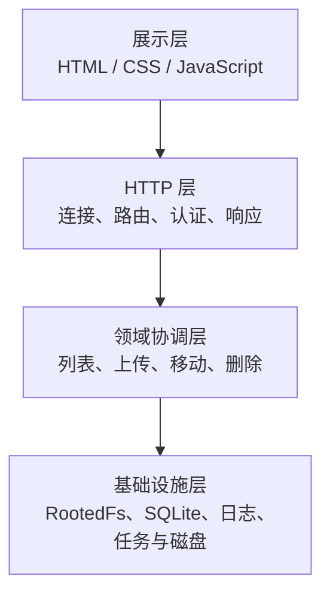
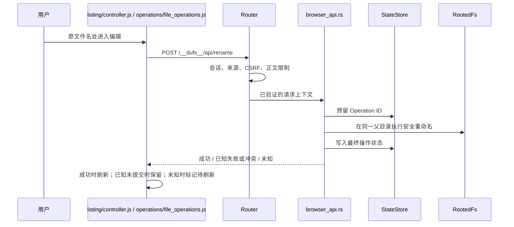

# 01. 项目全景：先知道自己在读什么

## 1.1 一句话理解 Dufs

Dufs 是一个只运行在 Linux AMD64 GNU（`x86_64-unknown-linux-gnu`）上的浏览器文件管理器：服务端把某个目录设为“共享根”，认证后的管理员可以通过网页浏览、搜索、上传、下载、移动、重命名、新建和删除其中的文件。其他 CPU、操作系统或 ABI 由编译守卫直接拒绝，不存在 best-effort 支持层。

它采用“一体化二进制”部署：Rust 程序既处理 API，也返回构建时嵌入的 React、Foundation CSS 和文件业务 ES modules。React 负责登录及页面结构，认证协议始终复用 Foundation。生产环境通常在它前面放置 nginx，负责 TLS 和公网边界。

## 1.2 用户看到什么

用户从浏览器看到的核心流程是：

1. 打开 HTTPS 地址；
2. 输入 Foundation 管理员 username 和密码；登录 candidate 由共享规则执行 ASCII trim/lowercase 后变成 canonical username；
3. 进入共享根，面包屑最左侧的房子图标代表根目录；
4. 分页浏览或搜索文件；
5. 在一列 Actions 中通过“移动、下载、删除、重命名”四个固定槽操作项目；
6. 选择文件或文件夹上传；
7. preflight 已发现可替换目标时先做批量确认；若提交时才出现晚到重名，再对该文件确认；
8. 页面根据操作结果刷新或把列表标记为可能过期。

当前版本只下载单个文件，不提供目录 ZIP。目录仍可以通过文件夹选择器上传；“文件夹上传”实际是把所选文件的相对路径逐个上传，空目录不会凭空出现。

## 1.3 它有意不做什么

先认识产品边界，能避免在错误位置寻找不存在的实现：

- 不提供匿名共享内容访问；health、登录路由和内容寻址静态资产仍是公共路由；
- 只提供 `admin` 一种角色；不提供普通用户、只读用户、角色分级或路径 ACL；
- 不做多租户目录隔离；
- 不提供在线预览或在线编辑；
- 不提供目录打包下载；
- 不提供 WebDAV、静态站点托管或 CORS；
- 不支持把页面挂到 `/files/` 之类的 URL 子路径；
- 不把前端做成单独的 Node 服务；
- 不承诺移动端 Web 体验；
- 不把浏览器页面刷新后的本地文件句柄持久化，因此刷新后不会自动续传旧页面任务。

这些不是“遗漏的代码”，而是为了让安全模型和维护范围可控而明确删减的能力。

## 1.4 四层心智模型

可以把项目分成四层：



### 展示层

位于 [clients/web](../../clients/web)。它负责页面、键盘交互、对话框、列表 DOM、上传队列以及把后端问题显示给用户。

### HTTP 层

入口主要位于 [src/main.rs](../../src/main.rs) 和 [src/server/router.rs](../../src/server/router.rs)。它负责 TCP、HTTP/1.1、路由分类、认证、CSRF、请求大小和超时边界。

### 领域协调层

位于 `src/server/` 下的 listing、upload、download、browser_api、delete 等模块。它把一次用户操作拆成“验证、预留、执行、提交、记录结果”。

### 基础设施层

包括安全的根目录相对文件访问、SQLite 状态 actor、磁盘空间预算、任务跟踪、日志和清理 worker。这一层决定项目在并发、超时和崩溃时是否仍可信。

## 1.5 两个持久化区域

Dufs 同时使用两个目录，不能混在一起：

| 区域 | 保存内容 | 用户是否直接看到 | 备份意义 |
| --- | --- | --- | --- |
| 共享根 `serve-path` | 用户的文件和目录、目标父目录私有子目录中的上传 stage、删除 trash | 普通业务文件可见；内部保留项隐藏 | 这是业务数据主体 |
| 状态目录 `state-dir` | `state.sqlite3` 及其 journal | 不可通过网页访问 | 保存操作、上传、清理的控制状态 |

状态目录必须在共享根之外，不能是其子目录，也不能让共享根成为状态目录的子目录。程序还会校验别名和底层身份，避免通过符号链接等方式把两者偷偷指向同一位置。

## 1.6 为什么同时需要文件系统和 SQLite

只写文件系统不够，因为进程崩溃后需要回答：

- 某个 Operation ID 是否执行过？
- 上传已经持久化到哪个偏移？
- 一个完整 stage 是否正在等待覆盖确认？
- 删除目标已经移入隐藏回收区，但是否还没清理完？

只写 SQLite 也不够，因为真实文件内容、权限、所有权、扩展属性和目录结构仍在 Linux 文件系统中。

因此项目采用“文件系统保存数据，SQLite 保存协议状态”的分工。两者无法组成一个跨系统事务，所以代码必须显式表达提交点和不确定状态。第 5、7 章会详细解释。

## 1.7 一次“重命名”的完整层次

以浏览器点击“重命名”为例：



这张图最重要的不是函数名，而是三个不同事实：

- 前端编辑框只是收集新名字；
- HTTP 成功或错误是协议结果；
- 磁盘对象是否真的改名由提交边界决定。

## 1.8 仓库目录地图

```text
dufs-ram/
├── clients/web/                 浏览器页面、样式和原生 ES modules
│   └── modules/                  列表、操作、上传、API 等前端模块
├── config/                       唯一当前源码配置样例
├── deploy/                       systemd、nginx 与代理头部署样例
├── docs/                   设计、取舍、运维和本教学手册
├── scripts/                质量门、文档检查、发布打包脚本
├── src/                          Rust 库和可执行程序
│   └── server/                   HTTP 业务、文件系统和状态模块
├── tests/                        Rust 集成测试和浏览器端到端测试
├── .node-version                 当前 Node 26.7.0 仓库级版本基准
├── build.rs                      精确 AMD64 GNU 编译守卫与 Git SHA 注入
├── Cargo.toml                    Rust 包、依赖和 release 配置
├── package.json                  前端检查与测试命令
└── rust-toolchain.toml           固定 Rust 1.98 工具链
```

源码配置一律位于 `config/`，部署资产一律位于 `deploy/`，客户端一律位于 `clients/web/`。生产安装故意使用 `/etc/dufs/dufs.yaml` 与 `/etc/dufs/tls/`：这是 Linux FHS/证书权限边界，不是仓库目录命名不一致，也不是历史兼容路径。

### `src/` 的重点

- [main.rs](../../src/main.rs)：进程入口、监听器、连接配额和优雅停机；
- [args.rs](../../src/args.rs)：CLI/YAML 配置、默认值和启动前验证；
- [auth.rs](../../src/auth.rs)：密码哈希与认证相关基础逻辑；
- [server.rs](../../src/server.rs)：`ServerBuilder` 和运行时依赖组装；
- [server/router](../../src/server/router.rs)：请求画像与路由分发；
- [server/browser_api.rs](../../src/server/browser_api.rs)：新建、移动、重命名、上传预检等浏览器 API；
- [server/listing.rs](../../src/server/listing.rs)：目录列表、搜索、分页快照；
- [server/download.rs](../../src/server/download.rs)：单文件和单段 Range 下载；
- [server/upload.rs](../../src/server/upload.rs)：上传 façade、共享事务类型和阶段装配；
- [server/upload/prepare.rs](../../src/server/upload/prepare.rs)、[target.rs](../../src/server/upload/target.rs)、[transfer.rs](../../src/server/upload/transfer.rs)、[commit.rs](../../src/server/upload/commit.rs) 与 [failure.rs](../../src/server/upload/failure.rs)：上传准备、目标 identity/revision、正文传输、原子提交和失败收口；
- [server/maintenance.rs](../../src/server/maintenance.rs)：上传 stage、删除 trash 与持久化清理任务的统一后台维护；
- [server/disk_space.rs](../../src/server/disk_space.rs)：按文件系统设备分桶的空间预留与 readiness 空间检查；
- [server/blocking_io.rs](../../src/server/blocking_io.rs)：为可能卡住的文件系统调用提供有界 blocking admission；
- [server/delete.rs](../../src/server/delete.rs)：持久化删除的协调；
- [server/rooted_fs.rs](../../src/server/rooted_fs.rs)：锚定共享根的安全文件系统操作；
- [server/state_store.rs](../../src/server/state_store.rs)：SQLite actor 的外部接口。

### `clients/web/modules/` 的重点

- [app.js](../../clients/web/modules/app.js)：页面启动和模块组装；
- [http/client.js](../../clients/web/modules/http/client.js)：`fetch`、错误解码、超时和 Operation 查询；
- [http/headers.js](../../clients/web/modules/http/headers.js)：严格解析规范的非负整数响应头；
- [listing/controller.js](../../clients/web/modules/listing/controller.js)：列表、分页、搜索、固定操作槽和行内重命名；
- [operations/file_operations.js](../../clients/web/modules/operations/file_operations.js)：新建、移动、重命名、删除、注销；
- [operations/dialogs.js](../../clients/web/modules/operations/dialogs.js)：应用内对话框和焦点恢复；
- [upload/manager.js](../../clients/web/modules/upload/manager.js)：上传编排和任务状态机；
- [upload/selection.js](../../clients/web/modules/upload/selection.js)：批量选择、路径预算和重复目标校验；
- [upload/protocol.js](../../clients/web/modules/upload/protocol.js)：严格解析上传响应头；
- [upload/queue.js](../../clients/web/modules/upload/queue.js)：有界任务队列和终态历史；
- [upload/view.js](../../clients/web/modules/upload/view.js)：进度、速度、剩余时间和操作按钮。

## 1.9 主要技术为什么合适

### Rust

适合构建单文件部署、低运行时开销的服务，并能用类型和所有权约束共享状态。代价是文件系统并发和异步错误路径的代码比脚本语言更显式。

### Tokio + Hyper

Tokio 提供异步任务、网络、信号和同步原语；Hyper 提供底层 HTTP/1.1 服务。项目需要精确控制连接、正文流、超时和停机，因此没有采用更高层的全家桶框架。

### 原生 HTML/CSS/JavaScript

页面功能集中，不需要复杂客户端路由和组件生态。原生模块避免生产 Node 运行时和大前端构建链；代价是开发者要自己维护状态边界、DOM 更新和 JSDoc 类型。

### SQLite

状态量小、与单进程服务一起部署，SQLite 能提供事务和崩溃恢复而不引入外部数据库。专用 actor 线程让连接所有权和命令顺序清晰。

### Linux `openat2`

共享根是安全边界，普通字符串拼接和 `canonicalize` 难以抵抗并发路径替换。锚定根目录 FD 并使用 Linux 的受约束路径解析更适合这里的威胁模型；代价是服务端只能运行在支持该能力的 Linux 上。

## 1.10 三种并发不要混淆

项目中至少有三种并发：

1. **网络并发**：多个 TCP 连接和 HTTP 请求同时到达；
2. **业务并发**：两个用户同时操作同一路径，或列表期间目录发生变化；
3. **阻塞 I/O 并发**：文件系统和 SQLite 操作可能卡住，不能长期占用 Tokio 异步执行线程。

连接信号量、路径协调器、Operation Registry、阻塞任务跟踪器解决的是不同问题，不能因为它们都叫“限制并发”就合并成一个锁。

## 1.11 新手最容易犯的五个误解

1. **把 URL 路径直接当磁盘路径。** URL 需要先规范解码和验证，磁盘操作必须从根 FD 相对执行。
2. **认为收到超时就一定没执行。** 普通写操作可能已经分离提交；上传只有在服务端总 deadline 原子关闭首次 mutation boundary 时才能证明本次 `not-started`，task 先越界或客户端自身超时都不能这样推断。普通写操作要用原 Operation ID 查询，上传要用原 Upload ID 对账。
3. **认为列表结果永远实时。** 分页使用短寿命快照；写操作会使旧快照失效。
4. **认为覆盖就是直接打开目标并截断。** 上传先写目标父目录下私有子目录中的 stage，再在校验后原子发布。
5. **认为 SQLite 记录成功就等于磁盘成功。** 两个持久化域必须按规定顺序同步，失败时有时只能报告未知。

## 1.12 本章动手检查

在仓库根目录执行：

```sh
rg --files src/server clients/web/modules tests/frontend | sort
rg "MKDIR_API_PATH|MOVE_API_PATH|RENAME_API_PATH" src
rg "class .*Error|@typedef" clients/web/modules
```

尝试回答：

1. 为什么 `clients/web/index.js` 很短，而页面逻辑仍然完整？
2. 为什么状态目录不能放在共享根里面？
3. 如果删除请求显示“请求超时”，你会先用原 Operation ID 查询，还是立即生成新 ID 再删一次？为什么？

下一章会真正准备环境并启动服务。
