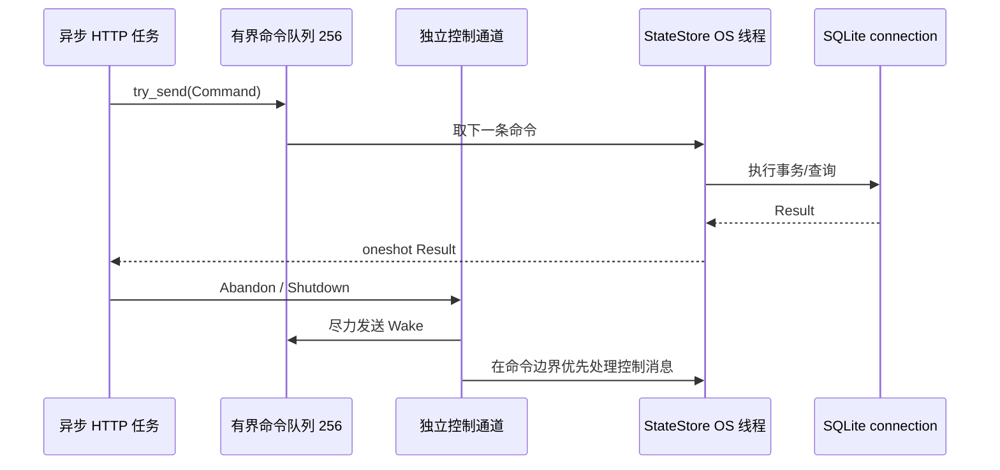
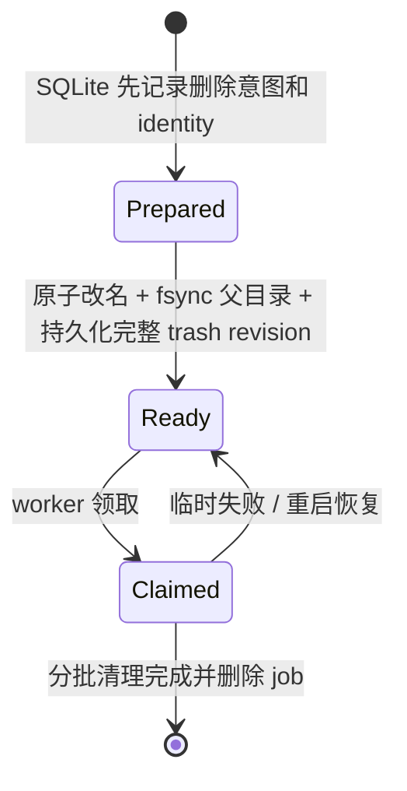

# 05. 文件系统、状态与可靠性

这一章解释 Dufs 最“重”的一组设计。先记住核心原因：这是一个允许浏览器修改真实文件的服务，路径可能被并发替换，客户端可能中途断网，进程也可能在文件系统与 SQLite 两次持久化之间崩溃。

如果只考虑“一切正常”，代码可以短很多；本章的大部分机制是在回答“一半成功时，系统能诚实地知道什么”。

## 5.1 先建立威胁模型

Dufs 需要同时防范或处理：

- 用户提交 `../`、NUL、重复编码或内部保留名称；
- 符号链接把路径引向共享根外；
- 检查路径后、真正操作前，另一个请求改变目录项；
- 本机其他进程修改共享根；
- 两个浏览器请求同时覆盖或删除同一路径；
- 慢文件系统让请求超时；
- 客户端断线，但服务器提交仍在继续；
- `rename` 成功后，目录 `fsync` 失败；
- 文件系统变化成功，但 SQLite 终态写入失败；
- 进程在删除目标已隐藏、后台清理未开始时重启；
- SQLite 某条命令失败，但服务仍应处理后续命令。

当前安全边界不包括：

- 抵抗拥有同一 Linux UID 的恶意进程；
- 给不同 Dufs 账号做目录权限隔离；
- 修复不正确兑现 `fsync` 的硬件、固件或网络文件系统；
- 阻止有共享根系统写权限的外部进程制造业务竞争。

理解“负责什么”和“不负责什么”同样重要。

## 5.2 路径不是一个字符串就够了

项目把路径分阶段表示，关键代码在 [path_policy.rs](../../src/server/path_policy.rs)。

| 阶段 | 代表什么 | 还不能证明什么 |
| --- | --- | --- |
| 原始 URI | 浏览器发送的字节形式 | 编码是否规范、是否安全 |
| `RoutePath` | 已解码和规范化的 HTTP 路由路径 | 业务上是否允许、磁盘解析是否仍在根内 |
| `RootedPath` | 词法上已经证明属于共享根命名空间 | 并发时真实路径对象没有被替换 |
| `RootedFs` 打开的 FD | 从锚定根 FD 按约束解析得到的对象 | 对象类型和身份仍需 `fstat`/快照核对 |

### 为什么不直接 `root.join(input)`

考虑下面的伪代码：

```text
检查 /shared/photos 是目录
另一个进程把 photos 换成指向 /etc 的符号链接
打开 /shared/photos/passwd
```

这叫 TOCTOU：检查时和使用时不是同一事实。仅靠先 `canonicalize` 再打开仍可能在两个系统调用之间竞争。

### 路径策略拒绝什么

根据使用场景，策略会拒绝：

- NUL 字节；
- `.`、`..` 或其他非规范组件；
- 试图访问 Dufs 内部 API 命名空间的业务路径；
- 上传 stage、删除 trash 等内部保留名称；
- 浏览器 mutation 中不符合绝对逻辑路径约定的值；
- 删除、移动或改名共享根本身；
- basename 为空、含 `/`、含 NUL 或超过 255 UTF-8 字节。

路由解析、根内路径策略和文件系统访问是三层不同职责。把它们全部合成一个字符串工具函数会丢失“现在验证到哪一步”的信息。

## 5.3 `RootedFs`：真正的共享根边界

[rooted_fs.rs](../../src/server/rooted_fs.rs) 把一个已经打开的共享根目录 FD 作为所有后续操作的锚点。

### 什么是 FD

FD（file descriptor，文件描述符）是 Linux 进程中指向一个已打开内核对象的小整数。路径可以被改名或替换，但一个已打开 FD 仍指向原对象。

### 启动时做什么

`RootedFs` 初始化大致会：

1. 打开共享根目录；
2. 用 `fstat` 确认它确实是目录；
3. 在根目录 FD 上取得非阻塞独占 `flock`；
4. 验证 Linux `openat2` 可用；
5. 保存根目录的 device/inode 身份；
6. 后续从这个 FD 相对执行 `openat`、`statat`、`renameat2`、`unlinkat` 等操作。

根锁阻止第二个 Dufs 实例管理同一共享根。不同共享根仍可由不同进程管理。这个锁不能阻止普通系统工具修改目录，所以最终身份复核依然必要。

### `openat2` 的作用

项目要求 Linux 的 `openat2`，并使用类似 `RESOLVE_BENEATH`、`RESOLVE_NO_MAGICLINKS` 的解析限制。直觉上，它要求内核在**解析本次路径的过程中**保证结果不越过锚定根，而不是应用先拼字符串再猜测结果。

仍位于共享根内的相对符号链接可以按策略工作；逃向根外的链接会被拒绝。打开后还要检查对象类型，下载只接受普通文件，不会把 FIFO、socket 或设备当成普通正文读取。

## 5.4 device、inode 与对象身份

Linux 目录项中的名字不是文件本身。`report.txt` 可以在两个系统调用之间指向不同对象。

项目把不同身份放在最接近用途的类型中：[identity.rs](../../src/server/identity.rs) 只负责账号的假名化 `OwnerId` 摘要；它是未加密盐的 SHA-256，不直接保存账号名，但低熵账号名仍可被字典枚举，不能视为保密或匿名化边界。运行时文件身份主要由 [rooted_fs.rs](../../src/server/rooted_fs.rs) 中的 `ReplacementTargetIdentity`、`DeleteIdentity`、`FileIdentity` 等类型表达，持久化形式位于 [state_store/model.rs](../../src/server/state_store/model.rs)。文件身份常见字段包括：

- device：对象所在设备；
- inode：文件系统中的对象编号；
- 类型：普通文件、目录、符号链接等；
- 链接数；
- 大小；
- uid/gid；
- mode；
- 纳秒级 mtime/ctime。

具体操作不一定使用全部字段，而且不能把最强保证外推到所有 mutation。列表为当前对象提供 revision；DELETE 用 `If-Match` 提交该 revision，Move/Rename 用 `source_revision` 提交源 revision，允许覆盖时还必须携带 `destination_revision`。这些 token 绑定 owner、规范路径和完整 identity，RootedFs 在紧邻 rename 时复核 source，并按模式复核 destination/no-replace 条件；上传覆盖使用独立 target revision。目标应不存在时用 `RENAME_NOREPLACE`，成功后还验证目的名称对应已钉住的源 fd；已有目标覆盖则是最后一次 identity 复核后执行普通 rename，不是内核目录项 CAS。后者只能收窄而不能消除拥有共享根写权限的外部进程制造的微小竞争窗。

### revision 不是内容哈希

上传覆盖确认使用由 64 个小写十六进制字符表示的 target revision（32 字节、256 bit）。它是绑定账号、规范路径和对象身份的**不透明版本 token**，不应向用户承诺它等于文件内容的 SHA-256。

### 为什么 inode 也不是万能的

- inode 可能在对象删除后被文件系统复用；
- 硬链接让不同名字指向同一 inode；
- 外部进程仍可在协调器之外改动对象；
- 不同文件系统的身份和时间精度可能不同。

因此代码通常结合路径、根身份、对象快照、打开 FD 和最终原子系统调用，而不是只比较一个数字。

## 5.5 `PathCoordinator`：进程内路径租约

[path_coordinator.rs](../../src/server/path_coordinator.rs) 为写操作提供路径租约。租约可以理解为“这段时间内，本 Dufs 进程不会让另一个冲突操作同时处理这些路径”。

它会协调：

- 完全相同的路径；
- 父子路径重叠；
- 通过目录 device/inode 识别出的符号链接别名。

移动和重命名会把源与目标作为同一批租约请求提交；协调器在内部排序、去重后统一判断冲突，而不是由调用者逐把加锁。这样既覆盖两个路径，又避免相反顺序逐锁造成死锁。

但路径租约只约束当前 Dufs 进程。Move/Rename 现在会校验列表提供的 `source_revision`，覆盖时同时校验 `destination_revision`；DELETE 用 `If-Match`，上传使用独立 target revision。Missing 目标由 `RENAME_NOREPLACE` 防止晚到 occupant 被覆盖，rename 后的 source-anchor 核对避免把错误对象误报为成功；Existing 覆盖仍是 identity 复核与普通 rename 两步，外部进程可以在中间抢占。因此生产一致性要求共享根由 Dufs 独占写入，人工写入只能停服执行。

## 5.6 检查、原子提交与同步是三件事

以“不允许覆盖的重命名”为例：

1. **检查**：目标目前不存在，用于快速返回友好错误；
2. **原子提交**：使用 `renameat2(RENAME_NOREPLACE)`，保证真正提交瞬间仍不覆盖；
3. **同步**：对相关父目录执行 `fsync`，要求目录项变化进入持久存储语义。

只做第 1 步会有竞争窗口；只做第 2 步能保证可见原子性，但不能单独说明掉电持久性；同步失败又可能发生在 rename 已可见之后，所以结果不能谎报成“确定未执行”。

## 5.7 `DurableStorage` 如何表达提交结果

[storage.rs](../../src/server/storage.rs) 通过生产实现 `DurableStorage`、可注入测试故障的 `StorageDurability` trait 和结果枚举，把底层发布结果区分为多个类型，而不是只返回 `true/false`。上传发布中的重要分类包括：

- 已发布；
- 明确拒绝；
- 确定未发布；
- 已发布但持久性未知。

最后一种典型场景是：rename 已完成，随后目的 identity 核对或父目录同步失败。此时把它转换成普通“失败并重试”会有覆盖已成功文件的风险。

## 5.8 为什么需要 Operation ID

新建目录、移动、重命名、删除等普通写操作要求规范 UUID 形式的 `X-Dufs-Operation-Id`。

操作登记键大致是：

```text
SHA-256(账号) + Operation UUID
```

请求还会生成 fingerprint，绑定方法、端点和原始正文。相同账号重复使用同一个 ID 时：

- fingerprint 相同且仍在执行：返回 `running`；
- fingerprint 相同且已结束：重放已保存结果；
- fingerprint 不同：返回 Operation ID 冲突。

因此 Operation ID 不是一个可以随便复用的“重试 token”。它代表同一个逻辑操作，换了请求内容就必须换 ID。

普通 operation ID 和 upload ID 也不是同一种会话。上传还要绑定路径、总长度、stage identity 和 durable offset。

## 5.9 `OperationGuard` 与提交边界

[operation_registry.rs](../../src/server/operation_registry.rs) 中的 guard 利用 RAII 处理异常退出：

- 还在预留阶段就退出：撤销 reservation；
- 已进入 `CommitStarted` 后异常退出：保守记录 `unknown`；
- 正常完成：写入成功或失败终态。

配合 Router 的 `MutationProgress`，可以把普通 Operation 请求理解为：

```text
PREFLIGHT ──> RESERVED ──> DETACHED_COMMIT ──> FINAL
   │              │                │
   │              │                └─ 超时后可能 unknown
   │              └─ 已登记，但尚未脱离请求
   └─ 尚未开始持久 mutation
```

这两套边界相关但彼此独立：对普通 Operation，Router 的 `DETACHED_COMMIT` 是任务能脱离 HTTP waiter 的所有权边界，通常早于持久 `OperationGuard::CommitStarted`；后者才表示具体文件系统提交已经跨过不能安全遗忘的持久状态边界。

上传有一个重要例外。它可以先把 task 放进 `commit_tasks`，同时仍在 `PREFLIGHT` 做 owner state、目标/stage identity、metadata 和空间等只读准备；直到首次文件系统或上传状态 mutation 才原子切到 `DETACHED_COMMIT`。总 deadline 若先把状态切到 `CANCELLED_BEFORE_UPLOAD_MUTATION`，服务会 abort task，任何稍后恢复的只读准备也不能再跨边界，因此返回 `408 not-started + retry`。边界前未处理的只读 I/O 是 `408/503 not-started + retry`；只有 task 先进入 `DETACHED_COMMIT` 后，外层 deadline 或未处理错误才是 `unknown + query_upload`。详见[第 4 章](04-backend-request-lifecycle.md#416-mutationprogress超时时如何避免撒谎)。

`unknown` 的准确含义是：服务不能可靠证明操作成功，也不能可靠证明未发生。它不是“失败”的委婉说法，更不是“请用新 ID 再做一遍”。

## 5.10 类型化错误和恢复建议

[problem.rs](../../src/server/problem.rs) 与 [protocol.rs](../../src/server/protocol.rs) 集中定义对外问题、状态和恢复建议。

一个安全的错误协议至少要区分：

- 人类可读 message；
- 机器可读稳定 code；
- HTTP status；
- operation/upload 的权威状态；
- 客户端下一步是重试、查询、刷新、确认、discard 还是停止。

如果前端只写：

```js
if (error.message.includes("exists")) { /* 覆盖 */ }
```

那么后端改一个英文句子就会改变业务行为，也容易把无关 I/O 错误误判为安全覆盖冲突。当前代码使用枚举和稳定 wire value，前端再通过严格解析收窄。

## 5.11 StateStore 的模块分工

外部入口是 [state_store.rs](../../src/server/state_store.rs)，具体职责已经拆到：

| 文件 | 职责 |
| --- | --- |
| [actor.rs](../../src/server/state_store/actor.rs) | 专用线程、命令循环、oneshot 响应、延迟清理和实时 SQLite readiness 写探针 |
| [database.rs](../../src/server/state_store/database.rs) | 安全打开、加固、当前 schema 身份、启动恢复和 `quick_check` |
| [model.rs](../../src/server/state_store/model.rs) | 操作、上传、purge 的类型化记录 |
| [operation.rs](../../src/server/state_store/operation.rs) | 普通操作 SQL 与容量/TTL |
| [upload.rs](../../src/server/state_store/upload.rs) | 上传会话 SQL 与转换 |
| [purge.rs](../../src/server/state_store/purge.rs) | 删除 outbox SQL 与领取/恢复 |

`StateStore` façade 负责把调用转换成命令，不再同时堆放所有 schema、SQL、恢复和线程循环。这种拆分按“变化原因”组织：改上传表逻辑时通常不需要碰 purge actor 循环。

## 5.12 SQLite actor 如何工作

`rusqlite` 是同步阻塞接口。当前结构是：



好处是：

- SQLite connection 只有一个明确所有者；
- 命令顺序清楚；
- 不会直接阻塞 Tokio 网络工作线程；
- 普通命令队列容量把过载变成显式错误，而不是无限占内存；
- reservation 清理和停机走独立控制通道，并用 `Command::Wake` 唤醒可能阻塞在普通队列接收上的 actor，因此普通队列满时仍能交付这些生命周期控制消息。

### 一条 SQL 错误为什么不能终止线程

actor 循环必须在**每条命令内部**处理 `Result`，把错误只回复给当前调用者，然后继续接收下一条命令。如果使用 `?` 让命令错误直接跳出整个线程入口，一次磁盘忙或约束错误就会永久关闭所有状态服务。

当前实现还会把某些未能立即完成的 abandonment 清理放入延迟队列，在后续命令边界重试。只有 actor 真正退出或通信断开，整体状态健康才变为不可用。

## 5.13 数据库中保存什么

固定文件是 `<state-dir>/state.sqlite3`，当前 schema revision 1 主要包含：

| 表/概念 | 保存什么 | 不保存什么 |
| --- | --- | --- |
| operations | 普通写操作 ID、fingerprint、状态和可重放结果 | 文件正文 |
| upload sessions | 上传 ID、目标/stage 路径与身份、长度、offset、覆盖 revision、状态 | 浏览器中的 `File` 对象 |
| purge jobs | 删除 target/trash 路径、源身份、可选 32 字节 committed trash revision、Prepared/Ready/Claimed 状态 | 一个用户可见的回收站目录 |

容量和寿命都有明确规则：普通完成操作保留约 15 分钟，全局最多 4096、每 owner 最多 1024；上传会话全局最多 16384、每 owner 最多 4096，每次实际更新后保留 7 天；purge job 全局最多 4096、每 owner 最多 1024。普通 purge I/O 故障没有 TTL 或固定失败次数，job 会保留并退避；缺少 committed revision、身份歧义或最终删除的 `InvalidData` 则把当前 trash 根移入永久 quarantine 并释放 job，供运维人员停服调查。当前没有公开的 purge 管理 API。

## 5.14 数据库自身的安全检查

启动会检查或设置：

- 状态目录 owner 和精确 `0700` 权限；
- DB 是 no-follow 普通文件、单硬链接；
- DB mode 为 `0600`；
- SQLite defensive mode；
- `trusted_schema` 与 mmap 关闭；
- 外键开启；
- busy timeout；
- rollback journal `DELETE`；
- `synchronous=EXTRA`；
- 五列 `product_metadata`、当前应用/版本/revision、统一 schema SHA-256、精确对象身份与 quick check；
- 数据库绑定的共享根 device/inode。

只有空白数据库会建立当前 schema revision 1。初始化事务写入精确五列 `product_metadata`：单例键、`dufs-ram` 应用名、当前 Cargo 版本、revision 和 schema SHA-256。指纹使用所有非 `sqlite_*`、非 `product_metadata` 的 `sqlite_schema` 行，按 `type/name/tbl_name` 排序，并将每个原始字段编码为 u64 大端长度加字段字节后计算 SHA-256。现存数据库先在只读 raw snapshot 与原路径视图中验证相同契约、根绑定和完整性；任何非当前 identity、无标记、版本/指纹漂移、额外对象或约束变化都在任何 chmod、journal 配置或恢复写入前拒绝，文件字节保持不变。运行服务不迁移 schema；未来稳定版本如确有跨版本转换需求，只能由 `sarmg-upgrade` 中精确绑定 source/target 的独立 adapter、fixture 与 CLI 在停服副本上负责。

数据库不能随意复制给另一个共享根继续使用，因为里面的路径、对象身份和未完成动作都绑定旧根。

## 5.15 重启恢复不是“把 running 都当失败”

启动恢复会根据最后可靠状态处理：

- 只有 reservation、尚未提交的 operation 可以移除；
- `CommitStarted` operation 恢复为完成但结果 `Unknown`；
- 上传 `CommitStarted` 恢复为 `Unknown`；
- `AwaitingConfirmation` 上传保留，继续等待明确决定；
- 已被 worker 领取的 purge `Claimed` 恢复成可再次领取的 `Ready`；
- 过期结果按有界规则清理。

把所有 running 记录删除看起来简单，却会丢掉“磁盘可能已经发生变化”的证据。

## 5.16 删除为什么不是直接递归 `unlink`

删除实现位于 [delete.rs](../../src/server/delete.rs)、[purge.rs](../../src/server/purge.rs) 和 [rooted_fs/purge.rs](../../src/server/rooted_fs/purge.rs)。

直接递归删除一个大目录有几个问题：

- 请求可能运行很久；
- 删除一半时失败，原目录处于部分可见状态；
- 进程重启后不知道应该继续哪里；
- 客户端超时后再删一次，语义难以判断。

当前流程使用持久化 outbox：



完整顺序是：

1. 登记 Operation ID；
2. 取得路径租约并读取路由所需的目标 metadata；
3. 检查与上传、其他操作和 purge 状态没有冲突；
4. 登记并进入可脱离 HTTP waiter 的 `commit_tasks` 提交任务；
5. 提交任务捕获精确 `DeleteIdentity`，并在 SQLite 创建 `Prepared` purge row；
6. operation 进入 `CommitStarted`；
7. 按 `DeleteIdentity` 复核目标，并原子改名到同目录内部 trash 名称；
8. `fsync` 父目录；
9. 计算覆盖 dev/inode、类型、nlink、size、uid/gid、完整 mode 和纳秒时间戳的 32 字节 trash revision，并与 `Ready` 原子持久化；
10. operation 成功并返回 `204`；
11. 后台 worker 分批递归清理。

因此 `204` 证明目标已经从用户可见命名空间可靠移除，不表示所有数据块已经物理清除。内部 trash 是实现细节，不是可恢复的用户回收站。

### Prepared 恢复为什么不再猜测两边

若进程在第 7～9 步附近崩溃，重启时可能看到 `Prepared`。它只有 rename 前捕获的弱源身份，没有 live DELETE 在 rename 和父目录同步后提交的 trash revision；当前 target 名或 trash occupant 都不能证明哪个对象经历了原 checked rename。

因此 `Prepared` 恢复规则刻意简单而保守：永远不触碰 target；trash 路径若存在任何 occupant，就原子改名为隐藏的 `.dufs-quarantine-<uuid>.hold`；随后释放 intent，绝不把它补写为 `Ready`。启动会把本版本遗留的 `Claimed` 恢复为 `Ready`，但只有 live 提交写入的完整 revision 才能授权 `Ready/Claimed` 自动回收；缺失 revision 会失败关闭并 quarantine 当前 trash occupant。

worker 还持有 trash 根的 `O_PATH` 锚点，并在每个最终 unlink/rmdir 前把候选移入随机 quarantine/disposal 名，再比较名称与 fd 的完整 identity。缺失 revision、身份不一致、最终 `ENOTEMPTY/EXIST` 或其他 `InvalidData` 都会使整棵 trash 根进入永久 quarantine 并释放 job，不从 cursor 0 重扫；普通瞬时 I/O 才保留 job 并退避。未记账 orphan 在兜底通道满、取消或普通 I/O 失败时保持隐藏，等待以后 maintenance 重新发现；若 purge 返回 `InvalidData`，整棵根立即永久 quarantine，不再进入扫描。quarantine 永不自动清理，运维人员必须先停止 Dufs，结合日志和状态库检查对象后再手工移除。

如果进程恰好在某个嵌套候选已经改成随机隔离名、但尚未 unlink 时中断，下一次 orphan 扫描可能重新捕获外层 trash。worker 看见树内遗留的严格 quarantine 名后不会继续删；它把这视为中断提交留下的身份歧义，并将整棵外层根 quarantine 供人工调查。

## 5.17 列表快照为什么会失效

目录第一屏会扫描并排序成不可变快照，后续 cursor 只切分同一结果。cursor 绑定 owner、目录身份、查询、排序和页大小。

如果可能改变目录可见内容的操作成功，前端继续拿旧 cursor 加载可能出现重复或遗漏。因此这类前端操作必须发布统一 mutation effect：

- `committed`：确认本次写入且列表变化；
- `outcome-unknown`：本次写入可能发生；
- `refresh-required`：本次写入已被拒绝，但服务器证明当前 snapshot 已陈旧；
- `not-committed`：确认没变化且 snapshot 仍可用。

前三种都会使旧分页状态失效。`refresh-required` 常见于上传 target 出现/消失/revision 改变或 reset-stage，以及 DELETE/MOVE/RENAME 的确定 revision 冲突；它不声称本次写入成功。非法名称等能够证明目录未变的拒绝才使用 `not-committed`。后端也会在目录变化、快照过期或绑定不一致时拒绝 cursor。前后两层共同防止静默混合两代列表。

## 5.18 readiness 如何证明“现在可写”

公开 `/healthz` 只证明 HTTP 进程能响应。

公开 `/readyz` 返回最近一次有界探针的最小结果，不要求会话，也不会为每个 HTTP 请求重复探测。Foundation 在启动时以及每 5 秒刷新一次；探针会实际：

1. 并行发起共享根、磁盘空间和 StateStore 三个实时探针；
2. 复核开始监听前创建并固定打开的私有隐藏探针仍绑定共享根中的同一 inode；
3. 通过固定 fd 写入、`fsync` 并读回短内容，且不改变共享根目录时间戳；
4. 检查探针是服务 euid 所有、`0600`、单硬链接且与共享根处于同一设备；
5. 检查计入进程预留后的最小空闲空间；
6. 通过当前 StateStore actor 在 SQLite 上 `BEGIN IMMEDIATE`；
7. 读元数据、写探针行并显式 `ROLLBACK`；
8. 汇总结果时确认 operation registry 健康且服务没有进入普通或强制停机。

它比 `access(path, W_OK)` 或启动时缓存一次结果强得多，但仍不保证每个具体业务请求成功。目标冲突、上传大小、并发槽、purge 容量或路径权限仍可能单独拒绝。

## 5.19 失败场景推演

### 场景 A：重命名提交前超时

如果还没进入 detached commit，Router 返回 `504`、operation state `rejected` 和 `recovery: retry`，明确表示用同一 Operation ID 重试是安全的。它不是 `failed` 终态，也不应改用新 ID；原 reservation 的异步清理尚未落库时，极短窗口内的 job 查询仍可能先看到 running。

### 场景 B：rename 已成功，响应丢失

磁盘可能已经变化。客户端用原 Operation ID 查询 job，并刷新列表；不能直接生成新 ID 重放。

### 场景 C：rename 成功，父目录同步失败

对象可能已经可见，但崩溃持久性未知。服务返回 unknown，保留证据，不能说“已回滚”。

### 场景 D：SQLite 某条命令报错

当前请求失败或未知，但 actor 线程继续处理下一条命令。readiness 可以反映持续的数据库不可写问题。

### 场景 E：删除大目录后马上查看磁盘空间

路径已经消失，但 purge worker 仍在后台逐批 unlink，空间可能稍后才释放。

### 场景 F：外部进程替换目标

PathCoordinator 无法控制外部进程。目标应不存在时，Upload/Move/Rename 用 `RENAME_NOREPLACE` 保留晚到 occupant，并在成功后确认目的名称仍对应已打开的源；失败会报告 unknown。Existing 覆盖会把客户端看到的 revision 带回提交边界并在紧邻 rename 时复核 source/destination identity，但随后仍是普通 rename，外部 writer 可在两步之间替换任一名称。DELETE 也带 revision；purge 的最终删除候选会先进入随机隔离名并用已打开 fd 再复核。这样能把绝大多数陈旧页面或普通外部替换转为冲突、unknown 或 quarantine，但不能承诺恶意外部替换总会被检测；同 UID writer 还可用 inotify 观察 purge 随机名并主动竞争。因此生产上必须让 Dufs 独占共享根写入；排除同 UID 攻击者需要其不可访问的私有工作目录或系统身份隔离。

## 5.20 维护这部分代码的规则

1. 不要把 `RoutePath`、`RootedPath` 和 OS path 混成裸字符串。
2. 不要把“预先检查不存在”当作 no-replace 保证。
3. 不要在持有路径租约或同步锁时执行不必要的网络等待。
4. 不要把所有 I/O error 映射成同一个可重试 500。
5. 不要在提交后取消路径里删除状态证据。
6. 不要让一条 SQLite 命令的 `?` 逃出 actor 主循环。
7. 新增 mkdir、move、rename、delete 一类普通 tracked mutation 时，必须接入 Operation ID、mutation progress、列表失效和测试；上传使用独立 Upload ID，preflight/discard 也不走普通 Operation Registry。
8. 修改 schema 时要同步更新唯一当前 identity、启动恢复、损坏校验和测试；Dufs 内不增加旧 schema 解析、迁移或双读分支。
9. 修改内部文件名形状时，要同步路径策略、列表隐藏、orphan 扫描和测试。
10. 所有“成功”都要写清它证明了可见性、持久性还是仅已受理。

## 5.21 本章动手练习

### 练习 1：画出重命名的可信事实

从 [browser_api.rs](../../src/server/browser_api.rs) 找重命名入口，记录每一步的输入类型、路径租约、identity 检查、commit 标记和最终状态。

### 练习 2：确认 actor 错误隔离

阅读 [state_store/actor.rs](../../src/server/state_store/actor.rs)，找出命令分发的循环边界，确认单条命令的 `Result` 在循环内部被回复。

### 练习 3：反向阅读删除测试

```sh
rg "purge|delete.*unknown|Prepared|Claimed" src/server tests
```

先读测试名和断言，再回到实现解释每个状态为什么存在。

### 练习 4：区分两个健康接口

让共享根暂时不可写或让测试卷低于配置水位，观察 health 与 ready 的差别。只在可丢弃的隔离环境操作，并在实验后恢复权限。

下一章转到浏览器页面；第 7 章会把这里的 identity、stage、SQLite 和 unknown 放进完整上传协议。
