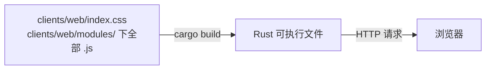
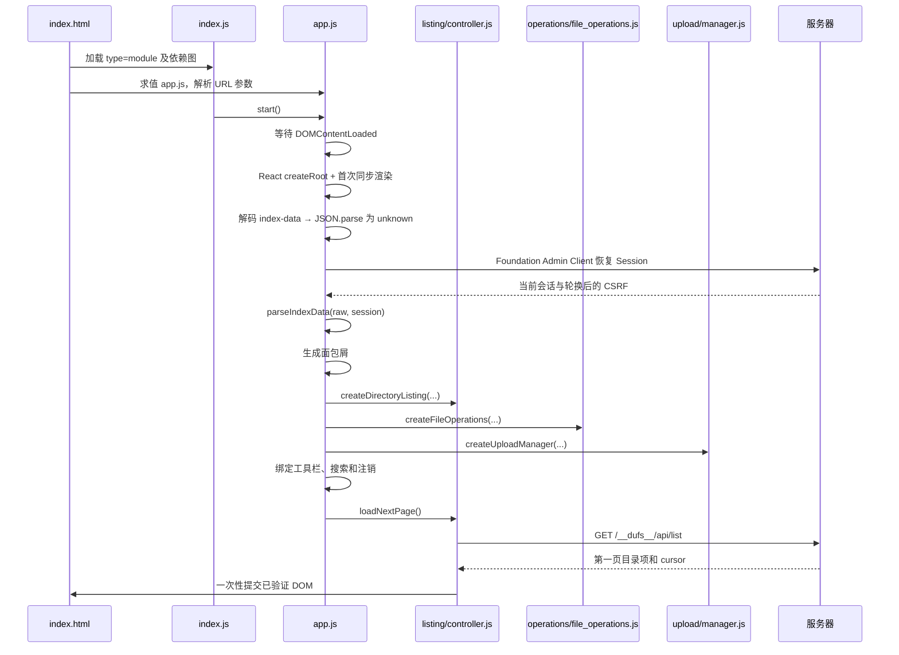
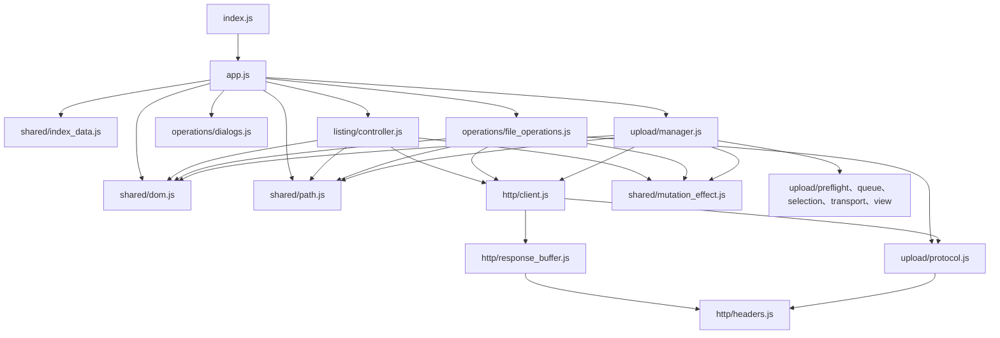
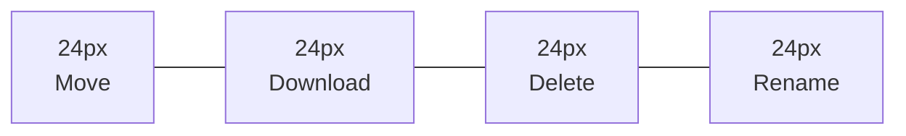
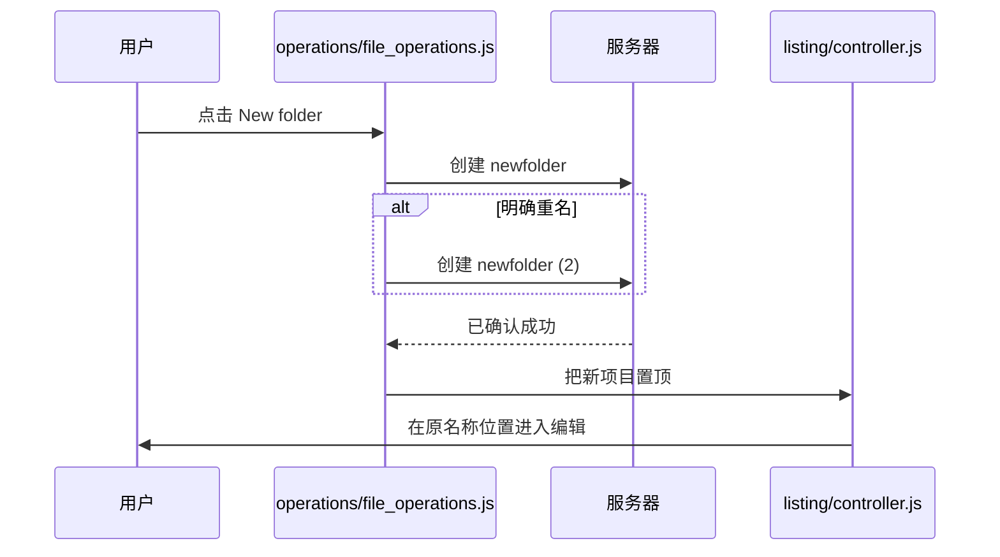
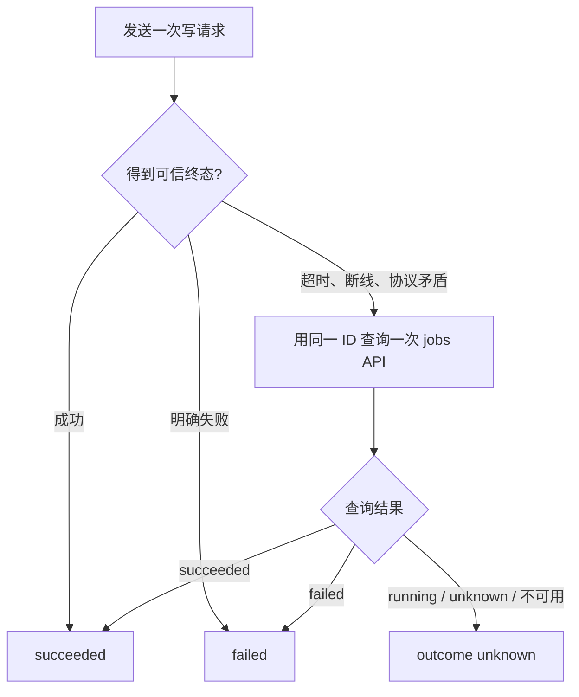

# 06. 前端页面与交互：从一张 HTML 骨架到可靠的文件管理器

本章面向没有前端框架经验的读者。我们会从浏览器拿到页面的第一刻开始，依次理解资源如何进入 Rust 二进制、页面如何启动、文件列表如何分页、四个操作按钮为什么不会移动，以及一次新建、重命名、移动或删除如何安全地反馈到列表。

上传拥有独立而且更复杂的状态机。本章只建立整体认识，预检、覆盖 revision、PUT、PATCH、断点恢复和 unknown 处理将在[第 7 章：上传协议逐步拆解](07-upload-protocol.md)中展开。

## 6.1 读完本章后应当会什么

读完后，你应当能够回答：

1. React 页面与文件业务控制器如何分工，且不重建正在工作的上传行？
2. 修改 `clients/web/index.css` 后，为什么只刷新浏览器可能看不到变化？
3. HTML 业务元数据与独立恢复的 Foundation session 如何一起启动页面？
4. `listing/controller.js` 为什么同时维护数据项、cursor、revision 和 DOM 窗口？
5. 文件夹没有下载按钮时，为什么删除和重命名按钮仍不会向左移动？
6. 为什么点击“新建文件夹”后先创建 `newfolder`，再在原位置编辑？
7. Move、Rename 和 Delete 为什么都不能把“网络报错”简单当成“操作失败”？
8. JSDoc 类型检查和运行时 JSON 校验分别解决什么问题？
9. 如何用浏览器开发者工具和仓库测试定位常见界面问题？

## 6.2 先建立正确的前端心智模型

当前前端采用 Foundation React Profile。React 19.2.8 负责页面结构和登录状态，认证 wire contract 严格使用 Foundation：

- HTML 只提供 React 根节点、资源引用及业务元数据；
- `react/application.js` 使用 React 和 Foundation UI 渲染登录、导航、表格结构与对话框；
- CSS 提供布局、主题、响应式和高对比度样式；
- 原生 JavaScript ES Modules 拆分业务逻辑；
- Fetch 处理普通 API 和状态查询；
- XMLHttpRequest 处理需要上传进度事件的文件正文；
- JSDoc 加 TypeScript `checkJs` 在开发阶段检查类型。

它不是一个独立部署的 Node.js 服务，也没有运行时 npm 依赖。浏览器执行构建后的 React 平台 bundle，以及独立嵌入的文件业务模块。根目录的 [package.json](../../package.json) 中，TypeScript、Playwright、axe 和 Acorn 都是检查或测试工具。

最短的前端入口只有三行，见 [clients/web/index.js](../../clients/web/index.js)：

```js
import { start } from "./modules/app.js";

start();
```

这不表示页面逻辑很少，而表示入口只负责把控制权交给 `app.js`。React 渲染入口在 `clients/web/react/application.js`；列表、操作、上传和 API 逻辑在 `clients/web/modules/` 中。React 首次同步挂载完成后才初始化控制器，主题组件的局部更新不能重新协调控制器独占的 DOM 区域。

## 6.3 源码文件不等于运行时静态目录

### 6.3.1 资源在编译时进入二进制

Rust 通过 `include_str!` 和 `include_bytes!` 把 CSS、JavaScript、图标和模块编译进可执行文件，资源清单位于 [src/server/assets.rs](../../src/server/assets.rs)。



因此运行中的服务不会在每个请求时重新读取工作区的 `clients/web/`。典型修改流程是：

```text
修改源码 → npm run build:platform → cargo build → 停止旧进程 → 启动新二进制 → 重新加载页面
```

如果只改文件并刷新旧进程，浏览器看到的仍是旧二进制内嵌的内容。

### 6.3.2 新模块必须加入资源清单

假设你创建了：

```text
clients/web/modules/preview.js
```

仅仅在另一个模块中 `import "./preview.js"` 还不够。必须同时在 [src/server/assets.rs](../../src/server/assets.rs) 的 `EMBEDDED_ASSETS` 中注册它，否则编译后的服务器不会返回该 URL，浏览器会报 module 404。

这是保留独立文件业务模块后的显式维护成本。`react/` 中的组件则由 Vite 打包，只公开构建后的平台模块，不能把含 npm 裸导入的源码直接加入 HTTP 白名单。

### 6.3.3 内容哈希前缀和缓存

服务器遍历所有公开嵌入资源的名称、声明 MIME 类型和内容，对各字段做长度分帧后计算一个 SHA-256 前缀，例如：

```text
/__dufs_assets_abcd.../index.js
/__dufs_assets_abcd.../modules/app.js
```

这些资源返回：

```text
Cache-Control: public, max-age=31536000, immutable
```

只要任一已注册资源的名称、MIME 类型或内容变化，重新构建的二进制就会生成新的前缀。旧 URL 可以放心长期缓存，新 HTML 会引用新 URL。

目录 HTML 本身则使用 `private, no-store`。它包含当前用户和当前页面的数据，不能像公共 CSS 一样长期缓存。

### 6.3.4 登录脚本也走同源资源合同

[clients/web/login.js](../../clients/web/login.js) 是同源外置入口，调用 React 登录挂载函数；React 表单经 Foundation Admin Client 发送认证请求。密码规则由服务器注入根节点，组件读取并验证后传给输入框。必填错误由 React 渲染到第五行，不触发原生校验气泡。

平台与业务 JS 均参与资源摘要。CSP 使用同源脚本策略，不需要为每次修改更新内联脚本哈希，也不能加入 `'unsafe-inline'`、eval 或 data:。实际规则见 [src/server/administrator_web.rs](../../src/server/administrator_web.rs)。

## 6.4 页面骨架和服务端注入数据

### 6.4.1 `index.html` 只提供稳定骨架

[clients/web/index.html](../../clients/web/index.html) 主要包含：

```text
body
├── div#dufs-root              React 根节点
├── template#index-data       已编码业务元数据，无身份或 CSRF
└── script[type=module]       index.js
```

React 在根节点内渲染顶部项目名/文件入口及五个操作图标、全宽工具栏、文件/上传表格结构和操作对话框。React 不重新渲染业务控制器已经接管的行与编辑器。

大多数需要 JavaScript 的控件初始带 `.hidden`。模块初始化成功并绑定事件后才逐个显示，避免用户在逻辑尚未就绪时点击一个看得见但不能工作的按钮。

### 6.4.2 Rust 注入哪些数据

返回目录页时，[src/server/listing.rs](../../src/server/listing.rs) 构造：

```js
{
  href: "/photos",
  dir_exists: true
}
```

字段含义：

| 字段 | 含义 |
| --- | --- |
| `href` | 当前共享根内的逻辑目录，以 `/` 开头 |
| `dir_exists` | 当前目录是否已经存在 |

服务端把两个业务字段序列化、编码为 Base64，替换 `__INDEX_DATA__` 占位符。JavaScript 读取 `<template id="index-data">`，解码并解析为 `unknown`。随后共享 Admin Client 独立恢复会话并轮换 CSRF；`parseIndexData(raw, session)` 验证业务字段和 Foundation 五字段 Session，再复制、冻结后使用。HTML 不含身份或 CSRF。

Base64 只是为了安全、稳定地把文本嵌入 HTML，不是加密。认证和传输机密性仍依赖会话、HTTPS、CSP 和响应缓存策略。

### 6.4.3 页面启动顺序

[clients/web/modules/app.js](../../clients/web/modules/app.js) 是页面的“装配层”。启动过程如下：



`requiredElement()` 会同时检查元素存在且类型正确。例如 `.paths-table` 不只是要查得到，还必须确实是 `HTMLTableElement`。如果 HTML 重构时忘记同步 JavaScript，初始化会进入页面级错误状态，而不是在后面的点击事件中随机报错。

### 6.4.4 面包屑和根目录房子

当前路径按 `/` 拆分后逐段生成链接：

```text
房子 / photos / 2026 / August
```

最左侧视觉上只有房子 SVG，仍保留：

```html
title="Root"
aria-label="Root"
```

因此鼠标用户能看到提示，读屏器也能读出 Root。中间目录是链接，最后一段是当前目录的加粗文字。

## 6.5 模块关系和职责边界



主要职责：

| 模块 | 负责 | 不负责 |
| --- | --- | --- |
| `app.js` | 启动、查找 DOM、连接模块、绑定顶栏 | 具体列表和写操作协议 |
| `shared/dom.js` | 创建安全 DOM、SVG 图标、格式化文件大小 | 业务状态 |
| `shared/index_data.js` | 严格校验并冻结页面启动数据 | 页面业务编排 |
| `shared/path.js` | 验证逻辑路径、编码浏览器 URL | 访问文件系统 |
| `shared/mutation_effect.js` | 定义列表可见内容变更后的四值失效契约 | 执行网络请求 |
| `listing/controller.js` | 列表、分页、窗口、排序、行内编辑 | 真正执行重命名和删除 |
| `operations/file_operations.js` | 新建、移动、重命名、删除、注销 | 列表分页和上传正文 |
| `operations/dialogs.js` | 应用内确认、输入和焦点恢复 | 发起文件操作 |
| `http/client.js` | 请求、超时、错误、结果对账 | 具体界面 DOM |
| `http/headers.js` | 规范非负整数 HTTP 头的共享解析 | 业务状态判断 |
| `upload/manager.js` | 上传编排和状态机 | 通用文件列表渲染 |
| `upload/{preflight,protocol,queue,selection,transport,view}.js` | 预检解析、协议、队列、选择预算、XHR 和进度视图 | 页面级装配 |

目录页当前由 `index.js` 加 18 个 ES modules 构成；后端资源注册表与 `clients/web/modules/` 文件集合由静态门双向核对，新增模块不能只写 import 而漏掉二进制嵌入。

`app.js` 通过回调连接这些模块。例如：

- 列表的 Move 点击回调调用 `fileOperations.movePath(index)`；
- 列表提交名称时调用 `fileOperations.renamePath(...)`；
- 上传提交成功后把 mutation effect 交给 `directoryListing.notifyMutation(...)`。

这种连接方式让模块可以独立测试，也避免把页面所有状态重新塞回一个全局 God Object。

## 6.6 路径、URL 和 DOM 安全

### 6.6.1 逻辑路径不是磁盘路径

前端只处理共享根内的逻辑路径，例如：

```text
/photos/猫.png
```

它既不是 Linux 真实绝对路径，也不能直接拼接为 URL。`shared/path.js` 会：

- 拒绝空名称；
- 拒绝以 `/` 开头的相对子路径；
- 拒绝空段、`.` 和 `..`；
- 对每个 URL 路径段分别执行 `encodeURIComponent()`。

所以逻辑名：

```text
reports/A B#1.txt
```

会安全地转换为浏览器 URL，而不会把 `#` 错当成 fragment。

### 6.6.2 不用字符串拼 HTML

`shared/dom.js` 的 `createElement()` 使用：

```js
element.textContent = String(value);
element.setAttribute(name, value);
```

文件名即使是：

```text
.txt
```

也只会显示成普通文字，不会变成标签。生产前端测试还明确禁止动态 HTML 注入接口，见 [tests/frontend/accessibility.spec.js](../../tests/frontend/accessibility.spec.js)。

静态 SVG 可以直接写在 HTML 中；运行时 SVG 则由 `createIcon()` 根据内部白名单创建。业务数据不能提供任意 SVG 路径。

## 6.7 登录页和注销

登录页与文件页是两套页面，见 [clients/web/login.html](../../clients/web/login.html) 和 [clients/web/login.css](../../clients/web/login.css)。登录采用 Foundation 当前 JSON 协议：

1. 浏览器 `GET /__dufs__/login` 取得页面；
2. 用户填写管理员 username candidate 和密码；candidate 必须是 1～64 bytes 且每字节 `0x20`～`0x7e`，允许外层 ASCII space 和大写字母；
3. React 登录表单阻止默认 form navigation，经 `login.js` 注入的共享客户端回调以 Fetch 向 `POST /api/v2/auth/login` 发送恰好 `username/password` 的 JSON；
4. 浏览器自动附带同源安全上下文，服务端还要求唯一且一致的 Origin、effective Host 与 `Sec-Fetch-Site: same-origin`；
5. 服务端验证 Foundation 当前 Argon2id PHC，设置 `__Host-sarmg-dufs-ram-session` Secure Cookie，并返回恰好五字段的 `AdministratorSession`；
6. 客户端严格验证 session 的字段集合、canonical 管理员 username、`role=admin` 与 token 规范，成功才 `location.replace("/")`；
7. `400/401/429` 等错误直接解析 Foundation `ErrorEnvelope` 并在原页面安全显示，不使用 PRG、查询字符串 token 或旧表单 alias。

登录脚本直接使用 Foundation `isAdministratorLoginRequest` 与 `isAdministratorPassword`，不复制 username/token 正则或密码字节策略：

- username candidate 必须为 1～64 bytes 且每字节 `0x20`～`0x7e`；客户端和服务端均执行 ASCII trim/lowercase，结果必须为 3～64 字节、首尾 alnum、字符仅 `[a-z0-9._-]` 的 canonical username；`@`、Unicode、控制字符和首尾分隔符拒绝，相邻分隔符允许；
- 密码必须为 12～1024 个 UTF-8 字节且没有 ASCII 控制字符。

“字符数”和“UTF-8 字节数”不同。英文字母通常占 1 字节，常见汉字通常占 3 字节，因此不能只依赖 `value.length`。

文件页的注销按钮向 `/api/v2/auth/logout` 发送 POST，并带当前 session 的 `X-CSRF-Token`。成功后不手工伪造登录界面，而是刷新页面，让服务端根据会话事实决定下一页。

当 API 返回 401，或返回带明确 CSRF 标记的 403 时，`redirectToLogin()` 同样只执行一次页面刷新，避免多个并发失败反复触发导航。

## 6.8 列表请求、搜索和排序

### 6.8.1 URL 参数先经过白名单

页面初始化时读取：

```text
q      搜索词
sort   name | mtime | size
order  asc | desc
```

非法 `sort` 会回退到 `name`，非法 `order` 会回退到 `asc`。这样排序链接不会继续传播任意未知参数。

搜索并不是在已加载 DOM 中实时过滤。提交搜索表单会导航到当前目录的新 URL，再由列表 API 在服务器端搜索。清空搜索词后回到没有 `q` 的当前目录。

排序标题本身是链接，并带：

- 当前查询词；
- 新排序字段；
- 应切换到的升降序；
- `aria-sort`；
- 具体的 `aria-label`。

### 6.8.2 一次列表请求

`loadNextPage()` 请求：

```text
GET /__dufs__/api/list
    ?path=/当前目录
    &limit=200
    &q=可选搜索词
    &sort=name
    &order=asc
    &cursor=可选下一页游标
```

三个关键限制定义在 [clients/web/modules/listing/controller.js](../../clients/web/modules/listing/controller.js)：

| 常量 | 值 | 保护对象 |
| --- | ---: | --- |
| `LIST_PAGE_LIMIT` | 200 | 单次网络响应和单次 DOM 提交 |
| `MAX_CURSOR_LENGTH` | 1024 | 不可信 cursor 字符串 |
| `MAX_RENDERED_ITEMS` | 200 | 同时存在的文件列表 DOM 行，与默认页大小一致 |

### 6.8.3 先验证整页，再改 DOM

服务器 JSON 对 TypeScript 来说仍然是 `unknown`。`validateListingPage()` 会检查：

- payload 是对象；
- `paths` 是数组且最多 200 项；
- `next_cursor` 是 `null` 或 1 到 1024 字符的字符串；
- `path_type` 只能是四个允许值；
- 名称是合法逻辑路径；
- 名称不会长得异常；
- `mtime`、`size` 是非负安全整数；
- 一页内没有重复名称。

随后还会检查：

- 新页名称没有和以前页面重复；
- cursor 没有等于本次请求 cursor；
- cursor 没有在当前快照中出现过。

只有整页全部通过校验，才创建 DocumentFragment 并提交 DOM。若第 200 项非法，前 199 项也不会提前出现在页面中。

### 6.8.4 cursor 是快照位置，不是页码

cursor 是服务器生成的不透明字符串。前端不能解析、修改或自己计算它，只能原样带回服务器。

不要把 cursor 理解成 `page=2`。它还绑定了服务器的目录快照语义。目录变化后继续使用旧 cursor 可能导致重复或遗漏，因此所有可能写入目录的操作都必须使 cursor 失效。

### 6.8.5 DOM 窗口不是总数据上限

当累计加载不超过 200 项时，新行直接追加。

超过 200 项后：

- JavaScript 的 `items` 仍保存已加载条目；
- `<tbody>` 只渲染一个最多 200 项的窗口；
- 页面出现 Show previous items 和 Show next items；
- 到达当前内存末尾且服务器还有 cursor 时，再显示 Load more。

因此：

```text
200 行 DOM 上限 ≠ 200 个文件上限 ≠ 200 项 JavaScript 内存上限
```

DOM 窗口解决浏览器节点过多造成的布局和无障碍树成本，但不会把已经加载的 `items` 从内存中丢掉。

新建项目置顶时，若当前显示首个窗口且没有同名旧条目，控制器只创建一个新行、平移现有行的操作索引并裁掉窗口尾行，不会同步重建全部 200 行。若 DOM 索引约束不一致、当前显示后续窗口或存在同名旧条目，则回退到完整窗口渲染，优先保证索引正确。

### 6.8.6 空目录有三种文案

空状态取决于页面上下文：

- 有搜索词：`No search results`；
- 目录存在但没有项目：`Folder is empty`；
- 目录尚不存在：`Uploading files will create this folder automatically`。

不存在的目录不会立即请求列表 API。上传文件时，后端可以按目标路径创建所需目录。

## 6.9 一行文件是怎样生成的

### 6.9.1 四种路径类型

前端只接受：

```text
Dir
SymlinkDir
File
SymlinkFile
```

目录和目录符号链接显示文件夹类图标，文件和文件符号链接显示文件类图标。

名称链接行为：

- 目录：URL 末尾加 `/`，点击进入目录；
- 文件：带 `download` 属性，点击下载文件。

当前项目没有在线预览、在线编辑和目录 ZIP。文件夹 Size 单元格留空，文件 Size 通过 `formatFileSize()` 显示为 B、KB、MB 等单位。

### 6.9.2 固定四操作槽

每行严格按照以下顺序建立四个槽：

```text
Move | Download | Delete | Rename
```



对应代码是 `createActionSlot()` 和 `createPathRow()`。CSS 使用：

```css
grid-template-columns: repeat(4, 24px);
```

文件夹没有单文件下载能力，但仍创建一个空 Download `<span>`：

```text
文件：   Move | Download | Delete | Rename
文件夹： Move |   空槽   | Delete | Rename
```

空槽带 `aria-hidden="true"` 且不可点击。它的作用不是提供空按钮，而是保留几何位置，让用户的肌肉记忆稳定。

### 6.9.3 操作事件使用委托

列表没有为每一行单独注册 Move/Delete/Rename 监听器。`setupActions()` 在 `<tbody>` 上注册一次 click，然后通过：

```js
target.closest("button[data-action][data-index]")
```

找到实际按钮。

这种事件委托适合分页和整表重绘：替换一行或整个 `<tbody>` 后不需要重新给每个按钮绑定事件。

## 6.10 行内新建与重命名

### 6.10.1 “新建”是先提交，再编辑

点击新建文件夹后，不会先弹出输入框等待用户取名。实际顺序是：



默认名称：

- 文件夹：`newfolder`；
- 空文件：`newfile`。

只有服务器明确证明候选重名时才递增：

```text
newfolder
newfolder (2)
newfolder (3)
...
```

最多尝试 1000 个候选。超时或 unknown 时不会擅自尝试下一个名称，因为上一个候选可能已经成功创建。

空文件使用长度为 0 的完整上传协议创建，而不是一个无条件覆盖的普通 PUT。细节见[第 7 章](07-upload-protocol.md)。

### 6.10.2 新项目如何进入列表

`addCreatedItem()` 会：

1. 再次校验项目类型、名称、mtime 和 size；
2. 清除可能同名的陈旧本地项；
3. 把新项目插入 `items` 开头；
4. 标记当前服务器列表快照已失效；
5. 从窗口开头重新渲染；
6. 返回 index 0，供行内编辑器使用。

这条本地行只是已知提交事实的即时呈现。行内编辑结束后仍会刷新第一页，获得服务器权威排序、mtime 和过滤结果。

### 6.10.3 全表只有一个编辑器

`activeEditor` 保存当前编辑器。若用户在编辑 A 时点击 B 的 Rename，列表会先尝试结算 A，成功后才开启 B。

同样，分页按钮、Move、Delete、新建等操作也会先调用 `settleInlineRename()`。这样不会同时出现两个输入框争抢异步重命名结果。

编辑器保存：

- 当前数组 index；
- 源逻辑名称；
- 原 basename；
- input 和错误元素；
- 应恢复焦点的控件；
- 是否属于刚创建项目；
- blur 后应把焦点放回哪里；
- 当前是否已有提交 Promise。

### 6.10.4 键盘和失焦规则

| 行为 | 结果 |
| --- | --- |
| Enter | 校验并提交 |
| Tab | 输入框失焦，因此提交；焦点继续到目标控件 |
| 点击别处 | 失焦并提交 |
| Escape | 取消本次改名 |
| IME 组合输入期间 Escape | 不取消，交给输入法 |
| 输入时 | 清除旧的行内错误 |

名称规则：

- 不能为空；
- 不能包含 `/`；
- 不能包含 NUL；
- 不能是 `.` 或 `..`；
- 最多 255 UTF-8 字节。

按 Enter 提交非法名称时，输入框保留并显示 `role="alert"` 错误。非法内容直接失焦时，则取消编辑并恢复原名称，避免一个无焦点的坏编辑器卡住整张表。

### 6.10.5 当前不会自动蓝色选中文本

进入行内编辑时调用 `placeInlineCaret()`，设置：

```js
input.setSelectionRange(position, position);
```

起点和终点相同，因此没有蓝色选择块。

- 文件夹和无扩展名文件：光标在末尾；
- 有扩展名文件：光标在最后一个点之前；
- `archive.tar.gz`：光标在 `.gz` 前。

输入框本身也刻意没有边框、下划线、阴影或装饰框，视觉提示主要是浏览器原生插入光标。

若实际页面仍整段蓝色选中，先确认：

1. 是否重新构建并重启了服务器；
2. 页面加载的资源哈希前缀是否已经变化；
3. 当前看到的是行内名称，还是 Move 对话框输入框。Move 对话框仍会主动全选初始路径。

### 6.10.6 防止 blur 重复提交

浏览器在禁用一个获得焦点的 input 时可能同步触发 blur。若代码先禁用 input、后记录请求，blur 处理器就可能发送第二个 Rename。

当前顺序是：

1. 先把请求 Promise 写入 `editor.commitPromise`；
2. 再禁用 input 并设置 `aria-busy`；
3. blur 重入时先看到已有 Promise，只等待它，不再发请求。

这是一个很小但很典型的前端并发问题：JavaScript 单线程不等于事件处理不会重入。

### 6.10.7 Escape 不会删除刚创建项目

新建操作在进入编辑器前已经提交成功。因此对 `newfolder` 按 Escape 的语义是：

```text
保留 newfolder，只取消把它改成别的名字
```

如果用户想撤销创建，需要明确执行 Delete。教程和界面都不应把 Escape 描述成“撤销新建”。

## 6.11 Move、Rename 和 Delete

### 6.11.1 三个操作的边界

| 操作 | 用户提供什么 | 保持什么不变 | 成功后的页面行为 |
| --- | --- | --- | --- |
| Rename | 新 basename | 父目录 | 更新名称并刷新当前目录 |
| Move | 目标目录 | basename | 导航到目标目录 |
| Delete | 删除确认 | 无 | 删除本地行并刷新 |

Rename 和 Move 不再共用一个“完整目标路径”输入框。这样能防止用户本来只想改名，却意外把项目移动到另一个目录。

### 6.11.2 Rename 请求

行内名称校验通过后，`operations/file_operations.js` 发送：

```http
POST /__dufs__/api/rename
Content-Type: application/json
X-CSRF-Token: ...
X-Dufs-Operation-Id: UUID

{
  "source": "/docs/old.txt",
  "name": "new.txt",
  "overwrite": false
}
```

前端只传新 basename，后端也能据此坚持“同父目录重命名”的语义。

若服务器明确返回 `destination_exists`，才显示覆盖确认。用户同意后发送一个新的受跟踪请求，并把 `overwrite` 改为 `true`。

### 6.11.3 Move 请求

Move 对话框要求输入共享根内已有目标目录，例如：

```text
/archive/2026
```

前端会：

- 为缺少的开头 `/` 补上 `/`；
- 删除多余的末尾 `/`；
- 拒绝非法路径段；
- 保留源 basename；
- 若目标恰好仍是当前目录，则不发送请求。

请求正文：

```json
{
  "source": "/inbox/report.pdf",
  "directory": "/archive/2026",
  "overwrite": false
}
```

成功后使用 `location.href` 进入目标目录，让用户立即看到移动后的项目。

### 6.11.4 内部可以合并，外部语义保持独立

Move 和 Rename 都调用内部 `relocatePath()`，共享：

- pending 防重；
- Operation ID；
- 第一次 `overwrite:false`；
- 可信冲突后的覆盖确认；
- unknown 结果对账；
- 对话框错误展示；
- 列表失效通知。

这种合并减少重复代码，却没有把两个用户动作重新混成一个按钮或一个模糊请求。

### 6.11.5 Delete 请求

Delete 先显示：

```text
Delete "name"? This action cannot be undone.
```

确认后对文件或目录自身 URL 发送 DELETE，并携带 CSRF token 和 Operation ID。

成功后前端按名称寻找项目并移除，而不是继续盲信操作开始时的 index。原因是等待请求期间，新建项目可能已经插入列表开头，旧 index 可能指向另一个项目。

删除当前焦点行后，焦点按以下顺序移动：

1. 下一行的第一个按钮或链接；
2. 上一行的第一个按钮或链接；
3. 搜索框。

### 6.11.6 pending Map 防止快速重复写

`operations/file_operations.js` 使用一个 Map 记录正在进行的操作：

```text
path:/docs/a.txt  → 正在移动、重命名或删除
create-item       → 正在创建文件或文件夹
logout            → 正在注销
```

同一个 key 存在时不会再次发请求。新建文件和新建文件夹共享 `create-item`，所以快速连点不会同时创建两个默认项目，也不会争抢唯一的行内编辑器。

pending 期间触发控件带 `aria-busy` 和 `aria-disabled`，页面上方的 `.operation-status` 显示最近一项操作。真正的防重复依据是 Map，不是仅依靠视觉禁用样式。

## 6.12 为什么写操作需要“结果对账”

浏览器发送写请求后连接断开，可能存在三种现实：

```text
请求没有到服务器
请求到达但失败
请求已经成功，只是响应没有回到浏览器
```

所以“Fetch 抛异常”不能直接翻译成“服务器没有修改文件”。

普通写操作带 UUID 格式的 `X-Dufs-Operation-Id`。`runMutationWithReconciliation()` 的流程是：



这里有两个重要限制：

- 不自动重放原写请求；
- 状态查询只做一次，不在页面内无限轮询。

若状态仍不确定，界面要求刷新目录检查事实。第 5 章会从后端提交点解释 unknown，第 7 章会解释上传专用的 upload ID 和 HEAD 对账。

## 6.13 统一列表失效协议

所有可能改变目录可见内容的前端模块只能向列表报告四种效果，定义在 [clients/web/modules/shared/mutation_effect.js](../../clients/web/modules/shared/mutation_effect.js)：

```js
MUTATION_EFFECT.COMMITTED
MUTATION_EFFECT.OUTCOME_UNKNOWN
MUTATION_EFFECT.REFRESH_REQUIRED
MUTATION_EFFECT.NOT_COMMITTED
```

| 效果 | 已知事实 | 列表动作 |
| --- | --- | --- |
| `committed` | 已确认目录发生变化 | 作废行和 cursor |
| `outcome-unknown` | 目录可能变化 | 同样作废，但显示更保守文案 |
| `refresh-required` | 本次写入被拒绝，但服务器证明当前 snapshot 已陈旧 | 作废行和 cursor，不宣称写入成功 |
| `not-committed` | 已确认没有成功写入 | 保留当前列表 |

### 6.13.1 失效时具体做什么

`invalidate()` 会：

1. 增加列表 `revision`；
2. 标记 `invalidated = true`；
3. 清空 `nextCursor`；
4. 清空见过的 cursor；
5. 把 Load more 文案改为 Refresh；
6. 显示“已变化”或“可能已变化”；
7. 阻止继续混用旧分页快照。

若一个旧列表请求仍在飞行，它返回后会发现自己的 `requestRevision` 已不等于当前 revision，于是直接丢弃响应。

### 6.13.2 为什么失败不总需要刷新

如果服务器明确证明 Rename 因非法名称被拒绝，目录没有变化。此时报告 `not-committed`，继续使用已有列表更友好。相反，上传目标出现、消失、revision 改变或 reset-stage，以及 DELETE/MOVE/RENAME 的确定 revision 冲突，虽然证明本次写入被拒绝，却也证明旧列表已陈旧，应报告 `refresh-required`。上传管理器对每一个可信 target-change 都重新通知，而不是记住“这个任务已经失效过一次”；因此两次冲突间若用户完成 Refresh，第二次响应仍会使新 snapshot 失效。

如果浏览器超时且一次状态查询也失败，则报告 `outcome-unknown`。即使用户肉眼还没看到变化，也不能继续拿旧 cursor 加载下一页。

### 6.13.3 编辑和加载期间的延迟刷新

`invalidate()` 本身只作废 cursor、更新提示并提供 Refresh，不会自动刷新第一页。当成功的 Rename/Delete 等调用方随后明确执行 `refreshFromFirstPage()` 时，可能恰好：

- 用户还在行内编辑；
- 列表请求仍在加载。

刷新函数不会粗暴删除正在输入的 DOM，而是按当时状态设置：

- `refreshAfterEditor`；
- `refreshAfterLoad`。

等待当前临界动作结束后再刷新第一页。上传的 committed/unknown/refresh-required 目前只调用 `notifyMutation()`，因此只标记失效并等待用户点 Refresh，不会设置这两个自动刷新标志。

## 6.14 对话框系统

项目不使用浏览器原生 `alert()`、`confirm()` 和 `prompt()`，而是复用页面中唯一的原生 `<dialog>` 元素。

`createActionDialogs()` 提供：

| 方法 | 用途 | 返回值 |
| --- | --- | --- |
| `showMessage()` | 只读错误或提示 | `undefined` |
| `confirmAction()` | 是/否确认 | boolean |
| `chooseAction()` | 覆盖/跳过/取消三选一 | choice 字符串 |
| `requestText()` | 输入 Move 目标目录 | 字符串或 `null` |

### 6.14.1 为什么只有一个 `<dialog>`

多个异步任务可能几乎同时想显示提示。若每个任务自己操作同一个 DOM，就会覆盖标题、按钮和 resolver。

当前实现维护 Promise `queue`：前一个对话框关闭后，下一个才显示。这样每次调用都有唯一的结果。

### 6.14.2 键盘和焦点

对话框会：

- 用 `showModal()` 打开；
- Escape 统一转换为 cancel；
- 在可用 input 和按钮之间循环 Tab；
- 打开时把焦点放到输入框或确认按钮；
- 关闭后恢复到调用方传入的触发控件；
- 删除和覆盖操作使用 danger 样式。

Move 使用 `requestText()`，打开时会调用 `input.select()`，方便整段替换目标目录。因此 Move 对话框中的蓝色选择块是当前设计；行内文件名编辑器则不会自动选择文字。

## 6.15 JSDoc 类型、TypeScript 检查和运行时校验

### 6.15.1 当前源码仍然是 JavaScript

代码中的：

```js
/** @typedef {{ name: string, size: number }} ListingItem */
```

和：

```js
const table = /** @type {HTMLTableElement} */ (element);
```

是 JSDoc，不会生成新的 JavaScript，也不会在浏览器里自动检查对象。

开发阶段执行：

```sh
npm run check:types
```

实际调用 TypeScript：

```text
tsc --noEmit --allowJs --checkJs --strict ...
```

含义是：

- `allowJs`：允许读取 JavaScript；
- `checkJs`：检查 JavaScript 中的类型；
- `strict`：开启严格规则；
- `noEmit`：只检查，不输出编译文件。

所以项目有静态类型检查，但生产仍执行原始 JavaScript。

### 6.15.2 静态类型无法证明网络数据

下面的标注只能告诉编辑器“我们希望 payload 长这样”：

```js
/** @type {ListingItem} */
const item = payload;
```

它不能阻止服务器实际返回：

```js
{ name: 42, size: -1 }
```

因此外部边界仍然需要运行时解析器：

- `validateListingPage()` 校验目录页；
- `parseIndexData(raw, session)` 校验 HTML 两个业务字段，再用 Foundation guard 校验独立恢复的会话。
- `parseUploadPreflight()` 校验预检顺序和 revision；
- `classifyUploadResponse()` 校验上传状态矩阵；
- `parseErrorPayload()` 只从 `application/problem+json` 中容错读取有界、规范命名的顶层字段；
- `requiredElement()` 校验 HTML 与 JavaScript 的 DOM 合约。

`parseErrorPayload()` 也不是完整 Problem Details schema validator：只要 media type 正确，它会尝试读取受支持的有界字段，缺失或非法字段会回落为空值/默认值；只有调用方需要的 HTTP status、协议头和业务组合另行做权威校验。

服务端 HTML 的 IndexData 只含 `href` 与 `dir_exists` 两个字段，不嵌入身份或 CSRF。页面经共享 Admin Client 调用 `GET /api/v2/auth/session` 恢复会话，再把结果交给 `parseIndexData(raw, session)`；它严格验证两个业务字段，并使用 Foundation `isAdministratorSession` 验证独立的五字段会话合同，复制并冻结结果后才启动文件业务界面。

一个实用原则是：

```text
JSDoc 保护开发者写代码时不自相矛盾；
运行时校验保护程序不相信浏览器外部输入。
```

### 6.15.3 `RequestError` 保存结构化事实

[clients/web/modules/http/client.js](../../clients/web/modules/http/client.js) 中的 `RequestError` 不只有 message，还保存：

- HTTP status；
- Problem code、type、title、detail；
- recovery 建议；
- Retry-After；
- 是否 outcome unknown；
- Operation ID 和状态；
- Upload ID、状态、长度和 offset。

调用方不必解析英文错误文案来决定行为，而是检查规范字段。

### 6.15.4 三类请求辅助函数

| 函数 | 适用响应 |
| --- | --- |
| `requestJson()` | 成功时必须是 JSON |
| `requestNoContent()` | 成功时不应有业务正文 |
| `requestHead()` | 只读取响应状态和头部 |

默认浏览器控制请求超时为 30 秒。调用方可以为状态检查等场景提供专门时限和文案。

若调用者在 fetch 之前已经 abort，前端能确认请求没有发出；若写请求发出后才超时、断线或取消，则只能保守标记 unknown。

### 6.15.5 响应正文也有上限

`http/response_buffer.js` 限制：

- 普通错误正文最多 16 KiB；
- 默认成功正文最多 16 MiB。

它先检查可信格式的 `Content-Length`，再对流逐块累计。超限时取消 response body，避免错误服务器返回无限正文拖垮页面。

### 6.15.6 `Object.freeze()` 的作用和边界

列表页、预检结果和模块公开接口经常用 `Object.freeze()`：

- 明确调用方不应替换字段；
- 减少状态被意外改写；
- 让测试更容易推理。

但 `Object.freeze()` 默认是浅冻结。若内部字段仍指向可变数组或 DOM，它不会递归把整棵对象图冻结。不要把它理解成完整不可变数据框架。

## 6.16 上传在前端架构中的位置

上传入口仍由 `app.js` 装配：

- Upload files 打开 `multiple` 文件选择器；
- Upload folder 打开 `webkitdirectory multiple` 选择器；
- 选择结果交给 `uploadManager.addFiles()`；
- 页面明确阻止拖放文件。

上传管理器大体执行：

```text
校验选择数量和路径
→ 去除同一逻辑目标
→ 预检目标是否存在及其 revision
→ 必要时进行一次批量覆盖选择
→ 排入有界队列
→ XHR PUT 正文并显示进度
→ 必要时 HEAD 查询和 PATCH 恢复
→ 提交时目标变化则再次确认
→ committed、unknown 或 refresh-required 通知列表失效
```

本章只需记住三点：

1. 预检不是原子锁，提交时必须再次核对目标 revision；
2. 上传使用 XHR 是为了上传进度，普通控制 API 仍使用 Fetch；
3. 上传成功、结果未知，或服务器证明当前 snapshot 已陈旧时，都必须通过同一个 `notifyMutation()` 边界使列表失效。

完整状态、请求头、覆盖确认、空 PATCH、断点恢复和刷新限制见[第 7 章](07-upload-protocol.md)。

discard 不复用普通 operation 的 `succeeded` 解析。`http/client.js` 的 `assertDiscardUploadResponse()` 只接受严格绑定同一 ID、声明长度、满 offset 的 `204 + rejected`；普通上传的跳过路径和新建空文件候选清理都使用这一分类器，单元测试与 Playwright mock 也携带真实协议头。网络结果歧义时可由 HEAD 的严格 `rejected` 终态确认“未发布”，但不能把它表述成 stage 路径已经物理消失。

## 6.17 无障碍、主题和小视口回流

### 6.17.1 原生语义优先

当前界面使用：

- `<button>` 表达动作；
- `<a>` 表达导航或下载；
- `<table>` 表达二维文件和上传数据；
- `<dialog>` 表达模态交互；
- `<form>` 表达登录和搜索提交。

纯装饰 SVG 使用 `aria-hidden="true"`。只有图标没有可见文字的按钮，提供具体 `aria-label`，例如 `Rename report.txt`，而不只是含糊的 `Rename`。

### 6.17.2 状态区域

页面有不同强度的播报：

- 普通操作和列表状态：`role="status" aria-live="polite"`；
- 阻塞上传队列的警告：`role="alert" aria-live="assertive"`；
- 行内名称错误：`role="alert"`；
- 上传进度：视觉节点对读屏器隐藏，另有专用 live 节点。

上传进度不会在每个字节事件都播报，而是在跨过新的 10% 档位时更新读屏信息，避免形成语音洪水。

### 6.17.3 焦点不是一个可永久保存的 DOM 节点

列表刷新会删除旧行。如果只保存 `document.activeElement`，刷新后它已经脱离文档。

当前代码保存逻辑锚点：

```js
{
  name: "report.txt",
  control: "rename"
}
```

刷新后再按名称寻找新行和同一逻辑控件。若项目消失，则把焦点放到列表状态区域。

它还会先确认用户没有在请求期间主动把焦点移到别处，避免异步刷新把焦点“抢回来”。

### 6.17.4 320 CSS 像素回流

在 537px 以下，文件表从普通 table 布局转换为网格：

- 第一行显示图标、名称、四操作槽；
- 第二行显示修改时间和大小；
- 搜索框占整行；
- 管理员 username 空间不足时可截断并显示省略号；
- 上传状态允许换行。

注释把 320 CSS 像素视为 1280px 桌面在 400% 缩放下的宽度。因此这项设计首先是桌面缩放无障碍保证，不等于项目承诺完整的移动端产品体验。

### 6.17.5 亮色、暗色和强制颜色

[clients/web/index.css](../../clients/web/index.css) 使用 CSS 变量定义背景、文字、危险色和边框：

- `prefers-color-scheme: dark` 替换变量；
- `forced-colors: active` 使用 Canvas、ButtonText、LinkText、Highlight；
- SVG 使用 `currentcolor`，不会在高对比度模式中消失；
- 焦点轮廓使用当前主题或系统 Highlight。

行内名称输入框按当前产品要求没有装饰边框，其主要视觉焦点提示是原生文本插入光标。修改这部分时需要同时在普通、暗色和 forced-colors 中验证。

### 6.17.6 自动测试覆盖

前端测试分工：

| 文件 | 重点 |
| --- | --- |
| [browse.spec.js](../../tests/frontend/browse.spec.js) | 列表、搜索、排序、分页、DOM 窗口 |
| [operations.spec.js](../../tests/frontend/operations.spec.js) | 新建、行内改名、Move、Rename、Delete、unknown |
| [upload.spec.js](../../tests/frontend/upload.spec.js) | 上传状态机和故障恢复 |
| [auth.spec.js](../../tests/frontend/auth.spec.js) | 登录、Cookie、注销 |
| [accessibility.spec.js](../../tests/frontend/accessibility.spec.js) | 键盘、400% 缩放、forced-colors、axe |
| `unit/*.test.mjs`（如 [http_client.test.mjs](../../tests/frontend/unit/http_client.test.mjs)） | HTTP、mutation、上传协议、队列和选择纯逻辑 |

axe 测试覆盖登录页、文件页、行内编辑器和操作对话框的 WCAG A/AA 自动规则。自动通过不等于人工体验一定完美，仍需用键盘和真实缩放手工检查。

## 6.18 前端调试：先判断问题在哪一层

### 6.18.1 第一步：确认浏览器加载的是新二进制

若修改没有生效：

1. 执行 `cargo build --locked`；
2. 确认旧服务进程已经停止；
3. 启动刚生成的二进制；
4. 重新加载目录 HTML；
5. 若改的是 `EMBEDDED_ASSETS` 白名单中的 CSS/ES module/图标，在 Network 或 Sources 中查看 `__dufs_assets_...` 前缀是否变化；若改的是 `index.html`、`login.html` 或外部 `login.js`，前缀可以不变，应直接核对新 document 内容及登录 CSP。

只有浏览器重新取得新 HTML，才会知道新的页面内容和资源 URL。一个已经打开的旧标签页不会自动替换它内存中的模块。

### 6.18.2 第二步：查看 Console

初始化失败会打印原错误，并把 `Unable to initialize the file manager` 显示到列表状态区域。

常见 Console 线索：

- ES module 404：文件没有加入 `EMBEDDED_ASSETS`，或运行的是旧二进制；
- CSP 拒绝登录脚本：构建资源缺失或使用了非同源模块；
- `Required page control is missing`：HTML selector 与 JavaScript 不一致；
- `Invalid file list response`：后端 JSON 与运行时合约不一致；
- `crypto.randomUUID is not a function`：页面没有运行在所需安全上下文中。

### 6.18.3 第三步：按请求类型查看 Network

可以按路径过滤：

| 目标 | 关注内容 |
| --- | --- |
| `/__dufs__/api/list` | q、sort、order、cursor、JSON Content-Type |
| `/__dufs__/api/mkdir` | CSRF、Operation ID、Operation State |
| `/__dufs__/api/rename` | `name` 与 `overwrite` |
| `/__dufs__/api/move` | `directory` 与 basename 是否保持 |
| 资源 DELETE | URL 是否逐段编码、操作头是否完整 |
| `/__dufs__/api/jobs/{id}` | 是否在 unknown 后只查询一次 |
| `/__dufs__/api/upload/*` | 上传问题转到第 7 章 |

不要只看 HTTP 状态。当前协议还要求响应头中的 ID 和状态与请求匹配。

### 6.18.4 第四步：检查 Elements 和无障碍树

固定操作列问题应检查：

```text
.cell-actions
└── .action-slots
    ├── [data-action-slot=move]
    ├── [data-action-slot=download]
    ├── [data-action-slot=delete]
    └── [data-action-slot=rename]
```

文件夹的 Download 槽应存在但为空。若槽根本不存在，是 JavaScript 行构造问题；若存在但按钮仍错位，是 CSS Grid 或缓存问题。

无障碍面板可检查：

- 房子链接是否名为 Root；
- 图标按钮是否包含具体文件名；
- 对话框标题与描述关联；
- 排序列的 `aria-sort`；
- 空操作槽是否没有进入无障碍树。

### 6.18.5 建议断点位置

| 现象 | 断点函数 |
| --- | --- |
| 页面启动失败 | `initialize()` |
| 列表不加载 | `loadNextPage()` |
| 分页重复或消失 | `validateListingPage()`、`invalidate()` |
| 操作按钮错行 | `createPathRow()`、`dispatchActionAfterEditor()` |
| 重命名发两次 | `commitInlineRename()` |
| 新建默认名异常 | `createDefaultFolder()` 或 `createDefaultFile()` |
| Move/Rename 覆盖异常 | `relocatePath()` |
| 删除后焦点异常 | `remove()` |
| 弹窗叠加 | `enqueue()`、`show()` |

### 6.18.6 常见现象速查

| 现象 | 常见原因或当前设计 |
| --- | --- |
| 行内名称仍有蓝色选区 | 运行旧二进制；或实际看到的是 Move 输入框 |
| 新建后按 Escape 仍有 `newfolder` | 项目已先创建，Escape 只取消改名 |
| Load more 突然变成 Refresh | 写操作使分页快照失效 |
| 新文件创建后刷新消失 | 当前搜索条件不匹配，状态区会说明 |
| 文件夹操作中间有空位 | 固定 Download 槽，属于预期布局 |
| 网络报错后列表显示“可能变化” | 操作结果 unknown，不等于明确失败 |
| 快速连点新建只执行一次 | `create-item` pending 防重复 |
| 点击 Move 后整段路径变蓝 | 对话框为方便替换而主动 `select()` |
| 改了 JS 却出现 module 404 | 新模块未加入 Rust 资源清单 |
| 登录页脚本不执行 | 外部 login.js/平台 ESM 缺失或违反同源 CSP |

## 6.19 修改前端时的最小验证闭环

### 6.19.1 静态检查

```sh
npm run check:js
npm run check:types
git diff --check
```

作用：

- `check:js` 检查 JavaScript 语法和项目约束；
- `check:types` 用严格 JSDoc 类型规则检查模块；
- `git diff --check` 检查空白错误和冲突标记。

### 6.19.2 纯前端单元测试

```sh
npm run test:frontend:unit
```

适合验证：

- 响应分类；
- cursor 和 mutation effect；
- 上传预检解析；
- FIFO 队列；
- RequestError 和 Problem Details。

### 6.19.3 浏览器端到端测试

```sh
npm run test:frontend
```

该命令会先构建 Rust 服务，再运行浏览器测试。它比 DOM 单元测试更慢，但能验证：

- 服务端真正返回的 HTML 和资源；
- HTTPS 测试代理；
- Cookie、CSRF 和登录；
- 浏览器焦点、表单、下载和 XHR 行为；
- Chromium 与 Firefox 差异；
- axe 无障碍规则。

### 6.19.4 修改哪一层，就补哪一层测试

例子：

- 修改文件大小格式：优先补单元测试；
- 修改分页和 DOM 窗口：补 `browse.spec.js`；
- 修改新建或重命名：补 `operations.spec.js`；
- 修改按钮语义、焦点或响应式：补 `accessibility.spec.js`；
- 修改上传：补 `upload.spec.js` 和协议单元测试；
- 修改登录输入：补 `auth.spec.js`，并同步 CSP 哈希。

最后还要重新构建和重启真实开发实例。若改动属于 `EMBEDDED_ASSETS` 哈希白名单，手工确认浏览器加载了新摘要 URL；若改的是 `index.html`、`login.html` 或外部 `login.js`，则确认加载了新 document，并在适用时核对登录 CSP 和外部模块 URL。

## 6.20 三个动手阅读练习

### 练习一：跟踪一次列表加载

执行：

```sh
rg "loadNextPage|validateListingPage|MAX_RENDERED_ITEMS" \
  clients/web/modules/listing/controller.js tests/frontend
```

尝试回答：

1. 为什么 payload 校验要先于 `items.push()`？
2. 为什么重复 cursor 不能只当作“没有下一页”？
3. `items` 超过 200 后，哪些数据仍在内存，哪些节点会被替换？

### 练习二：跟踪一次 Rename

执行：

```sh
rg "startInlineRename|commitInlineRename|renamePath|relocatePath" \
  clients/web/modules tests/frontend/operations.spec.js
```

按顺序找出：

1. Rename 按钮如何通过事件委托进入编辑器；
2. 输入怎样按 UTF-8 字节校验；
3. 如何防止 blur 重复请求；
4. 后端明确重名后怎样显示覆盖确认；
5. committed、unknown 或 refresh-required 怎样使列表失效。

### 练习三：证明文件夹的按钮不会移动

在浏览器 Elements 中同时选中一个文件行和文件夹行，比较四个 `data-action-slot`。然后阅读：

```sh
rg "createActionSlot|action-slots|data-action-slot" \
  clients/web/modules/listing/controller.js clients/web/index.css \
  tests/frontend/accessibility.spec.js
```

思考：如果直接不生成文件夹 Download 元素，视觉、键盘顺序和用户肌肉记忆会发生什么变化？

## 6.21 本章小结

当前前端的核心不是炫目的组件系统，而是几个清晰、可验证的边界：

- Rust 二进制拥有并返回一组白名单嵌入资源；
- 内容哈希资源长期缓存，用户页面和会话数据不缓存；
- `app.js` 只装配模块，不承包全部业务；
- `listing/controller.js` 把网络分页、DOM 窗口、行内编辑和焦点恢复放在同一列表边界内；
- 四个固定 action slot 保证能力缺失时按钮仍不移位；
- Move 和 Rename 共享可靠性代码，但对用户和后端保持独立语义；
- 所有可能改变目录可见内容的前端模块通过四值 mutation effect 统一处理列表和 cursor 失效；
- JSDoc 静态检查与运行时不可信数据校验缺一不可；
- 原生语义、live region、焦点恢复、缩放回流和 forced-colors 共同构成无障碍实现；
- 调试前端时首先确认新源码已经进入新二进制；只对哈希白名单资源核对新摘要 URL，页面骨架和内联登录脚本要核对新 document/CSP。

下一章将沿着 Upload files 按钮继续，逐步解释为什么一个文件上传需要预检、目标 revision、上传 ID、stage、PUT、PATCH、HEAD 和 unknown 状态。
