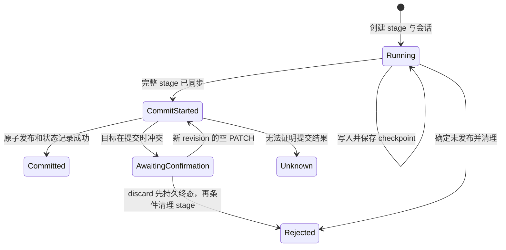
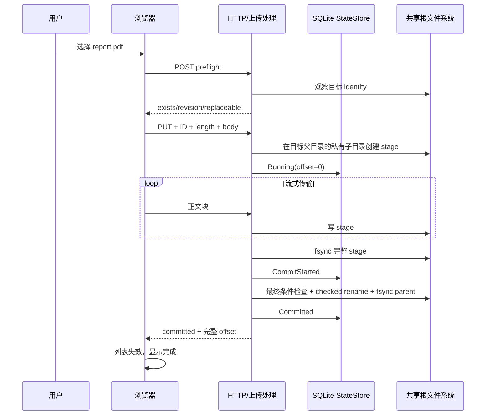

# 07. 上传协议逐步拆解

上传是当前项目状态最多的功能。它同时跨越浏览器 `File`、HTTP 流、目标目录中的 stage、SQLite 会话、覆盖确认和最终原子发布。

先用一句话建立直觉：**Dufs 不把正文直接写进目标文件，而是先在目标父目录的私有子目录中可靠写完暂存文件，确认目标仍满足用户选择后，再在同一文件系统内原子发布。**

## 7.1 三个容易混淆的概念

### 文件夹选择

“Upload folder” 使用浏览器 `webkitdirectory` 取得一组文件和相对路径，然后每个文件独立执行上传协议。它不会把目录压成 ZIP，也不会为完全空的目录创建条目。

### 单文件上传请求

每个任务只对应一个最终文件路径。一次选择 100 个文件，前端会创建 100 个任务，而不是一个包含 100 个正文的请求。

### 断点续传

当前后端仍支持断点续传，但浏览器只在**当前页面仍持有原 `File` 对象和 upload ID** 时恢复。刷新页面后不会根据文件名、大小和修改时间自动认领旧会话。

下载的 HTTP Range 是另一套协议，不要把“单段 Range 下载”与上传的 PUT/PATCH 检查点混为一谈。

## 7.2 为什么普通一次性 PUT 不够表达全部需求

最简单实现可以是：

```text
PUT /target → 直接 truncate target → 边收边写
```

但它会产生问题：

- 上传到一半时原文件已被破坏；
- 网络中断只能从头开始；
- 预检后出现同名文件时可能被静默覆盖；
- 客户端断线后无法查询服务器是否已经提交；
- 覆盖时难以证明目标仍是用户确认的那一版；
- 崩溃后不知道隐藏临时文件属于谁、写到哪里。

Dufs 因此把控制面和数据面分开：

- 控制面：preflight、HEAD 查询、discard、SQLite 状态和协议头；
- 数据面：PUT/PATCH 正文写入 stage；
- 提交面：身份复核、原子 rename、目录同步和终态记录。

## 7.3 代码地图

### 浏览器端

| 文件 | 负责什么 |
| --- | --- |
| [upload/manager.js](../../web/modules/upload/manager.js) | 预检、队列、任务状态机、重试与冲突编排 |
| [upload/selection.js](../../web/modules/upload/selection.js) | 文件选择、批量路径预算与重复目标校验 |
| [upload/preflight.js](../../web/modules/upload/preflight.js) | 严格验证 preflight JSON |
| [upload/protocol.js](../../web/modules/upload/protocol.js) | 校验 HTTP status 与上传头部状态矩阵 |
| [http/headers.js](../../web/modules/http/headers.js) | 供上传、传输和正文预算共用的规范非负整数头解析 |
| [upload/transport.js](../../web/modules/upload/transport.js) | XHR 正文、进度、abort 和 timeout |
| [upload/queue.js](../../web/modules/upload/queue.js) | FIFO、取消和有界终态历史 |
| [upload/view.js](../../web/modules/upload/view.js) | DOM 行、速度、进度、ETA、按钮和 live status |

### 服务端

| 文件 | 负责什么 |
| --- | --- |
| [upload.rs](../../src/server/upload.rs) | 上传 façade、共享事务类型和阶段装配 |
| [upload/prepare.rs](../../src/server/upload/prepare.rs) | 路径准入、会话准备与 checkpoint 恢复 |
| [upload/target.rs](../../src/server/upload/target.rs) | 目标 identity/revision、响应头与冲突渲染 |
| [upload/transfer.rs](../../src/server/upload/transfer.rs) | 正文接收、磁盘写入、进度与 deadline |
| [upload/commit.rs](../../src/server/upload/commit.rs) | 元数据复核、原子发布与持久化终态 |
| [upload/failure.rs](../../src/server/upload/failure.rs) | 空间、I/O、超时和 unknown 结果收口 |
| [upload/protocol.rs](../../src/server/upload/protocol.rs) | 上传头与策略解析 |
| [upload/record.rs](../../src/server/upload/record.rs) | 会话状态和记录转换 |
| [maintenance.rs](../../src/server/maintenance.rs) | 过期记录、孤儿 stage、删除 trash 和恢复维护 |
| [internal_names.rs](../../src/server/internal_names.rs) | 内部 stage/trash 名称规则 |
| [state_store/upload.rs](../../src/server/state_store/upload.rs) | 上传会话 SQL |
| [storage.rs](../../src/server/storage.rs) | 最终发布与持久性结果分类 |

## 7.4 上传中的四个身份

### 账号 owner

会话按账号摘要隔离。查询其他账号的 upload ID 与查询不存在记录一样返回不可见结果，避免泄露内部状态。

### upload ID

浏览器为一个逻辑文件上传生成规范 UUID。它贯穿 PUT、HEAD、PATCH 和 discard。

### 目标路径

是共享根内的规范逻辑路径。相同 ID 不能换路径续传。

### stage identity

stage 的 device/inode 与 SQLite 记录绑定。仅仅猜中隐藏文件名或 upload UUID 不会获得删除、续写或发布权限。

这四者还会绑定声明总长度、持久 offset 和覆盖策略。

## 7.5 关键 HTTP 头

| 头部 | 方向 | 含义 |
| --- | --- | --- |
| `X-CSRF-Token` | 请求 | Foundation 当前会话的写请求证明 |
| `X-Dufs-Upload-Id` | 双向 | 上传会话 UUID |
| `X-Dufs-Upload-Length` | 双向 | 文件完整字节长度 |
| `X-Dufs-Upload-Offset` | 双向 | 本次续写起点或服务端可靠检查点 |
| `X-Dufs-Upload-Overwrite` | 请求 | `false` 或申请受条件覆盖 |
| `X-Dufs-Target-Revision` | 双向 | 用户确认那一版目标的不透明 revision |
| `X-Dufs-Target-Replaceable` | 响应 | 当前目标是否属于允许替换的类型 |
| `X-Dufs-Operation-State` | 响应 | 普通操作和上传响应共用的权威 wire state 头；值按各自状态枚举解释 |

UUID、长度、offset 和 revision 都按规范形式解析；重复、歧义或越界头会被拒绝。HTTP 2xx 也必须与这些头一致，前端才承认成功。

## 7.6 内部状态与对外状态

SQLite 内部状态主要包括：



对外还可能出现：

- `not-seen`：当前 owner 看不到可信会话；
- `not-started`：本次合法请求在任何新 mutation 前停止；
- `running`；
- `awaiting-confirmation`；
- `committed`；
- `rejected`；
- `unknown`。

`not-started` 只描述**本次尝试**，不证明该 ID 从未有旧记录。所以客户端遇到可重试失败时仍要先 HEAD 查询原 ID。

## 7.7 前端选择阶段先做哪些限制

用户选完文件后，前端不会立刻为任意数量创建 DOM：

| 限制 | 当前值 | 防止什么 |
| --- | ---: | --- |
| 单批文件数 | 512 | 过大的预检和任务创建 |
| 单批 UTF-8 路径总量 | 256 KiB | 巨大路径集合和请求体 |
| 预准入文件与非终态任务合计上限 | 512 | 慢预检/确认期间无界保留 File、Promise、队列和 DOM |
| 保留的终态历史 | 200 行 | 长时间页面持续增长 |
| DOM 入队分片 | 每 50 项让出一帧 | 大批选择时卡死主线程 |
| 客户端实际默认并发 | 1 | 控制浏览器和网络压力 |

`upload/manager.js` 支持外部注入最多 8 并发，但当前页面数据没有传入后端并发配置，因此实际走默认单并发。不要把“代码允许最大 8”误写成“页面自动并发 8 个”。

前端还会：

- 复制 `FileList` 后再清空 input；
- 验证每个相对路径；
- 拒绝同一批或当前非终态队列中的重复最终路径；
- 阻止整页 drag/drop 触发浏览器导航，但不会把拖入文件当上传。

这些客户端限制改善体验，服务端仍要独立执行同样或更严格的预算校验，因为请求可以绕过网页构造。

## 7.8 第一步：批量 preflight

前端把所有文件映射为当前目录下的绝对逻辑路径，调用：

```http
POST /__dufs__/api/upload/preflight
Content-Type: application/json
X-CSRF-Token: ...

{"paths":["/docs/report.pdf"]}
```

服务端按输入顺序为每个目标返回观察结果：

```json
{
  "targets": [
    {
      "path": "/docs/report.pdf",
      "exists": true,
      "revision": "64个小写十六进制字符",
      "replaceable": true
    }
  ]
}
```

前端严格要求：

- 返回数量和请求完全相同；
- 顺序、路径完全相同；
- 不得重复；
- `exists`、`replaceable` 是 boolean；
- 已存在目标必须有合法 revision；
- 不存在目标不能凭空携带 revision。

`replaceable` 只是基于目标类型、硬链接数和 mode 等廉价检查得到的 preflight 提示，不是“最终一定能覆盖”的承诺。完整 metadata/xattr 捕获和提交时复核仍可能因特权属性、预算或 I/O 失败而拒绝。

### 用户看到的三种结果

- 不存在：按 create-only 入队；
- 存在且初步符合替换条件：可以进入整批 Overwrite 或 Skip 确认，但不保证最终覆盖成功；
- 存在但不可替换：明确跳过，例如不允许覆盖目录或危险对象。

### preflight 不是锁

它只说“刚才看见什么”。从对话框出现到正文传完可能经过很久，目标可以被其他请求或系统进程创建、删除或替换。真正提交必须再次做条件检查；这个检查对 Dufs 内部并发有效，但 Existing 覆盖不是文件系统提供的原子目录项 CAS。

## 7.9 两种覆盖策略

服务端内部不是一个模糊的 `overwrite=true`：

### `NoReplace`

目标必须在最终原子提交时仍不存在。预先 `stat` 只是提示，真正保证来自 no-replace rename；成功后还要确认目的名称对应提交前已打开的 stage。晚到 occupant 不会被覆盖，若外部 writer 换掉 stage 名而导致发布 identity 无法证明，则报告 unknown。

### `IfUnchanged(TargetRevision)`

用户明确确认覆盖某一版现有目标。服务在普通 rename 紧前要求目标 identity 匹配该 revision；这不是一个系统调用内的 compare-and-replace，共享根外部 writer 仍能在复核与 rename 之间竞争。

revision 绑定 owner、规范路径和完整目标身份，不能拿 `/a.txt` 的 revision 覆盖 `/b.txt`。

## 7.10 第二步：fresh PUT

第一次发送文件正文使用 XHR：

```http
PUT /docs/report.pdf
X-CSRF-Token: ...
X-Dufs-Upload-Id: 规范UUID
X-Dufs-Upload-Length: 123456
X-Dufs-Upload-Overwrite: false

<文件字节>
```

上面是 create-only 请求。若用户在 preflight 确认覆盖，请求必须同时改为：

```http
X-Dufs-Upload-Overwrite: true
X-Dufs-Target-Revision: 64个小写十六进制字符
```

`Overwrite: false` 与 revision 组合是无效协议，服务端会拒绝。

使用 XHR 而不是普通 `fetch` 的直接原因是需要标准的上传进度事件。preflight、HEAD、discard 等控制请求仍使用 Fetch。

## 7.11 服务端 PUT 的完整流程

可以分成准备、传输、提交三段。

### 准备

1. 严格解析方法、上传头、路径、总长度和覆盖策略；
2. 申请路径租约；
3. 申请上传并发槽；
4. 受跟踪地读取 route metadata，fresh PUT 再只读检查持久路径义务；
5. 登记受跟踪上传 task，但仍只读检查 owner + ID 会话；
6. 检查目标/stage identity、revision、metadata 和空间准入；
7. 在首次文件系统或上传状态 mutation 前，与总 deadline 原子竞争 mutation boundary；
8. task 赢得边界后，原子补建必要祖先；
9. 在目标父目录下建立或验证服务账号所有、仅供当前实现使用的私有上传暂存目录（`0700`）；该名称和布局不是历史格式兼容合同；
10. 在该目录内以独占方式创建隐藏 stage，并设置 mode `0600`；
11. 同步 stage 及其目录，并在 SQLite 写 `Running(offset=0)`。

如果准备失败，代码会尽量自底向上回收仅由本请求创建、仍为空且 identity 未变的祖先目录，不会误删已经被并发请求使用的目录。

这里要区分“task 已受跟踪”和“task 已能 mutation”。只读准备期间，总 deadline 可以先把原子边界关闭并 abort task；即使某个慢只读 I/O 随后返回，task 也无法再创建祖先/stage、截断旧 stage、更新 SQLite 或开始写正文。这个分支返回绑定的 `408 request_timeout + not-started + retry`。只读准备中未处理的 timeout 同样返回 `408`，其他未处理 I/O 返回 `503 upload_precommit_failed + not-started + retry`。由于同一 ID 可能已有更早检查点，Retry 仍先 HEAD。只有 task 先跨过 mutation boundary 后，外层 deadline 或未处理错误才返回 `unknown + query_upload`。

### 传输

1. 流式读取请求正文；
2. 校验不能超过声明长度；
3. 写入同一个可写 no-follow stage FD；
4. 维护总时限、idle 时限和关闭信号；
5. 在符合条件时同步 stage 并保存 durable offset；
6. 正文结束时要求精确等于声明长度。

前端 progress 只表示浏览器把多少字节交给网络栈，不证明第 5 步或最终提交已完成。

### 提交

1. 完成允许的 metadata 重放并 `fsync` 完整 stage；
2. 复核已打开 stage FD 及 no-follow stage 路径仍是绑定的 device/inode；
3. SQLite 写 `CommitStarted`，建立歧义屏障；
4. 复核目标仍满足 `NoReplace` 或 `IfUnchanged`；
5. 同文件系统原子 rename stage 到目标；
6. `fsync` 目标父目录；
7. SQLite 写 `Committed`；
8. 返回带完整 ID、长度、offset 和终态的成功响应。

只有第 7 步成功后，服务才向客户端确定报告 committed。

## 7.12 stage 为什么放在目标父目录的私有子目录

隐藏 stage 名称形如项目保留的 `.dufs-upload-...part`，实际形状由 [internal_names.rs](../../src/server/internal_names.rs) 统一定义。

这个私有子目录仍与目标处在同一个父目录和文件系统中，有几个关键好处：

- stage 和目标确定在同一文件系统；
- 最终 rename 可以是原子的；
- 不需要把巨大文件从状态目录复制到目标卷；
- 空间准入针对真实目标卷；
- 崩溃后可用 SQLite 的相对路径与 identity 对账。
- 覆盖上传重放较宽的 mode 或 ACL 后，其他本机账号仍不能穿越 `0700` 父目录读取未提交内容。

代价是备份共享根时不能盲目排除所有内部项，否则 stage、trash 和 SQLite 时点可能不一致。

## 7.13 覆盖时保留哪些 metadata

覆盖普通、单硬链接文件时，服务会尝试保留：

- numeric uid/gid；
- 原目标的权限位，但只接受本来就没有 setuid/setgid 的目标；
- 预算范围内允许的扩展属性；
- POSIX ACL 等明确允许项。

会拒绝或限制：

- 多硬链接目标；
- 目录、FIFO、socket、设备等非普通文件；
- `security.*`、`trusted.*` 等特权扩展属性；
- setuid/setgid；
- 无法安全读取、删除或精确重放的 metadata；
- 超过名称、条目、单值或总内存预算的 xattr。

这避免一次普通网页上传意外继承 capability、SELinux/IMA/EVM 或 overlay 特权语义。

## 7.14 检查点何时保留

中断不代表每次都保存断点，20 MiB 也不是所有 checkpoint 的统一门槛：

- fresh 上传创建 stage 后会先持久化 `offset=0`；这个首次 checkpoint 需要同步 stage 及其新目录项，再提交 SQLite；
- 后续普通 checkpoint 先同步 stage 内容，再更新 SQLite，通常不重复同步已经持久化的父目录项；
- fresh PUT 已跨 mutation boundary 后发生 idle、I/O 或总超时中断时，通常只有已可靠写入至少 20 MiB 且未超过声明长度的部分才建立检查点；边界前失败不修改状态；
- resumed PATCH 已经占用一条持久会话，因此 20 MiB 不再作为保留门槛：合法的新增部分即使仍很小也推进 offset，无法安全推进时至少保留请求开始前的行与 stage identity，不会因 fresh 阈值删除旧检查点；
- 如果请求正常结束但实际正文短于声明长度，服务也可以保存小于 20 MiB 的可靠 offset，供客户端对账。

因此尚未建立会话的小上传在多数异常中断场景会被清理并要求新 ID 重来；一旦客户端按已持久 offset 发起 PATCH，后续异常不会用 fresh 阈值撤销这个检查点。不能把 20 MiB 写成所有状态转移的硬规则。

## 7.15 HEAD：先问服务器，不盲目猜

Retry 会先对同一目标和 upload ID 发 HEAD。服务器以已认证 owner 和 upload ID 查 SQLite，会把数据库路径当不可信输入重新验证，并拒绝记录目标与当前请求路径不一致；对仍可续传的部分 `running` 记录还会检查 stage：

- 是普通文件；
- 单链接；
- 至少达到 durable offset；
- device/inode 与最后检查点一致。

`Running` 可以带有尚未形成新检查点的尾部，因此 PATCH 会在同一可写 fd 上把它截回 durable offset。`AwaitingConfirmation` 已代表完整且只读打开的 stage，实际长度必须精确等于完整 offset；变短或变长都只会被判为无效 stage，不会尝试截断或把状态降回 `Running`。

HEAD 请求本身不携带客户端文件总长度。服务端返回记录中的 length/offset；浏览器随后用 `parseBoundUploadProtocol()` 把它们与仍由用户选中的同一 `File` 长度进行绑定校验。完整 `running` 记录可能已经跨过 rename 边界，因此不能只因当前 stage 名称缺失就把歧义降格为 `not-seen`。

请求示例：

```http
HEAD /docs/report.pdf
X-Dufs-Upload-Id: 原UUID
```

HEAD 是只读查询，不携带 CSRF header。一个 running checkpoint 响应形如：

```http
HTTP/1.1 200 OK
X-Dufs-Upload-Id: 原UUID
X-Dufs-Upload-Length: 123456789
X-Dufs-Upload-Offset: 20971520
X-Dufs-Operation-State: running
```

HEAD 没有响应正文，也不复用标准 `Content-Length` 表示检查点，因为该字段只能描述同一 URI 的 GET 表示长度。完整声明长度看 `X-Dufs-Upload-Length`，可靠检查点只看 `X-Dufs-Upload-Offset`。

前端使用的 status/state 矩阵是：

| upload state | fresh PUT | resume PATCH | checkpoint HEAD |
| --- | --- | --- | --- |
| `running` | 408、409 | 408、409、413、500、507 | 200 |
| `awaiting-confirmation` | 409 | 408、409、413、500、507 | 409 |
| `committed` | 200、201 | 200、204 | 200 |
| `rejected` | 408、409、413、500、507 | 408、409、413、500、507 | 409 |
| `not-seen` | 404 | 404 | 404 |
| `not-started` | 403、404、408、409、429、503 | 403、404、408、409、429、503 | 不允许 |
| `unknown` | 408、500、503、504 | 408、500、503、504 | 500、503 |

`401` authentication 和带明确 auth error 的 `403` CSRF 会先于该矩阵分类。绑定字段也有状态规则：

| upload state | `X-Dufs-Upload-Length` | `X-Dufs-Upload-Offset` |
| --- | --- | --- |
| `running`、`awaiting-confirmation`、`committed` | 必须存在且等于所选文件长度 | 必须存在；committed 还必须等于完整长度 |
| `rejected`、`not-started` | 必须存在 | 可选；若存在必须是范围内规范整数 |
| `not-seen` | 必须缺失 | 必须缺失 |
| `unknown` | 可选 | 可选；若存在仍要满足绑定和范围 |

`awaiting-confirmation` 的 target revision/replaceable 组合由上传编排层继续严格验证，不只靠这张基础矩阵。
空确认 PATCH 在传输层明确判定正文空闲/总超时、读取失败或收到非空正文时，仍保留完整 stage 和 `awaiting-confirmation`；该响应携带完整 offset，并要求客户端查询原上传，不能把它降格成普通 `running` 续传。若请求外层的同一总预算先结束，响应会更保守地报告 `unknown + query_upload`，后续 HEAD 仍可恢复真实的 `awaiting-confirmation`。
同样地，空确认在打开完整 stage 后若无法取得或复核磁盘空间预留，会返回 `507 awaiting-confirmation + query_upload`；它不会截断只读 stage，也不会把持久状态伪报或降回 `running`。
正文被确认为空后、metadata 重放开始前的 flush、空间、文件 metadata、精确长度和 deadline 复核也沿用这一不变量：已知失败关闭当前 fd 并保留 `AwaitingConfirmation`，绝不保存普通 `Running` 检查点或删除完整 stage。请求外层总预算先结束时仍可保守报告 `unknown`。
metadata 重放本身或其后的空间复核失败时，只要 `CommitStarted` 还没有成功持久化，也同样保留待确认行和 stage identity。重放可能已经部分改变隐藏 stage 的 owner、mode、ACL 或 xattr；若它仍能按记录安全打开，下一次确认会从目标重新取得并完整应用允许的 metadata，否则客户端仍可显式 discard。服务端不会在这个错误分支静默丢掉已上传数据。

客户端根据权威状态决定：

- `committed`：完成，不再 PUT；
- `running + offset`：从 offset PATCH；
- `awaiting-confirmation`：恢复冲突决策；
- `rejected/not-seen`：根据恢复建议建立新会话；
- `unknown` 或协议矛盾：停止自动动作。

## 7.16 PATCH：只发送剩余正文

续传时浏览器保留原 `File`，执行：

```js
file.slice(offset)
```

然后发送：

```http
PATCH /docs/report.pdf
X-CSRF-Token: ...
X-Dufs-Upload-Id: 原UUID
X-Dufs-Upload-Length: 123456
X-Dufs-Upload-Offset: 服务器返回的精确offset
X-Dufs-Upload-Overwrite: false

<剩余字节>
```

服务器不会相信客户端自报 offset，而是要求它与持久记录严格相同，再重新打开绑定的 stage inode 续写。上例是 create-only 会话；若原会话是条件覆盖，PATCH 必须继续携带 `X-Dufs-Upload-Overwrite: true` 和原先绑定的 `X-Dufs-Target-Revision`。

## 7.17 晚到重名为何要再次确认

时间线可能是：

```text
T1 preflight：目标不存在
T2 用户开始上传 5 GiB 文件
T3 另一请求创建同名目标
T4 正文完整写入 stage
T5 最终 no-replace 提交发现冲突
```

如果服务静默覆盖，会违反 T1 时的 create-only 意图；如果直接丢弃 5 GiB stage，用户确认覆盖后又要重传全部数据。

当前方案是：

1. 不动新出现的目标；
2. 保留已经完整同步的 stage；
3. 会话进入 `AwaitingConfirmation`；
4. 返回最新 revision 和作为低成本提示的 replaceable；
5. 页面只对这个文件再次询问 Overwrite、Skip file 或 Cancel remaining。

这次追加确认不是要求用户手工检查文件名，而是在**真实提交冲突发生后**让用户决定如何处理最新目标。如果用户确认后目标 revision 又变化，空 PATCH 可以再次返回新的冲突，界面会针对更新后的目标继续确认；协议没有“最多两次”的上限。每一次可信 target-change 响应都会重新发出 `refresh-required`，即使用户刚在上一轮冲突后刷新过列表，也不会继续信任那份已经再次陈旧的 snapshot。

## 7.18 空 PATCH 为什么不会创建空文件

若用户确认覆盖，浏览器发送同一 ID、完整 offset、新 revision 的空 PATCH：

```http
PATCH /docs/report.pdf
X-CSRF-Token: ...
X-Dufs-Upload-Id: 原UUID
X-Dufs-Upload-Length: 123456
X-Dufs-Upload-Offset: 123456
X-Dufs-Upload-Overwrite: true
X-Dufs-Target-Revision: 最新revision
Content-Length: 0
```

服务器把它理解为：“不再追加正文，使用已完成 stage 再次尝试发布。”目标内容来自 stage，不来自本次空请求体。

这既保留 revision 条件覆盖确认，也避免重新传输大文件；Existing 目标的最终文件系统动作仍遵守前述“复核后普通 rename”的部署边界。
请求携带的新 revision 在正文被确认为空且提交真正进入 `CommitStarted` 前只属于本次请求；空闲、读取失败或实际收到非空正文都不能改写 `AwaitingConfirmation` 记录。记录中原有 revision 描述 stage 已承载的目标 metadata 来源，尤其不能把原本 create-only 的 stage 仅因一次失败确认伪装成覆盖 stage。

若下一次确认前服务观察到目标已经消失，当前前端不会把携带旧目标 metadata 的 stage 直接当 create-only 文件发布。它先 discard 旧 stage，再用新 Upload ID、`NoReplace` 和完整 PUT 重传；这是避免把旧目标 uid/gid/mode/xattr 赋给语义上新文件的安全分支。

## 7.19 discard：明确放弃 stage

用户选择 Skip、某些不可恢复 metadata 例外或页面需要换新 ID 时，前端调用：

```http
POST /__dufs__/api/upload/discard
Content-Type: application/json
X-CSRF-Token: ...

{"path":"/docs/report.pdf","upload_id":"原UUID"}
```

服务端先在 SQLite 事务内把 owner、ID、路径全部绑定的 `AwaitingConfirmation` 原位 CAS 为 `Rejected`，保留长度、offset 和 stage identity，再进入可取消的文件系统清理。已有 `Rejected` 的重试不写库、不延长 TTL，但会继续根据原 identity 清理；stage 已不存在或同名路径已被替换时保留当前 occupant 并仍可安全完成。这样即使第一次响应或 cleanup waiter 被取消，终态决定也不会退回可发布状态。

成功响应的真实契约是：

```http
HTTP/1.1 204 No Content
X-Dufs-Upload-Id: 原UUID
X-Dufs-Upload-Length: 123456
X-Dufs-Upload-Offset: 123456
X-Dufs-Operation-State: rejected
```

这里的 `rejected` 表示上传会话已明确结束而未发布，和普通 mutation 的 `succeeded` 不是同一协议。前端使用专用 `assertDiscardUploadResponse()`，只接受同一 ID、精确长度、满 offset 和 `204 + rejected`；普通上传与新建空文件候选清理共用该分类器，并由真实绑定头测试锁定。`204` 还表示本次 identity-safe cleanup 已得到安全结果，可能是原 inode 已删、已不存在，或发现替换物并保留；网络歧义后仅由 HEAD 得到 `rejected` 只证明终态未发布，不证明 stage 路径物理消失。过期 maintenance 会对带 identity 的 `Rejected` stage 做相同条件清理，再以原 snapshot 且仍过期为条件删除控制行。

### metadata 安全例外

一个已暂存的覆盖上传可能已经复制旧目标的 uid/gid、mode 或允许 xattr。如果旧目标随后消失，把这份 stage 当全新文件发布会把旧对象 metadata 赋给语义上的新对象。

因此服务会返回 `upload_metadata_preservation_refused`：前端先确认 discard，再用新 ID、`NoReplace` 和完整 PUT 重传。

## 7.20 浏览器任务状态

前端粗粒度生命周期：

```text
new → queued → running
               ├─ completed
               ├─ failed
               ├─ unknown
               └─ cancelled
```

细粒度 phase 让界面更准确：

| phase | 用户看到什么 |
| --- | --- |
| `new` | 尚未入队 |
| `transferring` | 速度、百分比、预计剩余时间 |
| `checking` | 正在查 checkpoint 或 discard 状态 |
| `submitting` | 正文已发完，等待服务器提交 |
| `awaiting-confirmation` | 真正提交时发现新冲突 |
| `completed` | 已确认 committed |
| `failed` | 已确认失败，或有明确恢复操作 |
| `unknown` | 最终结果无法证明，队列暂停 |
| `cancelled` | 未发送任务取消或冲突被跳过 |

进度约每 300 ms 重绘；读屏器按新的 10% 档位播报，避免高频事件持续打断。

## 7.21 Cancel 的语义为什么不同

### 尚未 dispatch

任务仍在队列时取消，可以确定正文请求没有发送，状态是普通 cancelled。

### 请求已经发送

XHR abort 只停止浏览器继续等待或发送，不能撤销服务器已经接收并可能提交的工作。此时页面必须查询或进入 unknown，不能向用户承诺“已取消且目标未变化”。

## 7.22 unknown 后为什么暂停整个队列

假设 `/folder/a.bin` 的上传结果未知，随后队列继续上传同目录其他文件、刷新或执行覆盖，可能让用户更难判断现场，并复用已经过期的列表认识。

因此 unknown 会：

- 把当前列表标为可能变化；
- 暂停后续上传；
- 不提供盲目的 Retry；
- 只在本地传输/响应语义（断线、超时、已 dispatch abort、响应超出预算而无法完整校验）或结构化 recovery 明确支持 HEAD 时允许 Check upload status；
- 通常要求用户刷新目录和核对目标。

`unknown` 可能最后证明已成功，也可能证明未发布；暂停是在缺少事实时避免扩大副作用。

## 7.23 响应协议为何比 HTTP 状态更严格

例如收到 `204` 但 `X-Dufs-Upload-Id` 变成另一个 UUID，可能表示代理、服务器 bug 或响应错配。前端不能仅看 2xx 就把任务标绿。

[upload/protocol.js](../../web/modules/upload/protocol.js) 会联合验证：

- 当前请求是 fresh、resume 还是 checkpoint；
- HTTP status；
- upload ID；
- upload state；
- length；
- offset。

该模块还提供 revision/replaceable 的严格解析器；它们与 `awaiting-confirmation` 等状态的组合关系由 `upload/manager.js` 的目标变化和 checkpoint 处理继续验证。两层合在一起，才构成完整响应校验。

Problem Details 只在正确 `Content-Type` 下按有界大小解析。正文 `status` 与真实 HTTP 状态冲突会视为协议错误；若 Problem Details 的 operation/upload extension 与已验证协议头冲突，当前实现以响应头为权威并覆盖正文 extension，而不是把两者不一致本身判成失败。安全决策仍不能从英文 detail 推断。

## 7.24 超时覆盖哪些阶段

上传至少涉及：

- 路径租约等待；
- 上传槽准入；
- metadata 检查；
- 请求正文 idle 和总时间；
- 磁盘写入与同步；
- 提交确认等待。

浏览器分别设置上传无进展、总时限、状态查询和提交确认预算。服务端总 deadline 覆盖进入不可取消提交点之前的阶段，但“受跟踪 task 已建立”本身不是 unknown 边界：首次文件系统/上传状态 mutation 会与总 deadline 原子竞争。deadline 先赢时边界永久关闭、task 被 abort，返回 `408 not-started + retry`；边界前未处理的只读 I/O 返回 `408/503 not-started + retry`。task 先跨界后，外层 deadline 或未处理错误才返回 `unknown + query_upload`；更晚越过不可取消提交点后，更不能为了迎合 HTTP timeout 任意终止。

所以错误语义首先要回答“服务端总 deadline 是否在首次 mutation boundary 前胜出”，再回答边界后的收尾是否得到确定状态；不能只用笼统的“提交前/提交后”，更不能把所有 timeout 都转换成同一个“可以重试”。

## 7.25 一条完整时序



若最终 revision/no-replace 条件冲突，`CommitStarted` 与发布之间会转到 `AwaitingConfirmation`，用户确认后用空 PATCH 回到提交路径。

## 7.26 维护上传代码时的检查表

修改任何上传分支时，逐项回答：

1. owner、ID、路径、长度、offset 是否都绑定？
2. 重复或非规范 header 是否失败关闭？
3. stage 是否从根 FD 安全打开并复核 identity？
4. 什么时候第一次留下持久记录？
5. 什么时候进入 `CommitStarted`？
6. 这个错误能证明未发布，还是只能 unknown？
7. cleanup 是否可能删除另一个会话或被替换的路径？
8. 覆盖是否绑定用户真正确认的 revision？
9. metadata 是新建语义还是覆盖语义？
10. 前端能否根据类型化状态安全决定 retry/query/discard？
11. 写操作是否通知列表 committed/unknown/refresh-required/not-committed？
12. 队列、路径总量、响应正文和 DOM 是否仍有上限？
13. Rust 测试、前端单元测试和 Playwright 是否覆盖这个状态转移？

## 7.27 常见误解速查

- **“预检没冲突，上传就不会再问。”** 错；提交时目标可能变化。
- **“追加确认是让我手工查重名。”** 错；这是服务端发现真实晚到冲突。
- **“空 PATCH 会上传空文件。”** 错；它发布已经完整保存的 stage。
- **“Retry 就是再 PUT 一次。”** 错；必须先 HEAD 查询原 ID。
- **“页面刷新后还能自动续传。”** 错；当前不持久化浏览器 `File` 身份。
- **“Cancel 以后服务器一定停止。”** 错；已 dispatch 后可能 unknown。
- **“HTTP 200 就成功。”** 错；上传协议头也必须完整一致。
- **“revision 是内容 SHA-256。”** 错；它是绑定目标身份的不透明 token。
- **“上传文件夹会保留空目录。”** 错；浏览器只返回文件条目。
- **“stage 在 state-dir。”** 错；stage 在目标父目录的 `0700` 私有保留子目录，SQLite 在 state-dir。

## 7.28 动手阅读和测试

先找协议常量和状态：

```sh
rg "X-Dufs-Upload|AwaitingConfirmation|CommitStarted|RESUMABLE_UPLOAD_MIN_SIZE" \
  src assets tests
```

再运行不启动浏览器的协议单测：

```sh
npm run test:frontend:unit
```

定向阅读：

- [src/server/upload/tests.rs](../../src/server/upload/tests.rs)：后端状态、文件和恢复不变量；
- [src/server/upload/protocol.rs](../../src/server/upload/protocol.rs)：服务端上传头、revision 和覆盖策略解析单测；
- [tests/http.rs](../../tests/http.rs) 与 [tests/browser_api.rs](../../tests/browser_api.rs)：真实 HTTP 上传与 preflight/discard 边界；
- [tests/frontend/upload.spec.js](../../tests/frontend/upload.spec.js)：用户实际看到的选择、进度、冲突、重试和 unknown；
- [tests/frontend/unit/upload_protocol.test.mjs](../../tests/frontend/unit/upload_protocol.test.mjs)：前端 status/header 状态矩阵。

下一章会介绍如何把这些测试组合成日常修改工作流。
