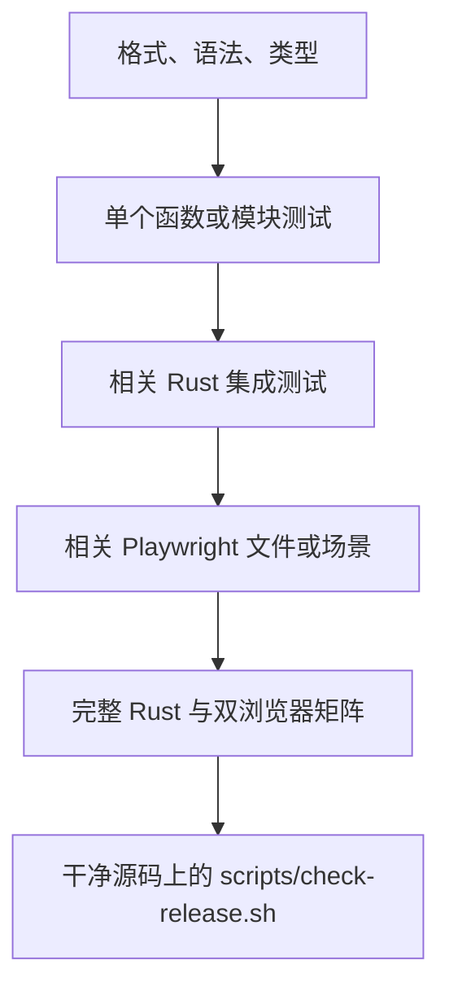

# 08. 测试、调试与安全改动工作流

本章回答一个维护者最实际的问题：改完代码以后，怎样证明它真的可用，而且没有破坏别的行为？

初学者容易走两个极端：要么只在浏览器里点一下就认为完成，要么每改一行都运行最慢的完整门禁。更有效的方法是把检查分层：先用几秒钟得到最直接的反馈，再逐步扩大到模块、协议、浏览器和完整工程。

读完本章后，你应该能够：

- 区分格式检查、静态分析、单元测试、集成测试和浏览器测试；
- 只运行与当前改动相关的测试，并能进一步定位到单个用例；
- 理解 Rust fixture 和 Playwright fixture 为何不会操作真实共享目录；
- 使用后端日志、浏览器 DevTools 和 Playwright trace 定位问题；
- 按固定顺序完成一次低风险修改；
- 理解日常、集成和发行检查各自验证什么。

## 8.1 测试不是一个命令，而是一组不同证据

每种检查回答的问题不同：

| 层级 | 主要回答的问题 | 典型耗时 | 是否启动真实 Dufs |
| --- | --- | --- | --- |
| 格式与编译检查 | 代码能否被工具正确理解 | 短 | 否 |
| JavaScript/文档静态门 | 是否触碰危险 API、类型是否收窄、链接是否有效 | 短 | 否 |
| Rust/Node 单元测试 | 一个函数或状态分类器是否正确 | 短到中 | 通常否 |
| Rust 集成测试 | CLI、HTTP、文件系统和进程组合后是否正确 | 中 | 取决于目标；HTTP/进程测试通常会，CLI/参数测试可以不启动 |
| Playwright 测试 | 用户在真实浏览器里的完整流程是否正确 | 中到长 | 是，并经过测试 HTTPS 网关 |
| 覆盖率、部署和完整门禁 | 工程级约束是否全部满足 | 长 | 是，多种方式 |

这不是“越靠下越好”的排名。一个 TypeScript 类型错误应该先由类型检查指出，而不是等 Playwright 在页面初始化时失败；一个真实浏览器焦点问题也不可能只靠 Rust 单元测试证明。

可以把日常反馈环想成一个漏斗：



越早发现问题，修复成本通常越低。因此先跑靠上的小检查，通过后再向下扩大。

## 8.2 首次准备测试环境

Rust 工具链由 [rust-toolchain.toml](../../rust-toolchain.toml) 固定为 1.98.0，并包含 Rustfmt 和 Clippy。先确认版本：

```sh
rustc --version
cargo --version
```

安装锁定的 Node 开发依赖：

```sh
npm ci
```

安装 Chromium 和 Firefox 测试浏览器：

```sh
npm run test:frontend:install
```

如果 Playwright 报告缺少 Linux 系统库，应根据它的诊断安装依赖。在 Playwright 支持的发行版上，可以使用具有系统管理权限的命令：

```sh
npx playwright install-deps chromium firefox
```

覆盖率和完整门禁还需要额外 Cargo 工具：

```sh
cargo install cargo-audit --version 0.22.2 --locked
cargo install cargo-llvm-cov --version 0.8.6 --locked
```

日常修改并不要求每次都运行覆盖率或依赖审计。先安装它们，是为了准备最终工程级检查。

首次安装 Rust/npm 依赖和 Playwright 浏览器通常需要网络；Cargo 审计还需要 RustSec，并须先取得锁图所需的 crates.io 索引项，`npm audit` 要访问 npm registry。正式发布只允许 cargo-audit 0.22.2。宿主 RustSec DB 只有在 canonical origin、`HEAD=FETCH_HEAD`、实体 FETCH_HEAD 不得比当前时间早超过 7 天或晚超过 300 秒，并通过物理/Git/内容完整性检查后才能复用；alternates、不安全元数据、symlink/submodule/特殊项、untracked 路径和 tracked 内容/mode 漂移都会拒绝。合格数据库以无硬链接私有 clone 封存 revision、fetch epoch、index/config 校验和；不合格、过期或缺失时，在运行任何项目或依赖代码前用 dummy lockfile 在私有数据库联网刷新，断网即失败关闭。发布入口先执行 `cargo audit --db ... --no-fetch --no-yanked` sealed advisory pre-audit，再用私有 Cargo home 执行 `cargo fetch --locked` 取得完整锁图所需的 crates.io 索引项，并以 `--deny yanked` 拒绝已撤回依赖；空索引不能作为成功审计。随后 `DUFS_QUALITY_AUDIT_DB` 把同一封存交给 `scripts/check.sh`。封存时校验 seal 与新鲜度，pre-audit 和 yanked 检查后重验 seal；完整门后重验 seal 与新鲜度，随后销毁质量树和该 RustSec 数据库。普通本地检查若要离线执行，必须预热或提供相应缓存/镜像并预先安装相容的 Chromium、Firefox；正式 yanked 检查使用每次全新创建的私有 Cargo home，当前仍要求 registry 网络可达，宿主缓存不能替代这一步；不能把“命令已经安装”误解为所有审计和浏览器门禁一定能离线运行。

所有 npm 脚本及锁定版本都可以在 [package.json](../../package.json) 和 [package-lock.json](../../package-lock.json) 中找到。生产前端没有 Node 打包步骤；这里安装的是检查和测试工具，不是服务器运行依赖。

## 8.3 最短反馈环

### Rust 改动

先运行：

```sh
cargo fmt --all --check
cargo check --locked
```

- `cargo fmt --check` 只检查格式，不改文件；
- `cargo check` 完成类型检查和大部分编译工作，但不生成可运行的最终二进制，通常比 `cargo build` 快；
- `--locked` 要求使用现有 [Cargo.lock](../../Cargo.lock)，不会悄悄重新解析依赖版本。

如果改动只涉及一个小模块，接下来应运行该模块的单元测试或最相关的集成测试，而不是立即跑全部浏览器测试。

### JavaScript、HTML 或 CSS 改动

先运行：

```sh
npm run check:js
npm run check:types
npm run test:frontend:unit
```

如果修改了 Markdown，再加上：

```sh
npm run check:docs
```

HTML/CSS 修改通常还需要一个相关 Playwright 场景，因为静态检查不能证明布局、焦点、键盘操作或高对比度模式正确。

### 只改文档

```sh
npm run check:docs
git diff --check
```

`git diff --check` 会发现尾随空格、错误的空白行等问题。它不会判断文档内容是否与代码一致，行为描述仍需要人工对照实现和测试。

还要注意：普通 `git diff` 和 `git diff --check` 不包含未跟踪新文件。本项目的 `check:docs` 会扫描文档树中的新 Markdown，因此能检查本教程这类未跟踪文档；仍应配合 `git status --short` 确认所有新文件都在预期范围内。

## 8.4 Rust 单元测试与集成测试

### 单元测试是什么

Rust 单元测试通常写在被测模块内部的 `#[cfg(test)] mod tests` 中。它们可以访问模块的私有函数和类型，适合验证：

- 状态转换；
- 边界值和解析器；
- 路径、身份和协议类型；
- 故障注入后的局部行为；
- 不需要真实 TCP 进程的内部协调逻辑。

例如状态 actor 的测试与实现位于 [src/server/state_store.rs](../../src/server/state_store.rs) 和 [src/server/state_store](../../src/server/state_store)；上传内部测试位于 [src/server/upload/tests.rs](../../src/server/upload/tests.rs)。

运行全部 Rust 单元和集成测试：

```sh
cargo test --locked --all-targets --all-features
```

运行名称中包含某段文字的测试：

```sh
cargo test --locked --lib readiness_probe -- --nocapture
```

`--nocapture` 会显示测试写到 stdout/stderr 的内容。测试 panic 时还可以增加回溯：

```sh
RUST_BACKTRACE=1 cargo test --locked --lib readiness_probe -- --nocapture
```

### 集成测试是什么

[tests](../../tests) 根目录下的每个 `.rs` 文件通常是一个独立集成测试 target。它从外部使用库；涉及 HTTP、文件系统和生命周期的 target 通常启动真正的 `dufs` 子进程，而 [tests/cli.rs](../../tests/cli.rs) 和 [tests/args.rs](../../tests/args.rs) 中的一部分用例只验证命令或参数，不启动服务器。因此是否有真实进程要看具体 fixture，而不能只看文件位于 `tests/`：

- [tests/args.rs](../../tests/args.rs)：CLI 和状态目录校验；
- [tests/auth.rs](../../tests/auth.rs)：登录、Cookie、CSRF 和会话；
- [tests/http.rs](../../tests/http.rs) 与 [tests/http](../../tests/http)：薄入口以及按 listing、download、upload、delete、resumable upload 拆分的 HTTP 行为；
- [tests/browser_api.rs](../../tests/browser_api.rs) 与 [tests/browser_api](../../tests/browser_api)：薄入口以及按 create、durability、jobs、relocation、request validation、upload preflight 拆分的浏览器 API 行为；
- [tests/pagination.rs](../../tests/pagination.rs)：分页快照与 cursor；
- [tests/range.rs](../../tests/range.rs)：单段 Range 下载；
- [tests/health.rs](../../tests/health.rs)：liveness 和 readiness；
- [tests/shutdown.rs](../../tests/shutdown.rs)：进程信号与优雅停机。

只运行一个集成测试文件：

```sh
cargo test --locked --test health -- --nocapture
```

只运行其中一个精确用例：

```sh
cargo test --locked \
  --test browser_api \
  'relocation::rename_directory_within_its_parent' \
  -- --exact --nocapture
```

测试放入子模块后，`--exact` 必须使用 `模块名::函数名` 的完整名称；只写叶子函数名会匹配零个测试但仍可能正常退出。因此修改测试目录后应先用 `-- --list` 核对完整名称。

如果测试使用 `rstest` 参数化，同一个 Rust 函数可能展开成多个带后缀的实际用例。此时先列出名称：

```sh
cargo test --locked --test args -- --list
```

再用实际名称或不带 `--exact` 的过滤词运行。

### Rust fixture 如何隔离真实数据

公共 fixture 位于 [tests/support/fixtures.rs](../../tests/support/fixtures.rs)。`server` fixture 会：

1. 创建临时共享根并写入样例文件；
2. 创建权限为 `0700` 的临时 state-dir；
3. 用 `-p 0` 让操作系统分配动态端口；
4. 未显式配置时加入测试账号；
5. 未显式配置时把 `min-free-space` 设为 0；
6. 启动真实测试二进制并自动登录；
7. fixture 销毁时停止子进程并删除临时目录。

因此普通集成测试不应写入开发者的真实共享目录。新增测试时优先复用 fixture，不要硬编码 `/srv/dufs`、5000 端口或个人目录。

测试账号和固定密码只属于测试环境。不要把 [fixtures.rs](../../tests/support/fixtures.rs) 中的 PHC、Cookie 处理或账号配置复制到生产配置。

## 8.5 Node 前端单元测试

Node 单元测试按模块位于 `tests/frontend/unit/*.test.mjs`，例如 [upload_protocol.test.mjs](../../tests/frontend/unit/upload_protocol.test.mjs) 和 [http_client.test.mjs](../../tests/frontend/unit/http_client.test.mjs)。它们不启动浏览器，主要直接导入纯 JavaScript 模块，验证：

- 上传响应状态矩阵；
- preflight 与 revision 解析；
- 上传队列和历史上限；
- mutation 失效分类；
- Problem Details 和响应头权威性；
- unknown 结果不会触发自动写重试。

运行全部 Node 单元测试：

```sh
npm run test:frontend:unit
```

只运行名称匹配的用例：

```sh
node --test \
  --test-name-pattern='upload preflight' \
  tests/frontend/unit/upload_protocol.test.mjs
```

适合放入 Node 单测的代码通常具有这些特征：输入是普通对象、字符串或数字，输出是分类结果或新对象，不依赖真实 DOM、网络和文件选择器。需要检查焦点、表格、对话框或浏览器 API 时，应使用 Playwright。

## 8.6 JavaScript 类型、安全与文档检查

### `check:js`

```sh
npm run check:js
```

[scripts/check-js.mjs](../../scripts/check-js.mjs) 运行固定版本的 ESLint 核心规则和 Mozilla `no-unsanitized` 规则，检查语法、基础格式以及项目禁止的常见危险模式，例如动态 HTML 注入、`eval`、浏览器原生模态弹窗和越过所属模块直接使用 `fetch`/XHR。少量策略单测验证这些常见误用会失败，并验证两个网络传输模块仍可使用各自原语；静态规则不承担识别故意构造的跨过程别名或完整污点分析。

这个门禁是项目专用的 ESLint 策略，不是完整的污点分析，也不能替代代码审查。

### `check:types`

```sh
npm run check:types
```

该脚本使用 TypeScript 的：

```text
allowJs + checkJs + strict + noEmit
```

检查 [web/index.js](../../web/index.js)、[web/login.js](../../web/login.js) 和 [web/modules](../../web/modules) 下的生产 JavaScript。它不会生成任何文件。外部数据应该先保持为 `unknown`，经类型守卫验证后再使用；用 `any` 绕开问题会破坏这一层的意义。

类型通过只证明静态模型一致，不证明服务器实际按该协议返回。协议关键路径还需要 Node 单测、Rust测试和浏览器测试交叉覆盖。

### `check:docs`

```sh
npm run check:docs
```

[scripts/check-docs.mjs](../../scripts/check-docs.mjs) 会递归检查项目 Markdown，包括：

- 本地链接目标是否存在；
- Markdown 标题锚点是否存在；
- 链接是否越出文档根；
- 文档树中是否混入符号链接；
- 文本格式是否符合项目约定。

代码围栏里的示例链接不会被误当成真实链接。新增或重命名教程文件后，应立即运行这一项，否则导航页中的断链可能直到完整门禁才出现。

## 8.7 Playwright 浏览器测试

Playwright 验证的是“真实页面 + 真实浏览器 + 真实 Dufs 进程”的组合行为。

### 运行方式

默认运行 Chromium 和 Firefox：

```sh
npm run test:frontend
```

显示浏览器窗口：

```sh
npm run test:frontend:headed
```

只运行 Chromium 中的一个测试文件：

```sh
npm run test:frontend:headed -- \
  --project=chromium \
  tests/frontend/operations.spec.js
```

再缩小到名称匹配的场景：

```sh
npm run test:frontend:headed -- \
  --project=chromium \
  tests/frontend/operations.spec.js \
  --grep '新建文件夹'
```

启用 Playwright Inspector：

```sh
npm run test:frontend:headed -- \
  --project=chromium \
  --debug \
  tests/frontend/operations.spec.js
```

已安装正式 Microsoft Edge 时，可以额外运行：

```sh
npm run test:frontend:edge
```

Edge 是可选扩展；Chromium 和 Firefox 才是仓库要求的基本矩阵。

### 浏览器测试文件如何分工

| 文件 | 重点 |
| --- | --- |
| [auth.spec.js](../../tests/frontend/auth.spec.js) | 登录、Cookie、注销和登录卡片 |
| [browse.spec.js](../../tests/frontend/browse.spec.js) | 列表、分页、搜索、排序、下载和大目录 DOM 上限 |
| [operations.spec.js](../../tests/frontend/operations.spec.js) | 新建、行内重命名、移动、删除、覆盖和 unknown 协调 |
| [upload.spec.js](../../tests/frontend/upload.spec.js) | preflight、PUT/PATCH、冲突、重试、取消、队列和续传 |
| [accessibility.spec.js](../../tests/frontend/accessibility.spec.js) | 键盘、语义、焦点、固定操作列、缩放、高对比度和 axe |

视觉变化不能只运行 `browse.spec.js`。如果变化涉及按钮、对话框、行内输入或布局，还应运行 `accessibility.spec.js` 中的相关场景。

### 测试服务器和浏览器 fixture

[tests/frontend/run.mjs](../../tests/frontend/run.mjs) 为每个浏览器项目分配临时端口，然后启动 Playwright。Playwright 配置 [playwright.config.js](../../playwright.config.js) 再启动 [tests/frontend/server.mjs](../../tests/frontend/server.mjs)：

```text
Playwright 浏览器
        │ HTTPS
        ▼
Node 测试网关（动态外部端口）
        │ HTTP/1.1
        ▼
Dufs 测试进程（动态后端端口）
        │
        ├── 临时共享根
        └── 临时 state-dir
```

测试服务器使用固定的 localhost 测试证书，建立 1 个测试账号并写入若干种子文件。正常退出时它会删除临时共享根和状态目录；SIGKILL、主机崩溃或某些早期启动失败仍可能遗留 `/tmp/dufs-frontend-runner-*`、`/tmp/dufs-frontend-test-*`、`/tmp/dufs-frontend-state-*`。确认没有对应测试进程、核对属主和精确路径后才能清理这些残留。该证书、私钥、账号和数据都不能用于生产；生产部署边界请直接阅读[第 9 章](09-deployment-security-and-operations.md)。

[tests/frontend/fixtures.js](../../tests/frontend/fixtures.js) 会为每个测试创建形如 `/pw-0-<UUID>` 的独立目录。新增用例时应使用 `appPage` fixture 和它提供的帮助函数，不要让两个测试依赖同一个可变文件名。

当前配置在 [playwright.config.js](../../playwright.config.js) 中规定：

- 单 worker 串行执行，避免经同一测试网关的登录互相争抢生产令牌桶；
- 单测试 30 秒，断言等待 8 秒；
- 失败重试一次以收集诊断；
- `failOnFlakyTests: true`。

最后一点很重要：第一次失败、重试成功仍会使门禁失败。重试不是用来掩盖不稳定测试的。

### 查看失败 trace

失败后先找 trace：

```sh
find test-results -name trace.zip -print
```

再打开具体文件：

```sh
./node_modules/.bin/playwright show-trace \
  test-results/具体测试目录/trace.zip
```

trace 可以查看每一步的 DOM、截图、网络请求和控制台输出，通常比反复盯着终端错误更容易发现“按钮其实被遮住”“请求发了两次”或“页面在断言前已经刷新”。

## 8.8 日志、浏览器 DevTools 与协议证据

### 后端日志

开发时让 Dufs 在前台运行，可以直接看到启动错误和访问日志。测试 panic 或 Rust 错误链难以定位时使用：

```sh
RUST_BACKTRACE=1 cargo test --locked --lib 测试过滤词 -- --nocapture
```

如果目标在集成测试中，把 `--lib` 换成明确的 `--test <target>`。只写一个名称过滤词会过滤运行的用例，但 Cargo 仍可能编译较广的测试 targets；显式选择 target 才能同时缩小编译范围。

项目的自定义 logger 固定输出 INFO 及更高等级，不通过 `RUST_LOG=debug` 开启调试日志，见 [src/logger.rs](../../src/logger.rs)。访问日志支持把请求、用户、状态以及 operation ID/state 放在同一行。日志内容和运行参数见 [src/http_logger.rs](../../src/http_logger.rs) 与 [README](../../README.md#访问日志)。生产日志的保存、轮转和服务管理属于部署主题，见[第 9 章](09-deployment-security-and-operations.md)。

测试输出很少时，不要立刻在生产代码到处添加永久日志。先使用 `--nocapture`、已有访问日志和更小的测试过滤器；确认缺少关键诊断后，再添加不会泄露密码、Cookie、CSRF、完整文件内容或内部绝对路径的有界日志。

### 浏览器 DevTools

前端问题至少检查 Console 和 Network 两个面板。

Console 重点看：

- 页面初始化异常；
- 未处理 Promise rejection；
- CSP 违规；
- 模块加载 404；
- 浏览器 API 类型错误。

Network 重点看：

- 请求方法和 URL 是否符合预期；
- 是否意外发送了两次写请求；
- HTTP 状态和 `Content-Type`；
- Problem Details 的 `code`、`recovery` 和状态；
- `X-Dufs-Operation-Id`、`X-Dufs-Operation-State`；
- 上传的 ID、length、offset 和 state 响应头；
- 请求是在发送前取消，还是发送后结果未知。

不要只看页面上的一句错误提示。页面提示经过了协议分类，Network 中的状态码、权威响应头和有界错误体才是定位客户端与服务端分歧的关键证据。

## 8.9 常见测试失败如何定位

| 现象 | 常见原因 | 首先检查 |
| --- | --- | --- |
| `cargo check` 编译错误 | 类型、生命周期、feature 或模块路径错误 | 从第一个编译错误开始修，不要先处理后续连锁错误 |
| Rust 报 `No space left on device` | `target`、trace 或其他构建产物占满文件系统 | 先用 `df -h .` 和 `du -sh target test-results` 确认位置；共享工作区中不要未经确认就清理他人的产物 |
| Clippy 报 warning | 代码虽然能编译，但违反项目 lint 基线 | 按 warning 所在行理解原因，不要随意加 `allow` |
| `cargo test` 单个集成文件失败 | HTTP、进程、路径或临时状态行为变化 | 用 `--test 文件名`、精确测试名和 `--nocapture` 缩小 |
| 测试提示端口占用 | 手工服务占端口，或残留进程 | 普通 fixture 应用动态端口；检查是否硬编码了 5000 |
| state-dir 权限错误 | 手写测试目录不是当前用户所有或不是 0700 | 优先复用 fixture，不要在测试中共享固定 state-dir |
| `npm ci` 报 lockfile 不一致 | `package.json` 与 `package-lock.json` 漂移 | 有意识更新并审查 lockfile，不要直接删除它 |
| `check:types` 大量连锁错误 | 某个 JSDoc 类型或守卫首先失效 | 从第一处 `unknown` 未收窄或返回类型变化开始 |
| `check:js` 报危险入口 | 使用了项目禁止的 DOM、网络或模态 API | 使用现有 `shared/dom.js`、`http/client.js` 或批准的 transport 边界 |
| `check:docs` 报链接不存在 | 文件改名、相对层级错误或目标章节尚未创建 | 从报错文档所在目录重新计算相对路径 |
| Playwright 找不到浏览器 | 浏览器二进制尚未安装 | `npm run test:frontend:install` |
| Playwright 启动即失败 | 缺系统库、测试 HTTPS 端口失败或 debug 二进制未构建 | 查看 webServer 输出，再单独运行相关准备命令 |
| Chromium 过、Firefox 失败 | 使用了浏览器差异 API、焦点/下载/事件时序不同 | 单独用 `--project=firefox --headed` 重现 |
| 首轮失败、重试通过但整体失败 | `failOnFlakyTests: true` | 看首轮 trace，修复竞态或不稳定断言 |
| 页面仍是修改前样式 | 前端已嵌入旧二进制或旧页面未刷新 | 重新 Cargo 构建、重启测试服务、刷新页面 |
| health 测试通过但写测试失败 | liveness 不证明共享根和 SQLite 可写 | 运行 readiness/相关写测试；概念见第 5 章 |
| 操作返回 `unknown` 后测试期望重试 | 测试错误地把“不知道”当成“失败” | 先查询原 operation/upload ID，不能盲目重放 |

定位时遵守“先找最小失败边界”：

1. 编译失败，先不要看浏览器；
2. 纯函数单测失败，先不要看集成测试；
3. Rust HTTP 测试通过而浏览器失败，重点看前端状态和 DOM；
4. 两个浏览器只有一个失败，重点看标准兼容、焦点、下载和事件时序；
5. 单独运行通过、全套并行失败，重点找共享固定路径、账号、端口或全局状态。

## 8.10 日常、集成与发行检查

日常开发入口是：

```sh
./scripts/check.sh
```

[scripts/check.sh](../../scripts/check.sh) 会依次执行：

- 必需工具检查，并在任何耗时步骤前把 [.node-version](../../.node-version) 的精确单行内容及实际 `node --version` 同时锁定到 26.7.0；
- 在 Git 工作区自动发现 `scripts/` 与 `tests/` 中未忽略的 Shell 源；在已验证且不含 `.git` 的发行归档中扫描同一目录，逐文件执行 Bash 语法检查，并在可用时运行 ShellCheck；
- 工作流权限策略、Rustfmt、JavaScript 安全、文档和依赖边界等轻量检查；
- Web 构建、strict 类型与 Node 单测；
- Clippy 和全 targets/features Rust 测试；
- Git 空白检查。工作树可以包含正在开发的修改。

真实部署和浏览器验收使用 `./scripts/check-integration.sh`。它从 Cargo 的结构化构建结果取得本次实际生成的候选路径，支持 `CARGO_TARGET_DIR`，并把同一候选显式传给浏览器 runner；`--deployment-self-test` 才额外运行检查器自身的清理故障注入。非法参数会在任何自测或构建之前退出。

干净提交上的正式发行入口是 `./scripts/check-release.sh`。它增加审计、覆盖率、部署、打包自测、release binary、完整浏览器矩阵和 clean-tree 校验。完整发行门可能访问依赖与审计网络；受限环境必须预先准备锁定缓存和浏览器制品。

### 为什么只有发行门要求干净源码

`check-release.sh` 末尾执行的语义相当于：

```sh
git diff --check
git diff --cached --check
git status --porcelain
```

只要存在下列任意内容，完整脚本最终就返回非零：

- 未暂存修改；
- 已暂存但未提交的修改；
- 未被 `.gitignore` 忽略的未跟踪文件。

`target/`、`node_modules/`、`test-results/` 等被忽略的生成物不会仅因为存在就触发这条 clean-tree 失败。

日常 `check.sh` 不执行 clean-tree 断言；脏工作树只会在正式发行门中失败，因为发行证据必须对应一个可复现提交。

正确做法是：

1. 开发阶段运行本章列出的分层命令；
2. 用 `git status --short` 区分自己的改动和原有未提交改动；
3. 在获得提交权限并完成预提交检查后，把预期内容形成一个干净提交；
4. 在该干净提交或独立干净 checkout 上运行 `./scripts/check-release.sh`；
5. 若门禁失败，修复后重新形成干净源码，再完整运行。

不要为了让脚本显示绿色而删除、覆盖或重置别人的未提交改动。完整门禁要求干净树，不代表它授权清理工作区。

## 8.11 一次安全修改的标准工作流

下面是一套适合本项目的通用顺序。

### 第一步：把预期行为写成一句话

例如：

```text
点击 Rename 后在原名称位置编辑；进入编辑时不自动产生蓝色选区。
```

同时写清不应变化的行为：Enter、Tab、失焦、Escape、扩展名光标位置、焦点恢复和 Move 按钮都不能被意外改变。

### 第二步：查看现状和工作树

```sh
git status --short
git diff -- 相关文件
```

先识别已有修改，避免把他人的工作误当成自己需要重写的代码。`git diff` 不展示未跟踪新文件；若 `git status --short` 显示 `??`，还要直接打开该文件检查内容。

### 第三步：找到最接近的现有测试

```sh
rg -n 'Rename|重命名|selectionStart|selectionEnd' \
  assets tests src
```

如果已有场景，先确认它是否真正断言本次行为；如果没有，新增一个最小回归测试。修 bug 时，理想证据是测试在修复前能失败、修复后通过。

### 第四步：做最小实现修改

只改实现该行为必需的文件。不要在同一次修改中顺手重构不相关模块、改格式和调整文案，否则失败时很难判断原因。

### 第五步：跑最快静态检查

Rust：

```sh
cargo fmt --all --check
cargo check --locked
```

前端：

```sh
npm run check:js
npm run check:types
npm run test:frontend:unit
```

### 第六步：跑精确回归测试

以重命名 UI 为例：

```sh
npm run test:frontend:headed -- \
  --project=chromium \
  tests/frontend/operations.spec.js \
  --grep '进入原位编辑'
```

### 第七步：扩大到相邻风险

同一例子还会影响键盘和焦点，因此继续运行：

```sh
npm run test:frontend:headed -- \
  --project=chromium \
  tests/frontend/operations.spec.js

npm run test:frontend:headed -- \
  --project=chromium \
  tests/frontend/accessibility.spec.js
```

确认 Chromium 后再运行默认双浏览器矩阵：

```sh
npm run test:frontend
```

### 第八步：检查最终差异

```sh
git diff --check
git status --short
git diff -- 相关文件
```

这里同样要单独检查 `git status` 中的 `??` 新文件；它们不会出现在普通 `git diff` 或 `git diff --check` 中。

人工确认：

- 没有临时调试日志、测试账号或绝对路径；
- 没有意外生成的截图、trace、数据库或共享文件；
- 新文件都在预期范围内；
- 错误和 unknown 语义没有被“简化”为盲目重试；
- 文档、代码和测试描述的是同一行为。

### 第九步：运行与交付阶段对应的总门禁

完成分层验证并形成干净提交后：

```sh
./scripts/check.sh
# 准备发行时，在干净提交或独立干净 checkout 中运行：
./scripts/check-release.sh
```

这一步是最终汇总证据，不替代前面快速、可定位的反馈环。

## 8.12 按改动类型选择测试

| 改动类型 | 最小检查 | 相关回归 | 扩大范围 |
| --- | --- | --- | --- |
| 只改 Markdown | `check:docs`、`git diff --check` | 阅读链接目标 | 完整文档门 |
| Rust 纯函数/解析器 | fmt、check、模块单测 | 对应集成测试文件 | Clippy + 全 Rust |
| CLI/YAML | fmt、check | `tests/args.rs`、`tests/config.rs`、`tests/cli.rs` | 全 Rust |
| 登录/会话/CSRF | Rust 定向测试、JS 类型 | `tests/auth.rs`、`auth.spec.js` | 双浏览器 + 全 Rust |
| 列表/搜索/排序 | JS 安全、类型、Node 单测 | `tests/pagination.rs`、`browse.spec.js` | accessibility + 双浏览器 |
| 下载/Range | Rust定向测试 | `tests/http.rs`、`tests/range.rs`、`browse.spec.js` | 全 Rust + 双浏览器 |
| 新建/移动/重命名/删除 | Rust定向测试、JS类型 | `browser_api.rs`、`operations.spec.js` | accessibility + 双浏览器 |
| 上传协议或队列 | Rust定向测试、Node单测、JS类型 | `tests/http.rs`、`upload.spec.js` | 全 Rust + 双浏览器 |
| HTML/CSS/焦点/按钮布局 | JS安全、类型 | `accessibility.spec.js` 和相关业务 spec | Chromium + Firefox |
| state store、路径或持久性 | fmt、check、模块单测 | browser_api/http/shutdown 等故障测试 | 全 Rust、覆盖率、相关浏览器流程 |
| 部署样例或服务配置 | 文档和格式检查 | 按[第 9 章](09-deployment-security-and-operations.md)执行部署门 | `check-integration.sh`；发行前再跑 `check-release.sh` |

“最小检查”不是交付标准，而是最快反馈入口。改动越接近文件提交、崩溃恢复、认证或公开协议，越应该扩大测试范围。

## 8.13 完成定义

提交一项修改前，用下面的清单自查：

- [ ] 我能用一句话说明改变了什么、没有改变什么；
- [ ] 我检查过工作树，没有覆盖不相关修改；
- [ ] 静态检查和类型检查通过；
- [ ] 有一个测试直接证明新行为或 bug 不再发生；
- [ ] 相邻模块测试通过；
- [ ] 涉及页面时已验证 Chromium 和 Firefox；
- [ ] 涉及键盘、焦点或布局时已运行可访问性场景；
- [ ] 涉及写请求时保留幂等、冲突和 unknown 语义；
- [ ] 没有把测试证书、账号、临时路径或敏感值带入生产配置；
- [ ] `git diff --check` 通过，并已单独检查 `git status` 中不受该命令覆盖的新文件；
- [ ] 日常 `scripts/check.sh` 已通过；若准备发行，`scripts/check-release.sh` 已在干净源码上通过或明确记录尚未执行的原因。

好的测试工作流不是“运行最多的命令”，而是让每一种风险都由最合适、最容易解释的证据覆盖。
