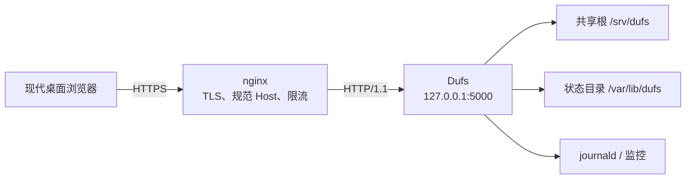

# 09. 部署、安全与日常运维

开发环境的目标是快速验证代码，生产环境的目标是长期、可恢复、可审计地管理真实文件。把开发命令直接复制到公网服务器，并不等于完成部署。

本章建立运维全景；精确的生产步骤、备份恢复和签名发布规则以仓库的[生产运维手册](../operations.md)为准。

## 9.1 推荐生产拓扑



核心边界：

- 浏览器只访问 HTTPS 网关；
- Dufs 默认只绑定回环地址；
- 认证始终忽略代理头；生产固定 HTTPS Origin，后端端口必须只对网关开放。
- 防火墙或 ACL 让后端端口仅可信网关可达；
- 一个 Dufs 实例管理一个共享根；
- 服务使用专用、低权限 Linux 账号；
- 状态目录不放在共享根中；
- 配置、TLS 私钥和状态库不对浏览器公开。

## 9.2 账号模型先讲清楚

当前账号只决定“能否登录”。每个配置账号登录后都可以浏览、上传、覆盖、移动、重命名和删除整个共享根。

因此它适合：

- 个人文件管理；
- 家庭或受控局域网中互相信任的用户；
- 所有登录者都应有完整权限的小团队。

它不适合直接充当：

- 不同客户互相隔离的多租户网盘；
- 有管理员、编辑者、只读者角色的文档系统；
- 对单目录做细粒度 ACL 的共享平台。

不能用“给每人创建不同账号”误以为已经获得目录隔离。需要这类能力时，应在更高层隔离实例、共享根和系统账号，或选择具有完整授权模型的产品。

## 9.3 文件与目录布局

一个典型布局：

```text
/opt/dufs/bin/dufs             已验证的可执行文件
/etc/dufs/dufs.yaml            配置
/etc/dufs/tls/                 TLS 证书和私钥（由 nginx 使用）
/srv/dufs/                     共享根
/var/lib/dufs/state.sqlite3    持久控制状态
```

建议用专用账号 `dufs:dufs`，并确保：

- `/srv/dufs` 只授予业务需要的读写权限；
- `/var/lib/dufs` owner 是服务用户、mode 精确 `0700`；
- `state.sqlite3` 最终为 `0600`；
- YAML 由 root 或服务 euid 拥有，精确使用 `0400/0440/0600/0640`、单硬链接且无扩展 POSIX access ACL；组读时 gid 必须匹配服务 egid；TLS 私钥同样不让无关用户读取；
- state-dir 与 serve-path 互不包含，也不通过别名落在一起。

systemd 样例通过 `StateDirectory=dufs` 与 `StateDirectoryMode=0700` 创建 `/var/lib/dufs`。

## 9.4 生产配置基线

[config/dufs.yaml.example](../../config/dufs.yaml.example) 是当前字段的起点：

```yaml
serve-path: /srv/dufs
state-dir: /var/lib/dufs
bind:
  - 127.0.0.1
port: 5000
auth:
  - 'admin:$argon2id$REPLACE_WITH_A_REAL_HASH'
log-format: '$time_iso8601 $log_level $remote_addr $remote_user "$request" $status operation_id=$operation_id operation_state=$operation_state'
max-upload-size: 107374182400
upload-idle-timeout: 60
upload-total-timeout: 86400
max-concurrent-uploads: 4
min-free-space: 1073741824
max-connections: 256
max-search-entries: 10000
max-concurrent-searches: 2
request-timeout: 300
```

### 参数不是越大越好

- 更大 `max-connections` 会增加 FD、内存和慢客户端暴露；
- 更大上传并发会增加磁盘竞争和空间预留；
- 更大搜索项上限会增加扫描、排序和快照内存；
- 更长 timeout 会允许合法慢操作，但也让资源占用更久；
- `min-free-space` 过小会让上传耗尽业务卷。

先根据磁盘、网络和同时在线人数做容量估算，再用监控验证。不要为了消除一个 `429` 或 `507` 就无限提高上限。

### YAML 为什么严格拒绝未知字段

如果新版本删除了某个安全参数，而 YAML 静默忽略它，操作者可能误以为限制仍生效。当前解析会对拼错或废弃字段启动失败，使配置漂移在上线前暴露；这不是旧字段兼容机制。

## 9.5 密码和会话

生成密码哈希：

```sh
/opt/dufs/bin/dufs hash-password
```

把完整 Argon2id PHC 放在 YAML 引号中，不保存明文。注意：PHC 虽不是明文，仍是可被离线尝试的敏感认证材料，应按密码数据库保护。

会话特征：

- 服务端内存会话；
- Cookie 使用 `Secure`、`HttpOnly` 和 `__Host-` 约束；
- Foundation Static Store 持有内存会话，重启全部失效；空闲期限 30 分钟、绝对期限 12 小时，每管理员最多 32 个活动会话、全局最多 1024 个。平台 HTTP Adapter 使用统一的 Unix 微秒时间；访问不延长绝对期限，存储拒绝倒退时间。会话和 CSRF 为 32 字节随机值，服务端只保留其摘要。恢复接口轮换 CSRF；其他页面仍使用旧 CSRF 写入时会失败关闭，客户端刷新并重新恢复，绝不重放未知结果的写入。
- 进程重启后用户需要重新登录；
- 写请求还需页面绑定的 CSRF token；
- 登录入口有应用内速率、并发、正文和密码计算限制。

nginx 的登录限流是额外一层，不能取代应用认证；应用限制也不能取代公网边界。

## 9.6 nginx 为什么不只是“加个证书”

仓库示例分为：

- [nginx-dufs.conf](../../deploy/nginx-dufs.conf)：server、TLS、规范域名、登录限流和 location；
- [dufs-proxy.conf](../../deploy/dufs-proxy.conf)：统一的回源头、HTTP/1.1、缓存/重试和 timeout 策略。

当前样例要求 nginx 1.25.1 或更高版本，编译时包含 HTTP SSL 与 HTTP/2 模块，并链接仍在上游或发行版安全维护期内的 OpenSSL；新部署优先选择 OpenSSL 3.5 LTS。每个 HTTPS `server` 块都只使用独立的 `http2 on;` 当前语法；项目不再为 nginx 1.24 或已弃用的 `listen ... http2` 写法保留兼容分支。切换流量前仍必须用目标主机上的 `nginx -t` 验证实际模块、证书路径和完整配置。

关键行为：

### 固定规范 Host

未知 HTTP Host 和 HTTPS SNI/Host 被默认 server 拒绝。HTTP 只跳到配置中的固定 HTTPS 域名，不用不可信 `$host` 构造开放重定向。

### 明确可信代理头

回源会覆盖：

```nginx
proxy_set_header Host $server_name;
proxy_set_header X-Forwarded-For $remote_addr;
proxy_set_header X-Forwarded-Host $server_name;
proxy_set_header X-Forwarded-Proto https;
```

生产模式固定要求 HTTPS Origin，并与唯一规范 Host/URI authority 和 `Sec-Fetch-Site: same-origin` 一致；不读取 Forwarded 或 X-Forwarded-* 来决定认证、scheme 或限流来源。nginx 必须终止 TLS、覆盖 Host 为规范域名，并通过防火墙、网络命名空间或精确 ACL 阻止客户端及不可信本机进程直连后端。仅显式 `--development` 允许 HTTP，且所有监听地址必须为 loopback；不能用于公网部署。

回环绑定不能区分 nginx 与其他本机进程；后端必须由进程隔离、网络命名空间或精确防火墙规则限制为仅可信网关可达。

### 禁止代理重放写请求

示例关闭：

```nginx
proxy_next_upstream off;
proxy_request_buffering off;
proxy_buffering off;
proxy_cache off;
```

网关不应因为一次上游错误自动把 PUT、PATCH、DELETE 发给另一个后端或重新发送。Dufs 自己的 Operation/upload ID 协议才能解释重复与 unknown。

### 长上传与响应边界

nginx 的正文大小、client body timeout、proxy send/read timeout 必须与业务最大上传和应用时限相容。限制不一致时，可能由网关在应用完成前中断连接。

## 9.7 为什么只支持 URL 根路径

当前资源、业务路径、内部 API、Cookie 和前端路由按站点根 `/` 设计。不支持把 Dufs 放在 `https://example.com/files/`。

正确做法是使用独立主机名，例如：

```text
https://files.example.com/
```

不要依靠一组未经完整测试的 nginx rewrite 把路径前缀剪掉；登录跳转、资源 URL、业务文件名和来源校验可能产生不一致。

## 9.8 systemd 做了什么

[deploy/dufs.service](../../deploy/dufs.service) 提供基线：

- 以 `dufs` 用户和组运行；
- `UMask=0077`；
- 自动创建私有 StateDirectory；
- 异常退出重启；
- `TimeoutStopSec=120s`；
- 只给 `/srv/dufs` 显式写入；
- 启用 `NoNewPrivileges`、`ProtectSystem=strict`、`PrivateTmp` 等沙箱；
- 清空 capability；
- 限制 namespace、内核、设备和可执行内存能力。

若修改共享根，必须同步修改：

1. YAML `serve-path`；
2. systemd `ReadWritePaths`；
3. 目录 owner/mode；
4. 备份和监控配置。

只改 YAML 而忘记 systemd 沙箱，服务会看见权限错误；只扩大 systemd 权限而忘记业务配置，又会无谓扩大进程能力。

还有两个容易漏掉的边界：

- 样例的 `ProtectHome=yes` 会隐藏 `/home`、`/root` 和 `/run/user`；单加 `ReadWritePaths` 不能把这些位置重新变成合适的共享根。优先把数据放在 `/srv` 等服务目录；若业务必须使用 home 路径，需要重新评估并调整 `ProtectHome`，同时记录安全取舍。
- 自定义 state-dir 时，要么同步使用合适的 `StateDirectory=` 让 systemd 在 `/var/lib` 下安全创建并授权，要么在部署阶段以正确 owner 和精确 `0700` 预建目录，并通过沙箱显式放行。只改 YAML 路径不够。

样例默认写 journald，没有放行 `/var/log`。若启用 `--log-file`，还要同步配置 `LogsDirectory=` 或精确的 `ReadWritePaths=`，确保目录/文件属主和 mode 满足 Dufs 的启动检查，并设计与验证轮转后重新打开文件的流程；不能只在 YAML 中填一个日志路径。

## 9.9 启动和配置验证

安装后先做静态验证：

```sh
systemd-analyze verify /etc/systemd/system/dufs.service
nginx -t
```

仓库开发环境还可以运行：

```sh
./scripts/check-deployment.sh
```

它不只做语法检查，还用真实 nginx 和 mock upstream 验证 Host、代理头、登录路由、重定向和重试边界；systemd 校验则把 `ExecStart` 换成占位可执行文件。这个脚本不会启动生产 systemd unit 与真实 Dufs/nginx 组合，所以不能替代下面的数据副本和 HTTPS 冒烟。

启动：

```sh
systemctl daemon-reload
systemctl enable --now dufs
systemctl enable --now nginx
systemctl reload-or-restart nginx
```

检查：

```sh
systemctl status dufs --no-pager
journalctl -u dufs -n 200 --no-pager
ss -ltnp
curl --noproxy '*' --connect-timeout 2 --max-time 10 --fail \
  http://127.0.0.1:5000/healthz
```

生产浏览器冒烟应通过 HTTPS 域名完成登录、ready、列表、上传、下载、移动和删除，而不是只看 systemd 是 `active`。

## 9.10 liveness 与 readiness

| 接口 | 认证 | 证明 | 不证明 |
| --- | --- | --- | --- |
| `/healthz` | 不需要 | HTTP 进程仍能响应 | 根目录或 SQLite 可写 |
| `/readyz` | 需要 | 根可创建/写/同步/删，SQLite 可开真实写事务后回滚，空间足够，未停机 | 每条业务请求一定被接受 |

所以 health 200、ready 503 是合理信号：进程还活着，但不应接收写流量。

负载均衡器若无法安全维护登录会话 Cookie，应只请求公开 health；另建受控的认证冒烟任务检查 ready。不要把账号密码塞进所有基础网络探针。

下面是一次交互式生产冒烟的 Bash 示例。它额外需要 `jq`，把管理员 username 和密码写入 mode `0600` 的临时文件并生成严格 JSON；curl 的进程参数只暴露文件路径，不暴露凭据内容。域名必须替换为真实站点，并正常校验证书：

```bash
(
  set -eu
  umask 077
  probe_dir="$(mktemp -d /tmp/dufs-ready.XXXXXXXX)"
  case "$probe_dir" in
    /tmp/dufs-ready.[A-Za-z0-9][A-Za-z0-9][A-Za-z0-9][A-Za-z0-9][A-Za-z0-9][A-Za-z0-9][A-Za-z0-9][A-Za-z0-9]) ;;
    *) printf 'Unexpected temporary path: %s\n' "$probe_dir" >&2; exit 1 ;;
  esac
  cleanup_probe() { rm -rf -- "$probe_dir"; }
  trap cleanup_probe EXIT

  command -v jq >/dev/null 2>&1 || { printf 'jq is required\n' >&2; exit 1; }
  IFS= read -r -p 'Dufs administrator username: ' probe_username
  IFS= read -r -s -p 'Dufs password: ' probe_password
  printf '\n'
  printf '%s' "$probe_username" > "$probe_dir/username"
  printf '%s' "$probe_password" > "$probe_dir/password"
  unset probe_username probe_password
  jq -n --rawfile username "$probe_dir/username" --rawfile password "$probe_dir/password" \
    '{username:$username,password:$password}' > "$probe_dir/login.json"

  curl --fail --silent --show-error \
    --connect-timeout 5 --max-time 30 \
    --cookie-jar "$probe_dir/cookies" \
    --header 'Accept: application/json' \
    --header 'Content-Type: application/json' \
    --header 'Origin: https://files.example.com' \
    --header 'Sec-Fetch-Site: same-origin' \
    --data-binary "@$probe_dir/login.json" \
    --output "$probe_dir/session.json" \
    https://files.example.com/api/v2/auth/login
  curl --fail --silent --show-error \
    --connect-timeout 5 --max-time 30 \
    --cookie "$probe_dir/cookies" \
    --header 'Accept: application/json' \
    https://files.example.com/readyz
)
```

第一条命令的 `session.json` 应为 Foundation 五字段 `AdministratorSession` 且 `role` 只能是 `admin`，第二条命令预期输出 `{"ready":true}`。自动探针应从只有探针进程可读的受控凭据源建立或更新会话，并控制登录频率，避免触发 Argon2 和登录限流预算。当前 Dufs 没有 readiness-only 或只读角色，任何管理员凭据都拥有共享根完整权限，因此必须把这项风险纳入设计；无法安全保存时就不要把它塞进通用负载均衡器。独立 ready 任务还必须接入告警或明确的摘流自动化，只记录一次 503 不会自动停止流量。

## 9.11 日志与 Operation ID

推荐访问日志包含：

```text
time level remote_addr remote_user request status operation_id operation_state
```

Operation ID 是连接“浏览器提示、HTTP 请求、状态库结果和服务日志”的关键线索。排错时记录：

- 精确时间和时区；
- 账号；
- 方法和规范路径，但避免泄露敏感文件名时要脱敏；
- HTTP status；
- operation/upload ID；
- operation/upload state；
- 网关与后端两侧是否都收到请求。

不要记录或分享：

- 明文密码；
- 完整 Argon2id PHC；
- 会话 Cookie；
- CSRF token；
- 私密文件内容；
- TLS 私钥。

文件日志会做 owner、普通文件、单硬链接等检查并设为 `0600`。轮转程序 rename 当前日志并在原配置路径创建新文件后，Dufs 会继续写已经打开的旧 inode，不会自动打开配置路径上的新文件；生产环境更适合 journald，或设计并验证明确的轮转/重启流程。

日志本身也不是无损审计数据库：文件 sink 或默认 stderr sink 使用容量 4096 的有界队列，拥塞时丢弃最新记录，并聚合输出 `log_queue_overloaded dropped_newest=...`。stdout 只保留启动监听地址。应监控这条告警；一旦出现，相关时间窗内的访问日志可能不完整，不能仅凭“没找到日志”断言请求未发生。

## 9.12 最低监控集合

至少监控：

- 进程重启和异常退出；
- HTTP `5xx`、`429`、`507`；
- 登录限流和失败趋势；
- 共享根与 state 卷磁盘空间；
- inode 使用率；
- 共享根挂载是否仍是预期设备；
- health 与独立 authenticated readiness；
- purge 长期积压或内部项异常增长；
- 备份年龄；
- 最近一次恢复演练结果和耗时。

只监控“端口能连”会漏掉最重要的只读挂载、SQLite 只读和磁盘耗尽。

## 9.13 备份要保存什么

至少包括：

- 共享根中的普通文件、目录、符号链接；
- numeric uid/gid、mode、ACL、xattr、硬链接关系；
- `/etc/dufs/dufs.yaml`；
- 状态目录；
- systemd、nginx、防火墙和备份任务配置；
- 当前二进制及其 checksum、签名、SBOM、构建环境和可信公钥材料；
- 备份时间点、Dufs 版本、共享根/state 快照身份和文件统计等可核验清单。

备份工具还要保留稀疏文件语义，避免把逻辑上很大但实际占用很小的文件意外膨胀。至少保留一份位于不同故障域的副本，并按威胁模型提供不可变或离线副本；同一磁盘上的可写副本不能抵御磁盘损坏、误删或入侵者同步删除。

会话只在内存中，不需要备份。

### 为什么共享根和状态目录要同一时点

SQLite 和文件系统没有共同事务。若先复制 DB，数小时后再复制共享根，上传 stage、purge outbox 和操作状态可能互相对不上。

首选：

- 同一受控时间点的存储快照；或
- 停止 Dufs，确认退出并冻结所有其他共享根写入者后，同时复制两个区域。

只停止 Dufs 不能约束 rsync、桌面同步工具或其他外部进程；仍有 writer 时，文件树和状态库就不再是同一静止时间点。

rollback journal 模式下，不要在活跃事务中只复制 `state.sqlite3` 主文件而忽略 journal。

### 不要过滤内部项

共享根里的上传 stage 和删除 trash 平时对用户隐藏，但备份工具若单独排除它们，恢复时可能让数据库控制状态找不到对应对象。备份应对整个受控时间点保持一致。

当内部 trash 的实际身份与持久记录不一致时，Dufs 会把它改名为 `.dufs-quarantine-<uuid>.hold`。该名称永不由 maintenance 或 orphan 扫描自动清理，也必须进入备份。发现它时先停止 Dufs，结合日志和状态库检查对象内容、owner 与来源；确认处置结论后再手工移除，不能在服务运行中把它当普通临时文件批量删除。

## 9.14 恢复比“备份命令成功”更重要

至少定期在隔离环境演练：

1. 校验备份清单、release checksum 和签名；
2. 恢复到新的空目录，不覆盖生产根；
3. 比较文件数、字节数和内容摘要抽样；
4. 核对 uid/gid、mode、ACL、xattr、符号链接和硬链接；
5. 为新根使用新的空 state-dir；
6. 启动并验证根锁、登录、分页、覆盖上传、下载、移动和删除；
7. 记录恢复点目标 RPO、恢复耗时 RTO 和缺失项。

新恢复根通常有不同 device/inode，不能强改旧数据库根绑定继续用。使用新 state-dir 意味着旧 Operation ID、上传检查点和 purge 控制状态丢失，应明确接受并人工处理遗留内部项。

## 9.15 新版本切换前检查

Dufs 每个版本都是一套新的 current-only 合同；运行服务不识别旧配置、旧 wire schema 或旧状态库，也不内置迁移。切换前先检查：

- 新版本当前 YAML、API、Foundation 管理员认证与页面合同；
- 新版本 nginx/systemd 样例、精确 AMD64 GNU target 及 Rust 1.98/Node 26.7.0 构建要求；
- 原状态是否需要转换；未来稳定版本如需要，必须交给 `sarmg-upgrade` 中已公开支持的精确迁移边并在停服副本上执行；
- 备份、恢复与转换失败后的回到原快照演练是否最新；
- 新制品版本、Git SHA、checksum、签名和 SBOM 是否可验证。

YAML 对未知字段严格拒绝，CLI 对未声明选项也统一拒绝。不要为了让旧调用方继续工作而在 Dufs 中增加 alias、fallback、自动探测或双写。

## 9.16 安全版本切换顺序

一个保守流程：

1. 在隔离环境用生产近似配置跑完整测试；
2. 校验签名制品和源码身份；
3. 记录原制品、配置、数据库 identity 和整组恢复条件；
4. 创建一致备份或快照；
5. 进入维护窗口，正常停止 Dufs；
6. 若 `sarmg-upgrade` 有明确支持且精确绑定 source/target 的转换边，则在副本验证后转换；否则只能从新版本当前格式初始化；
7. 原子切换制品和经过审查的当前配置；
8. 启动，检查 journal；
9. 验证 health 和 authenticated ready；
10. 经 HTTPS 完成关键业务冒烟；
11. 观察 5xx、unknown、空间与 purge 指标。

若 `sarmg-upgrade` 的精确转换边或新版本已经改变数据库或共享根，不能只把原二进制放回去就宣称恢复。恢复必须还原同一一致点的制品、配置、状态库和共享根；任何转换都不由 Dufs 运行服务承担。

## 9.17 优雅停机的运维意义

首次 SIGTERM 后，应用大致有 30 秒正常排空和 10 秒强制收尾边界；systemd 样例 `TimeoutStopSec=120s` 留出了应用退出及管理器余量。

不要把 systemd stop timeout 调成小于应用边界，否则管理器可能提前 SIGKILL。反过来，把它调得很大也不会延长应用自身硬截止。

停机期间可能存在已经越过提交点的操作。维护窗口应：

- 先停止入口流量；
- 发送正常 SIGTERM；
- 观察停机日志；只有 30 秒正常宽限耗尽或强制截止时，告警才会报告 `active_tasks`/`active_mutations`，正常排空期间没有持续任务计数日志；
- 等待退出；
- 只有在明确卡死并已保全现场时才改用强制终止。

## 9.18 事件响应原则

遇到数据库不匹配、内部文件异常、反复 unknown 或疑似数据丢失时：

1. 停止扩大影响，不盲目重启/重试/清理；
2. 记录时间、版本、Git SHA、operation/upload ID 和日志；
3. 保全共享根、state-dir 和 journal 的一致快照；
4. 确认挂载、空间、inode、owner/mode 与系统日志；
5. 在副本或隔离环境分析；
6. 不手工修改 SQLite 状态骗过启动校验；
7. 不按文件名猜测删除内部 stage/trash；
8. 按[运维文档的事件响应流程](../operations.md#8-事件响应)私密处理安全漏洞。

“先保全证据”通常比“先把服务变绿”更能避免二次破坏。

## 9.19 常见生产故障

| 现象 | 常见原因 | 优先检查 |
| --- | --- | --- |
| 服务启动但浏览器登录循环 | 非 HTTPS、Host/Origin 不一致或 Cookie 被拒绝 | 生产 HTTPS、规范 Host、浏览器 Cookie 与 Origin；开发必须显式启用且仅 loopback |
| health 200、ready 503 | 根/SQLite 不可写、空间不足、正在停机 | journal、权限、挂载、`df -h`、inode |
| 第二实例启动失败 | 同一共享根的 flock 已被持有 | 现有进程和根真实路径 |
| 写请求普遍 403 | CSRF 或 Origin/代理头不一致 | nginx snippet、后端是否被直连 |
| 上传 507 | 最低空间水位或预留失败 | 目标卷空间、并发上传预留 |
| 频繁 429 | Dufs 的上传、目录列表/搜索、普通 mutation/登录预算耗尽，或 nginx 登录请求率/连接限制命中 | 同时检查 nginx access/error log 与 Dufs 日志，定位实际返回层和具体限制 |
| 修改 CSS/JS 不生效 | 仍运行旧嵌入资源二进制 | 重编译、重启、资源摘要 URL |
| 删除后空间未立刻释放 | purge worker 尚未完成或反复失败 | 日志、内部项、I/O 错误 |
| state DB root mismatch | 把旧数据库接到新根 | 停服保全，使用新空 state-dir |
| operation 显示 unknown | 响应或持久化跨提交点失败 | 原 ID 查询、目录刷新、日志，不盲目重放 |

## 9.20 上线检查表

### 身份和边界

- [ ] 所有登录账号都应拥有整个共享根完整权限；
- [ ] 使用专用 Linux 用户；
- [ ] 后端只绑定回环或受 ACL 保护的私网地址；
- [ ] 浏览器只能通过 HTTPS；
- [ ] 固定规范域名和可信代理头；
- [ ] 不部署在 URL 子路径。

### 文件和状态

- [ ] 共享根、state-dir 互不包含；
- [ ] state-dir owner 正确、mode `0700`；
- [ ] systemd `ReadWritePaths` 与 YAML 一致；
- [ ] 最小空闲空间和上传并发符合目标卷容量；
- [ ] 已验证同一根只能启动一个实例。

### 运行

- [ ] `systemd-analyze verify` 和 `nginx -t` 通过；
- [ ] health 与 authenticated ready 通过；
- [ ] 登录、列表、上传、下载、移动、重命名、删除冒烟通过；
- [ ] 日志能关联 operation ID；
- [ ] 监控 5xx/429/507、空间、inode 和重启。

### 恢复

- [ ] 共享根与 state-dir 有一致备份方案；
- [ ] 制品 checksum/签名和可信公钥可用；
- [ ] 已在隔离环境完成恢复演练；
- [ ] 已记录版本切换、整体恢复和制品回退条件。

下一章提供完整源码阅读计划、术语表和常见问题，帮助把前九章串成长期维护能力。
