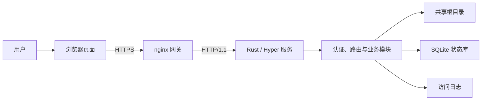

# Dufs 从零读懂：新手教学手册

这套文档面向第一次接触 Rust Web 项目、异步服务或文件系统安全的读者。目标不是让你背完所有源码，而是让你能够回答下面四个问题：

1. Dufs 启动后到底创建了什么，又如何接收一个 HTTP 请求？
2. 浏览、下载、上传、移动、重命名和删除分别经过哪些模块？
3. 为什么项目需要 SQLite、路径租约、对象身份和“结果未知”状态？
4. 修改代码后，怎样证明功能、安全边界和故障语义没有被破坏？

文档只描述**当前工作区源码（Cargo 版本 0.50.2）**。产品运行时、页面、配置和教程不提供其他版本合同；未来稳定版本若需要处理非当前数据，只能使用 `sarmg-upgrade` 中精确绑定 source/target 并独立审核的迁移 adapter、fixture 与 CLI，不能据历史标签推断当前行为。

## 适合谁阅读

- 只写过一点脚本，希望理解完整 Web 项目的初学者；
- 会 JavaScript，但不熟悉 Rust、Hyper 或 Tokio 的前端开发者；
- 会 Rust，但不熟悉浏览器上传、Linux 文件系统或 SQLite actor 的后端开发者；
- 准备维护、部署、排错或二次开发本项目的人。

阅读前不要求会 Rust，但最好知道“文件、目录、进程、端口、浏览器请求”这些基本概念。遇到陌生词时，可以先查[术语表](10-reading-roadmap-and-glossary.md#108-术语表)，再回到当前章节。

## 推荐阅读顺序

| 顺序 | 文档 | 读完后你会知道 |
| --- | --- | --- |
| 1 | [项目全景](01-project-overview.md) | 产品边界、整体架构、主要目录和一次操作经过哪些层 |
| 2 | [环境准备与第一次运行](02-environment-and-first-run.md) | 如何编译、生成密码、准备目录、启动和验证服务 |
| 3 | [本项目需要的 Rust 与 Web 基础](03-rust-and-web-basics.md) | `Result`、`Arc`、`async`、HTTP 方法、状态码等源码必备知识 |
| 4 | [后端请求完整旅程](04-backend-request-lifecycle.md) | 从 TCP 连接到 Router、认证、业务处理和响应的调用链 |
| 5 | [文件系统、状态与可靠性](05-filesystem-state-and-reliability.md) | `openat2`、路径身份、SQLite actor、删除 outbox 和未知结果 |
| 6 | [前端页面与交互](06-frontend-guide.md) | 页面如何启动、加载列表、显示固定操作列和刷新状态 |
| 7 | [上传协议逐步拆解](07-upload-protocol.md) | 预检、PUT、PATCH、覆盖确认、断点续传和故障恢复 |
| 8 | [测试、调试与安全改动](08-testing-debugging-and-change-workflow.md) | 如何运行检查、定位问题、写测试并完成一次低风险修改 |
| 9 | [部署、安全与日常运维](09-deployment-security-and-operations.md) | nginx、systemd、健康检查、备份和 current-only 版本切换的职责边界 |
| 10 | [源码阅读路线与术语表](10-reading-roadmap-and-glossary.md) | 分阶段读源码、练习、常见问题和术语速查 |

如果只想完成某个任务，也可以走短路线：

- **只想先运行起来**：读第 1、2 章；
- **只改页面**：读第 1、3、6、8 章；
- **只改后端 API**：读第 1、3、4、5、8 章；
- **只研究上传**：读第 1、5、6、7 章；
- **准备生产部署**：至少读第 1、2、5、8、9 章，再读仓库的[生产运维手册](../operations.md)。

## 学习时使用的三个视角

同一段代码可以从三个视角理解：

### 产品视角

用户看到的是“登录、打开目录、上传一个文件”。产品视角关心能做什么、不能做什么，以及失败时向用户表达什么。

### 请求视角

浏览器把操作转换成 HTTP 请求。请求视角关心路由、认证、CSRF、请求体、超时、响应状态和错误结构。

### 持久化视角

最终变化发生在共享目录和 SQLite 状态库中。持久化视角关心路径是否仍指向原对象、操作是否已经越过提交点、崩溃后如何判断结果。

阅读每章时都可以问：“这段说明属于哪个视角？”这样不容易把页面提示、HTTP 状态和磁盘事实混为一谈。

## 最小架构图



开发测试会使用一个 Node.js HTTPS 代理模拟网关；生产运行不需要 Node.js。HTML、CSS 和原生 ES modules 在编译时嵌入 Rust 二进制，由同一个服务返回。Dufs 是项目组唯一明确不使用 React/Vite 的前端；这一例外不改变 Foundation 管理员认证合同。

## 阅读源码的约定

教程中的相对链接都指向当前仓库，例如：

- [程序入口](../../src/main.rs)
- [服务组装](../../src/server.rs)
- [前端入口](../../clients/web/index.js)
- [Rust 集成测试](../../tests/browser_api.rs)
- [浏览器端到端测试](../../tests/frontend/operations.spec.js)

看到一个函数时，建议按以下顺序追踪：

1. 看输入类型，判断哪些事实已经验证；
2. 看返回类型，特别注意 `Result` 和错误转换；
3. 搜索调用者，而不是只读函数内部；
4. 找同名测试，确认代码承诺的外部行为；
5. 最后再看实现细节和优化。

仓库中搜索符号推荐使用：

```sh
rg "符号名|协议字段|错误代码" src clients tests
```

## 不要先入为主的几个事实

- 项目名称仍叫 Dufs，但当前产品是面向浏览器的文件管理器，不是原始 Dufs 的通用静态文件服务器功能全集。
- 可配置多个 canonical 管理员 username，但唯一角色是 `admin`；任一管理员都可管理整个共享根，没有普通用户、用户级目录隔离或只读角色。管理面 username 会成为本地文件操作 owner 的输入，但 data-plane 的 `user`/owner 字段不是第二套登录角色。
- “上传预检时没有重名”不等于提交时仍没有重名，并发变化必须在真正提交点再次处理。
- HTTP 超时不总能证明操作失败。上传的服务端总 deadline 会与首次 filesystem/upload-state mutation 原子竞争：deadline 先赢可返回 `not-started`，task 先越界后的外层超时只能返回 `unknown`；浏览器或网络自身的超时也不能证明哪个分支发生。普通写操作随后按原 Operation ID 查询，上传则始终先按原 Upload ID 对账。
- 删除成功并不表示递归清理已经全部结束。目标会先原子移入隐藏回收区，再由持久化 purge job 异步清理。
- SQLite 保存的是操作、上传和清理流程的控制状态，不是共享文件内容的数据库副本。

## 每章的使用方式

每一章尽量包含五类内容：

- **先建立直觉**：用普通语言说明要解决的问题；
- **映射到代码**：指出负责该问题的文件和类型；
- **走一遍流程**：按先后顺序串起调用链；
- **解释为什么**：说明复杂设计在防止什么故障；
- **动手检查**：给出只读命令、实验或思考题。

你不需要一次读完。先跑通最小环境，再带着一个真实需求回来看相关章节，通常比从头背源码更有效。

## 与仓库其他文档的关系

本手册负责“教学”，其他文档负责“完整规范和运维依据”：

- [项目工作流程](../project-workflow.md)是更紧凑的全流程参考；
- [功能与取舍清单](../feature-inventory-and-tradeoffs.md)用于判断功能依赖和删除成本；
- [生产运维手册](../operations.md)是部署、备份、current-only 版本切换与恢复的权威操作说明；
- [根目录 README](../../README.md)给出产品范围、CLI 和协议的完整公开说明。

教程为了帮助理解会使用简化例子；涉及生产参数、安全边界或故障处置时，以源码、测试和上述运维文档为准。
