# Dufs 浏览器文件管理器工作流程与流程树

本文以当前代码为准，说明 Dufs 作为现代桌面浏览器文件管理器时的启动、认证、页面生成和文件操作流程。目标客户端是当前版本的 Chromium、Edge、Firefox 等桌面浏览器；前端自动化通过测试 HTTPS 网关分别验证桌面 Chromium 和 Firefox，并可选验证本机安装的正式 Edge。

当前产品边界如下：

- 部署约定为每个共享根仅运行一个 Dufs 实例；进程会在长期持有的共享根目录 fd 上取得非阻塞独占 `flock`，同机第二实例若指向同一根会在启动时失败；advisory lock 不阻止其他程序写入，一致性保证要求共享根由 Dufs 独占写入，人工修改只能停服执行；
- `build.rs` 只接受 `x86_64-unknown-linux-gnu`；其他架构、操作系统、ABI 或指针宽度在应用编译前失败，运行内核还必须提供 `openat2`；
- 本地构建使用 `rust-toolchain.toml` 精确固定的 Rust/rustc/Cargo 1.98.0，源码采用 Rust 2024 edition；
- Foundation Core/Static/Axum 与 Runtime 为唯一上游；Rust 依赖固定完整 revision 和精确版本，Web 包使用正式发行 tarball 与完整性锁文件；
- 必须通过 Foundation 管理员 username 和密码认证，不存在匿名业务访问；
- 唯一角色是 `admin`；每个有效管理员拥有整个共享目录的浏览和文件管理能力；
- 服务只通过内网 HTTP/TCP 地址监听，HTTPS 统一由网关终止；
- TCP 接收错误使用分类日志和有界退避；SIGINT/SIGTERM 触发分阶段优雅停机；
- 目录页使用编译进程序的 HTML、CSS、原生 ES modules、Maple 字体和图标；Dufs 使用 Foundation 原生 Vite Profile，不使用 React；
- 浏览器通过 HTTPS 网关使用会话 Cookie 进行下载、持久化上传、删除和同源 JSON POST 操作；

## 1. 总体流程树

```text
配置验证 → Foundation 安装信号、绑定全部端口（失败不改状态）
 → 保留路径只读检查 → 根锁/openat2/严格当前状态恢复
 → Foundation 受限 HTTP/1 → 真实 socket peer、一次 request ID
 → 原始 PathPolicy → 请求许可 → Axum Router
    ├─ Foundation 认证与公开最小 healthz/readyz
    ├─ 公共登录 HTML 和摘要资源
    ├─ Foundation 认证后的列表、操作查询和 JSON 修改
    └─ Foundation 认证后的 GET/HEAD/PUT/PATCH/DELETE 文件动作
 → 流式 Body、协议错误、完成/失败访问日志
```

完整路由与所有权说明见[请求生命周期](beginner-guide/04-backend-request-lifecycle.md)。移动与重命名仍是两个明确业务命令，底层复用原子 rename、覆盖确认、路径租约和原有操作表。

## 2. 启动与监听流程

[main.rs](../src/main.rs) 只组装产品和 Foundation 的唯一 `serve` 入口，不含产品自建 accept、HTTP 连接或全局信号实现。先绑定全部端口，再构造持久状态；冲突不会修改旧数据。平台认证、健康检查与文件命名空间统一保留 `/healthz`、`/readyz` 和精确 `/api/v2/auth` 子树，但不整体封禁 `/api`。

Foundation 的连接许可全地址共享，先等 listener 可读再取许可再 accept；默认连接数来自 Dufs 配置。HTTP/1 请求头 10 秒、缓冲 64 KiB、socket 写入空闲 30 秒。真实对端来自 `ConnectInfo`，缺失时明确失败，不能信任 X-Forwarded-For 代替。流式响应和实际 socket 结束前不会释放连接资源。

## 3. Foundation 管理员认证模型

### 3.1 启动时管理员解析

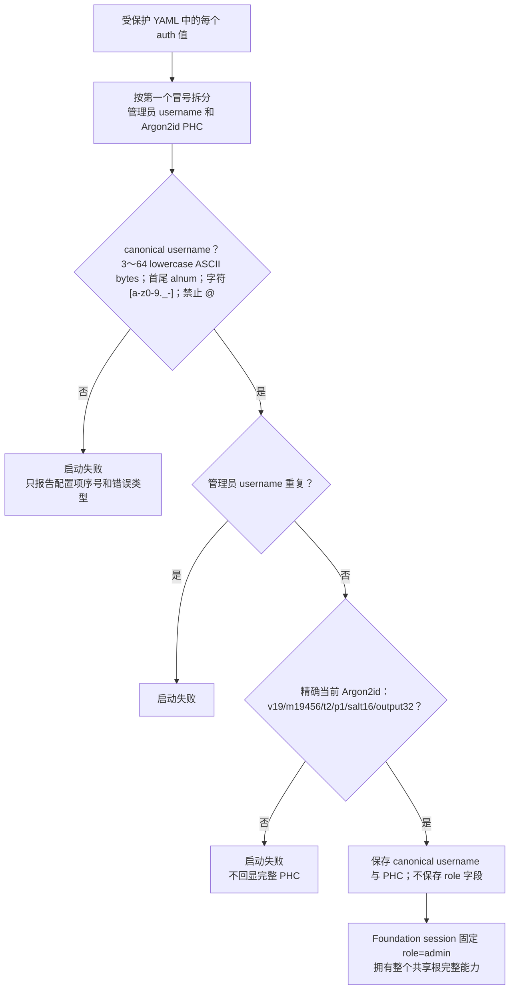

配置格式固定为 `canonical-admin:$argon2id$...`。canonical username 是 3～64 个小写 ASCII 字节，首尾必须为字母或数字，中间只允许 `[a-z0-9._-]`；`@`、Unicode、ASCII whitespace、控制字符和首尾分隔符均拒绝，相邻分隔符允许。先运行交互式 `dufs hash-password`，再把完整 PHC 写入受保护 YAML；CLI 不定义管理员参数。密码必须为 12–1024 个 UTF-8 字节且不含 ASCII 控制字符。`AuthConfig` 最多接受 1024 个管理员，至少一个是启动条件。Dufs 不读取普通用户、role、path rule 或权限位；所有通过认证的身份都由 Foundation session 明确返回 `role: "admin"`。

### 3.2 登录与单次请求认证

Dufs 的认证唯一所有者是 Foundation：受保护 YAML 经 `AuthConfig` 验证后映射为 Static Administrator Store，Hyper Router 接收真实 TCP peer 并处理三个当前认证 API。产品只拥有登录 HTML、响应正文类型适配、HTML 导航重定向和已认证的文件操作归属键，不实现 Session/Cookie/CSRF/密码哈希/登录限流。静态管理员不开放网页新增、改密或停用，配置变化必须重启。

三个唯一端点是 POST /api/v2/auth/login、GET /api/v2/auth/session、POST /api/v2/auth/logout。登录只接受恰好 username/password 的 JSON；wire 形状错误为 400，错误凭据为 401。成功返回 authenticated、user_id、username、role=admin、csrf_token 五字段合同。认证和 CSRF 失败统一为 Foundation ErrorEnvelope，不按产品路由改写成 Problem Details。

Foundation 统一限制登录正文为 16 KiB、读取期限 10 秒、全局 32/每个真实 TCP 来源 4 个读取许可；取消或失败释放许可。失败预算为五分钟内每来源 20 次、每规范账号 10 次，最多两个 Argon2id 计算槽，取得计算槽最多等待两秒。失败预算耗尽返回 `429 auth.rate_limited` 和保守的 `Retry-After: 300`。这些是共享平台政策，不由 Dufs 实现或配置；网关仍须独立按真实客户端 IP 限速。

Foundation Static Store 持有内存会话，重启全部失效；空闲期限 30 分钟、绝对期限 12 小时，每管理员最多 32 个活动会话、全局最多 1024 个。平台 HTTP Adapter 使用统一的 Unix 微秒时间；访问不延长绝对期限，存储拒绝倒退时间。会话和 CSRF 为 32 字节随机值，服务端只保留其摘要。恢复接口轮换 CSRF；其他页面仍使用旧 CSRF 写入时会失败关闭，客户端刷新并重新恢复，绝不重放未知结果的写入。

生产 Cookie 为 `__Host-sarmg-dufs-ram-session; Path=/; HttpOnly; Secure; SameSite=Strict`；显式 loopback 开发模式使用 `sarmg-dufs-ram-session` 且不带 Secure。重复 Cookie field line、重复当前名称和畸形 token 失败关闭。登录生成独立的新会话，其他有效会话仍受共享容量和过期规则管理；退出撤销当前会话并清除 Cookie。

业务请求先经 Foundation authenticate_request。安全方法不要求 CSRF；不安全方法必须同时满足严格同源和唯一有效 X-CSRF-Token。未认证 HTML GET/HEAD 导航可 303 到登录页，其他请求保留平台 JSON 401。

## 4. 英文登录、目录页与会话 CSRF

### 4.1 页面生成

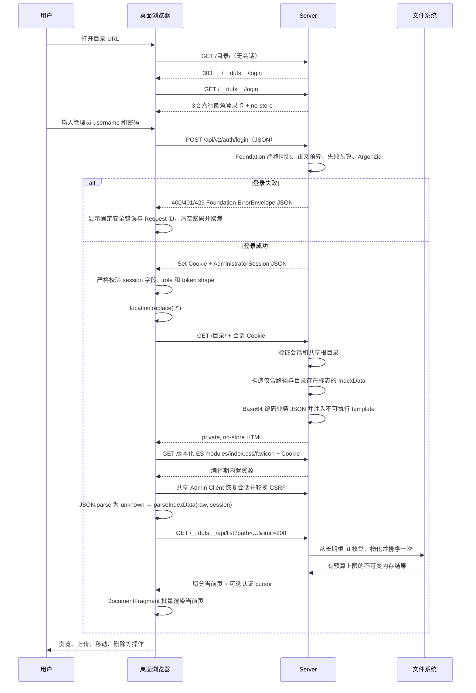

每个可操作列表项还携带绑定当前 owner、规范路径和完整文件身份的不透明 `revision`。浏览器必须把该 token 随 DELETE、Move 或 Rename 带回，不能从文件名、时间或下载 ETag 自行构造。

服务端 HTML 的 IndexData 只含 `href` 与 `dir_exists` 两个字段，不嵌入身份或 CSRF。页面经共享 Admin Client 调用 `GET /api/v2/auth/session` 恢复会话，再把结果交给 `parseIndexData(raw, session)`；它严格验证两个业务字段，并使用 Foundation `isAdministratorSession` 验证独立的五字段会话合同，复制并冻结结果后才启动文件业务界面。

目录项不再嵌入 HTML。分页 API 接受 `path`、`limit`、`sort`、`order`、`q` 和不透明 `cursor`。第一页在受跟踪的阻塞任务中完整物化并排序一次；递归搜索边遍历边转换 `PathItem`，逐项累计结构、路径字符串和 lowercase 排序键的真实容量，达到 32 MiB 结果预算前即停止；递归 DFS 本身另受 1024 层和 32 MiB 工作集限制，不会先在 Tokio runtime worker 上构造超预算向量。稳定索引归并排序在索引构造、每次合并选择和每个最终置换步骤都检查停机标志与总 deadline。如果超过一页，结果存入进程内不可变结果集，后续页只按 offset 切片，不再重复扫描或排序。

直接目录与递归搜索的运行时硬上限都是 100,000 项；只有递归搜索的较小上限可由 `--max-search-entries` 配置，且配置不能超过该硬上限。游标和结果绑定认证账号摘要，跨账号复用失败；结果以共享不可变切片保存，分页只复制 `Arc` 并借用当前范围，不再逐页克隆路径字符串。CLI 和默认 library builder 保持进程级共享缓存：最多 32 份/64 MiB，每账号最多 8 份/32 MiB，且每份从创建起固定 120 秒过期；多租户 embedder 可用 `ServerBuilder::with_isolated_list_snapshot_cache()` 显式选择相同上限的实例缓存。过期或被容量淘汰后返回 `409` 并要求重载第一页。一个账号不能再确定性填满全部缓存并淘汰其他账号的所有游标。

cursor 带服务端随机秘密生成的校验标签，并绑定结果 ID、offset、账号摘要、逻辑路径、目录设备号/inode/纳秒级 mtime/ctime、排序、查询和页大小；编码/版本无效、跨账号/跨查询或其他请求绑定不匹配返回 `400 Invalid list cursor`，认证标签不匹配、结果未知/过期/淘汰/不可用或目录身份变化返回 `409`。直接列表在扫描前后复核当前目录；递归搜索在访问每个目录前复核捕获快照，并在完成后再次复核所有访问目录。可观察变化返回可重试 `409`。浏览器只在不带 cursor 的首屏请求收到 HTTP/problem 双重 `409`、`directory_changed` 与 `refresh_target` 的完整组合时自动重放同一 GET 一次；第二次冲突、后续分页及其他 `409` 均停止并显示 `Retry`。

构造完成后的翻页来自同一不可变内存结果，不会混入后续新项目；但上述复核并非原子文件系统快照。检查间发生又恢复的变化、未更新目录元数据的子文件原地内容/权限变化以及最终复核后的变化仍可能不可见。需要文件系统级强一致读取时，必须从只读存储快照或等价版本化源遍历。浏览器始终只为当前页创建 DOM，不随整个结果规模创建等量节点。

CSRF Token 与会话一起在服务端内存中创建和保存。除尚未建立会话、只执行严格同源检查的 login API 外，所有受保护的 `POST`、`PUT`、`PATCH` 和 `DELETE` 都必须同时携带有效会话 Cookie 与唯一 `X-CSRF-Token`。服务端把全部 Origin、Host、URI authority、Sec-Fetch-Site 和 CSRF field line 原样交给 Foundation；缺失、重复、逗号合并、不可见字节、非规范 authority、非 same-origin Fetch Metadata 或 scheme/authority 不同全部失败关闭。生产模式只允许 HTTPS；HTTP 只允许 localhost、`127.0.0.0/8` 或 `::1` 的开发来源。CSRF 以 token digest 做常量时间比较，另一个管理员或另一次登录的 token 不能交叉使用。

### 4.2 内置页面资源

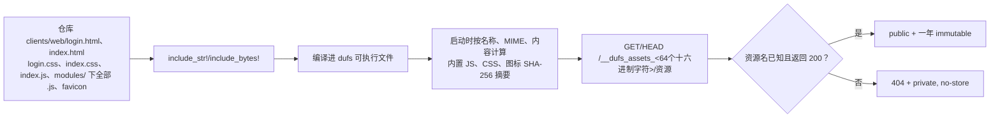

Dufs 使用 Foundation 原生 ESM Profile：`platform.js` 仅导出共享 Admin Client、合同和密码策略，并导入设计令牌与 Maple 字体；不引入 React。先执行 `npm ci` 和 `npm run build:platform`，再编译 Rust。共享 Vite 配置生成同源外部模块、CSS、正体/斜体 WOFF2 和 OFL 许可证；单资源 256 KiB 硬预算、禁止 source map。`server/assets.rs` 唯一注册表按名称、MIME 和字节计算摘要并嵌入全部平台/业务资源，精确资源 GET/HEAD 才可长期缓存。HTML 使用外部登录模块和字体 preload；CSP 仅允许同源脚本、样式及字体，不允许内联脚本或 eval。 运行时不读取外部页面或资源覆盖。

## 5. 公共路由

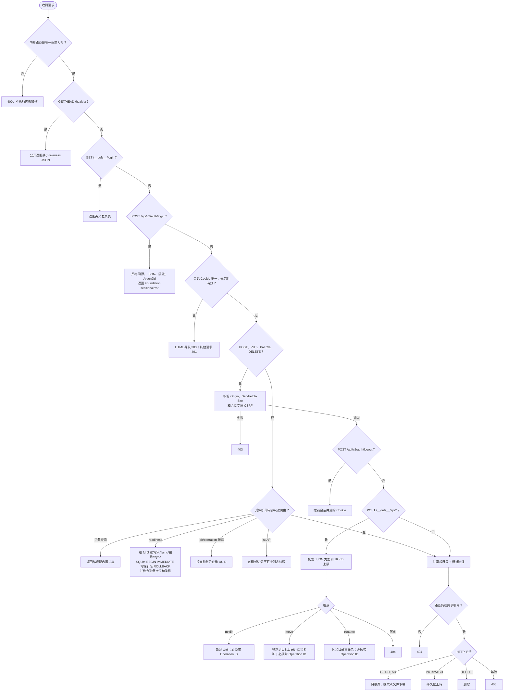

当前接口表：

| 方法 | 路径或用途 | 当前行为 |
|---|---|---|
| GET | `/__dufs__/login` | 公开返回英文登录 HTML；页面用 Fetch 调用唯一当前 Foundation login API |
| POST | `/api/v2/auth/login` | 无会话；严格同源、严格 `username/password` JSON、Foundation username normalization、登录 admission；成功返回 AdministratorSession 并 Set-Cookie，失败返回统一 ErrorEnvelope |
| GET | `/api/v2/auth/session` | 要求会话；返回唯一当前 AdministratorSession，role 固定 `admin` |
| GET/HEAD | `/healthz` | 公开 liveness；只表明 HTTP 处理仍存活，不读取文件内容或泄露账号/路径 |
| POST | `/api/v2/auth/logout` | 要求会话、唯一 `X-CSRF-Token` 和 Foundation 严格同源；撤销会话并清除 Cookie |
| GET/HEAD | 目录 | 要求会话；普通目录/搜索返回页面骨架，未识别的查询参数不选择其他输出格式 |
| GET | `/__dufs__/api/list` | 要求会话；fd 根锚定的目录/搜索快照分页 JSON |
| GET/HEAD | `/readyz` | 公开、禁止缓存；返回启动时及每 5 秒刷新的共享根、SQLite 回滚写事务和空间探针汇总；仅包含 `ready`，未就绪返回 `503`，停机立即未就绪 |
| GET | `/__dufs__/api/jobs/<UUID>` | 要求会话；统一查询当前账号的 mutation job，返回 `job_id` 及 `running/succeeded/failed/unknown` 状态 |
| GET/HEAD | 文件 | 要求会话；同一打开句柄生成附件响应和弱 ETag；只有 GET 支持无 `If-Range` 的单段 Range，HEAD 忽略 Range |
| GET/HEAD | 版本化内置资源 | 公开；仅编译期 allowlist 中精确摘要+名称可命中，供登录页加载；成功时允许公共长期缓存，HEAD 保留 GET 头并省略正文 |
| POST | `/__dufs__/api/mkdir` | 要求会话、CSRF、同源校验和 Operation ID；JSON 新建目录 |
| POST | `/__dufs__/api/move` | 要求会话、CSRF、同源校验和 Operation ID；JSON `{ source, directory, overwrite, source_revision, destination_revision? }`，移动到已经存在的目标目录并保留原名称；覆盖时 destination revision 必填 |
| POST | `/__dufs__/api/rename` | 要求会话、CSRF、同源校验和 Operation ID；JSON `{ source, name, overwrite, source_revision, destination_revision? }`，只在原父目录内修改为单段名称；覆盖时 destination revision 必填 |
| POST | `/__dufs__/api/upload/preflight` | 要求会话、CSRF 和同源校验；最多 512 个绝对逻辑路径，返回按原顺序绑定的存在、可替换和不透明 revision 结果 |
| POST | `/__dufs__/api/upload/discard` | 要求会话、CSRF 和同源校验；JSON `{ path, upload_id }`，同账号、同路径、同 ID 的 `AwaitingConfirmation` 原位转为 `Rejected` 后条件清理，已有 `Rejected` 可幂等重试且不续 TTL |
| PUT | 文件路径 | 要求会话、CSRF、同源校验以及 `X-Dufs-Upload-Id`、`X-Dufs-Upload-Length`、`X-Dufs-Upload-Overwrite`；默认/`false` 为原子不替换，`true` 还必须携带 target revision |
| PATCH | 文件路径 | 要求会话、CSRF、同源校验以及 `X-Dufs-Upload-Id`、`X-Dufs-Upload-Length`、`X-Dufs-Upload-Offset`和覆盖策略；从精确检查点续传，或以满 offset 的空正文条件发布已保留 stage |
| DELETE | 文件或目录 | 要求会话、CSRF、同源校验、Operation ID 及携带列表 revision 的 `If-Match`；提交前复核完整身份，原子移入隐藏 trash、同步后返回，后台有界回收空间 |

启动时只接受现有目录作为共享根。以 `__dufs__` 或当前摘要 assets 前缀开头的内部请求只接受唯一规范形式：不允许尾斜杠、重复斜杠、编码后的路径分隔符或对 unreserved 字符的多余百分号编码。原始路径只解析一次，外层 timeout/operation 分类、访问日志和实际 handler 共用同一结果；普通共享文件和目录的合法尾斜杠语义不受此约束。目录中的普通文件通过统一方法分派进入 `GET`/`HEAD` 附件下载，未知 HTTP 方法返回 `405 Method Not Allowed`；各方法受限端点同时返回与实际允许集合一致的 `Allow`，例如 health/ready 为 `GET, HEAD`、operation 状态为 `GET`。普通文件或其他非目录对象不能作为共享根启动服务。

readiness 的根探针使用服务启动时长期持有的目录 fd 创建保留形状的隐藏临时项，写入固定短内容并同步文件；随后无论写入是否成功都会尝试删除，成功路径还同步根目录 fd，避免仅凭 metadata 把只读或失效挂载误报为可写。state-store 探针由现有有界 actor 顺序执行：先核对当前 `product_metadata` 与 schema 指纹，再取得 SQLite immediate transaction、写入 `store_meta` 探针键并显式回滚，不发布业务状态。两类探针与磁盘水位检查并行；任一失败只使本次 readiness 返回 `503`，瞬时探针错误本身不等同于终止 actor。

## 6. 目录浏览和搜索

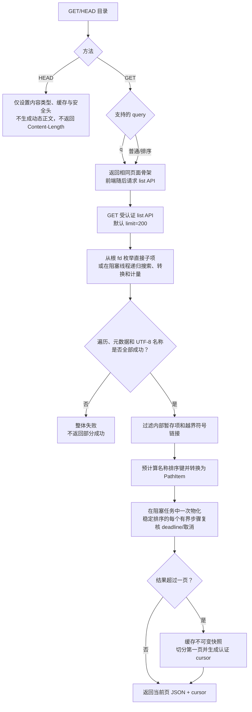

目录项不会为每个子目录再次扫描其子项。目录的 `size` 固定为 `0`，浏览器大小栏留空，避免大目录下的 N×子目录扫描。

目录查询协议是：

- `?q=关键词`：搜索；
- `?sort=name|mtime|size&order=asc|desc`：排序。

除此之外的查询参数不会选择其他目录输出格式；未定义入口一律按当前路由合同拒绝。

普通目录页和搜索结果使用同一份小型 HTML 骨架，GET 不枚举目录；HEAD 在安全响应头就绪后立即返回空正文并省略 `Content-Length`。分页 API 的第一页在受跟踪的阻塞任务中完成一次有界遍历、物化和排序：直接列表与递归搜索均固定最多检查 100,000 项，后者还受可调但不超过该硬上限的 `--max-search-entries` 约束。搜索条目在遍历 worker 中直接转换并累计真实内存重量；排序使用两个索引数组完成稳定的自底向上归并及原地置换，在索引构造、每次合并选择和每个置换步骤检查停机标志与 deadline，因此取消或超时不必等整个大排序结束。超过一页时缓存完整不可变结果，后续页只做切片，避免每页重新扫描导致的 O(N²/K) 工作。进程内结果同时受 120 秒绝对 TTL、总计 32 份/64 MiB 和每账号 8 份/32 MiB 预算约束。

递归搜索在第一个受跟踪的 blocking worker 内完成遍历、`PathItem` 转换与有界收集，再在第二个受跟踪的 blocking worker 内排序；同一个搜索 permit 保持到两者都退出。递归深度与工作集分别限制为 1024 和 32 MiB；active-ancestor `HashSet` 按最大深度一次性预留并保守预检，结果 `Vec` 与名称字符串扩容前把旧、新缓冲区瞬时峰值一并扣账，峰值可容纳时才增长。

遍历在解析下一项 metadata 前扣减项数预算，并在 push 结果前核算内存。直接列表会前后复核当前目录；搜索会在进入每个目录前核对已捕获身份，并在完成后再次复核所有访问目录。对象消失、目录身份/类型/可观察元数据变化或祖先符号链接循环时整体返回可重试的 `409`，不返回部分结果。这种构造期复核不等于原子快照。普通文件 HEAD 根据文件 metadata 保留真实 `Content-Length`。带 upload ID 的 HEAD 按第 9 章返回当前账号可见的检查点或终态。

可解析且仍位于共享根内的目录符号链接会按目标目录递归；若它指回当前遍历链上的祖先，祖先 dev/inode 集合会检测循环并终止，避免无限递归。直接单层列表仍可显示该链接，但递归搜索会整次返回明确的 `409 Directory symlink loop detected`，不会把可预期的循环映射成通用 500，也不会返回部分结果。

目录列表和搜索对遍历、目录项读取、metadata 获取及名称转换采用整体成功或整体失败语义。任一步失败都会终止本次请求并记录带路径上下文的错误，不会把已经收集的子集包装成看似完整的 `200`。浏览器 URL 和页面数据严格只支持 UTF-8；共享目录中存在非 UTF-8 名称时，相应目录或搜索请求会整体失败，部署者必须先在 Linux 侧将该名称重命名为有效 UTF-8。

项目不提供用户自定义隐藏规则，因此列表和搜索会包含所有普通文件和目录；上传暂存和删除回收项是协议内部保留项，仍不可见且不能通过普通路径访问。上传控制状态只存在共享根外的 SQLite，不对应共享根内的 JSON state sidecar。

## 7. 文件下载

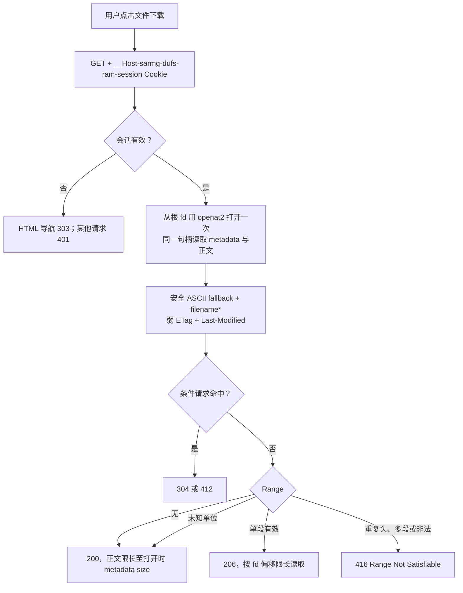

普通文件和单段 Range 都直接使用会话 Cookie。文件 GET 始终返回附件下载响应，查询参数不会切换为其他文件模式；浏览器端不提供预览、编辑或保存入口。

文件从共享根目录文件描述符经 `openat2(O_RDONLY|O_NONBLOCK)` 打开一次，并从同一 fd 的 `fstat` 确认仍为普通文件；路由 metadata 与最终打开之间被外部写者换成 FIFO 时不会在等待 peer 的 open 上挂住，特殊类型也不会进入正文读取。metadata 和正文来自这个已经分类的句柄，且 metadata 与每个 fd-relative `read_at` 分块都经过全局阻塞 I/O 门控。每次分块的门控等待与文件系统读取共用一个 30 秒 idle deadline；超时后正文返回带 `TimedOut` 来源的诊断错误，若 blocking worker 已经开始，门控许可仍由它持有到实际系统调用结束。附件 MIME 只按请求路径扩展名映射，未知名称固定为 `application/octet-stream`，不再读取样本、seek 回起点或猜测字符集。完整 GET 和 Range 都以这次打开取得的 metadata size 为正文硬上限，因此并发原子替换只影响后续新请求，当前响应的正文、`Content-Length` 和验证器保持同一 inode 版本；外部进程随后向同一 inode 原地追加也不会让本次响应越界。

ETag 使用设备号、inode、长度及纳秒级 mtime/ctime 生成，并明确带 `W/`，它用于区分通常的文件版本但不是内容摘要。条件请求按 HTTP 优先级执行：`If-Match` 优先于 `If-Unmodified-Since`，`If-None-Match` 优先于 `If-Modified-Since`。相同 `If-None-Match` 可按弱比较得到 `304`；`If-Match` 要求强比较，回放服务端发出的弱 ETag 会得到 `412`，而存在文件上的 `If-Match: *` 仍可通过。

HEAD 始终忽略 `Range` 并返回完整表示的 `200` metadata。对于 GET，弱 ETag 不能满足 `If-Range` 的强比较，秒级 `Last-Modified` 也不能安全区分快速原子替换，所以只要请求携带 `If-Range`，服务端就忽略 Range 并发送完整 `200`。没有 `If-Range` 时，只接受一个 `Range` 请求头中的一个字节范围，单位按 ASCII 大小写不敏感；合法单段返回 `206`，重复请求头、逗号多段、非法、溢出或不可满足的 `bytes` 范围返回 `416`，不支持的范围单位被忽略并返回完整 `200`。超出文件尾的 end 会截断，超过文件长度的 suffix 会把完整表示作为 `206` 返回。

服务端在最终响应出口对所有登录和认证响应强制设置 `Cache-Control: private, no-store`，覆盖完整文件、HEAD、`206`、`304`、`412`、`416`、上传、API 和错误响应，也不依赖 ETag 或 Last-Modified 是否成功生成。只有成功返回的版本化内置脚本、样式和图标进入明确的公共缓存白名单；未知资源和错误响应不可长期缓存。`no-store` 有意放弃认证文件的浏览器缓存和自动条件复用，以换取最严格的缓存边界。网关须关闭认证路径缓存并保留上游 `Cache-Control`。

下载名使用固定安全 ASCII `filename` 作为通用回退，真实 Linux 文件名通过符合 RFC 6266/8187 形式的 UTF-8 `filename*` 参数传递。因此双引号、反斜线、分号、空格、中文、emoji 和控制字符不会进入可产生歧义的传统 quoted-string；现代 Edge 和 Firefox 从 `filename*` 取得真实名称。


## 8. 统一写请求防护与同源 JSON API

### 8.1 全部写方法的公共检查

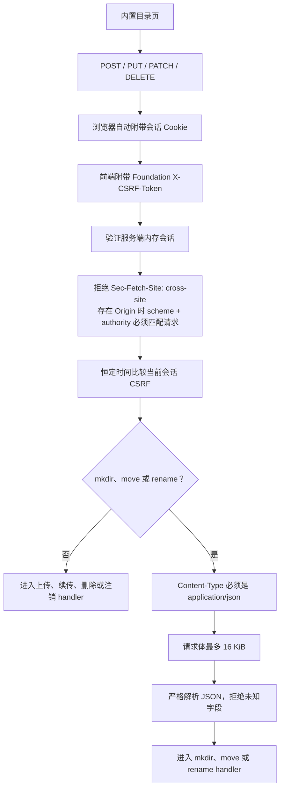

会话验证、来源检查和 CSRF 比较位于具体写操作之前。缺失、伪造或来自另一个会话的 `X-CSRF-Token` 返回 `403`，不会创建、追加、移动或删除磁盘对象。服务把每条原始 `Origin`、`Host`、URI authority、`Sec-Fetch-Site` 和 CSRF header 交给 Foundation：任何 singleton 缺失/重复/逗号拼接、非规范 scheme/authority、生产 HTTP、非 same-origin 或彼此不一致都失败关闭。外部 scheme 只从匹配显式受信代理的唯一 `X-Forwarded-Proto` 取得。Login API 尚未建立会话，因此不要求 CSRF，但仍要求同一套严格同源、正文前 admission、10 秒时限和严格 JSON；应用上限 16 KiB，生产 nginx 的 exact location 进一步限制为 4 KiB。

### 8.2 新建目录

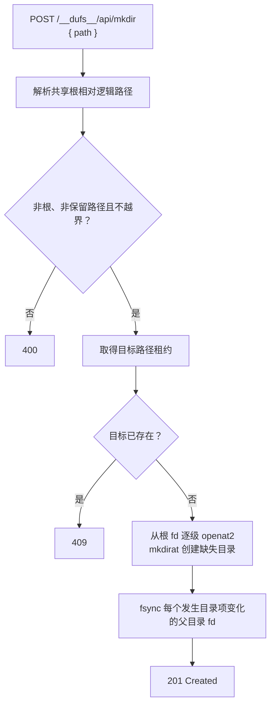

最终目录和自动补建的祖先目录都以 mode `0777` 请求 `mkdirat`，实际权限由服务进程的 umask 和父目录 default ACL 共同决定；创建后不会再对目录执行精确 `fchmod`。这与新建普通文件不同：新建或零字节文件由第 9 章的私有上传 stage 发布，最终 permission bits 固定为 `0600`。

### 8.3 独立移动与重命名

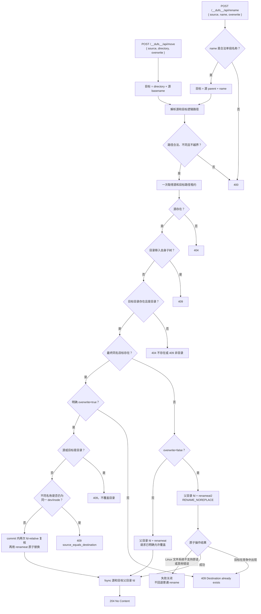

浏览器为每一项分别显示 Rename 和 Move 按钮。Rename 直接把名称单元格切换为只接受单段新名称的行内输入，Move 对话框只接受目标目录；前端不能借 Move 改名，也不能借 Rename 跨目录。第一次收到可信终态的稳定 `destination_exists` 和 `409` 后，才打开具有可访问标题的页面内原生 `<dialog>` 询问用户是否覆盖；Escape 取消覆盖后回到行内名称输入或对应的 Move 按钮，用户确认后才重新发送 `overwrite: true`。传输结果未知时绝不自动发起覆盖请求。

两种 relocation 都要求列表提供的 `source_revision`；token 绑定 owner、源路径和完整源 identity。`overwrite: false` 通过 rustix 调用 Linux `renameat2(RENAME_NOREPLACE)`，即使目标随后出现，最终原子调用也会保留目标并返回 `409`；Linux 文件系统不支持该原语时失败关闭，不降级为普通 rename。成功后服务还比较目的名称与提交前打开的 source anchor；若外部 writer 在微窗中换掉源名称，不能证明移动了原对象时返回 unknown，而不误报成功。`overwrite: true` 还要求绑定最终目标路径和完整目标 identity 的 `destination_revision`，RootedFs 在紧邻系统调用时复核 source/destination 后使用父目录 fd 上的普通 Linux `renameat` 原子替换；这不是对外部 writer 的目录项 compare-and-replace。若不同名称其实是同一 dev/inode 的硬链接，返回稳定的 `409 source_equals_destination`，不会误报 `204`。因此共享根必须排除外部 writer。

源和目标先作为一个租约集合交给路径协调器，规范化、排序并一次取得；反向移动不会因加锁顺序不同死锁。最终父目录从长期持有的共享根 fd 通过 `openat2` 打开，rename 只接收父目录 fd 和最后一个文件名，不再按绝对字符串路径重新解析，也不会在提交时重建已经消失的目标目录。成功 rename 后同步源和目标父目录 fd，全部成功才返回 `204`；同一父目录只同步一次。

### 8.4 统一路径协调与 fd-relative 最终变更

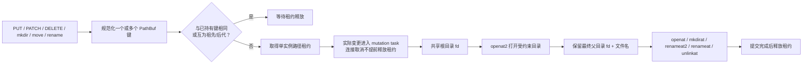

路径协调器覆盖同一路径以及祖先/后代关系，所以删除或移动目录会等待其子树中的上传，上传也不会在祖先删除提交期间穿过。互不为祖先的不同子树可以并行；这让来自个人多台设备的无冲突上传不必经过全局写锁。较早 waiter 还在异步解析语义键时，只按已经确定的词法祖先/后代关系阻塞后续 waiter，无关词法路径可超车；一旦解析完成，租约插入仍会检查解析后的别名冲突及更早冲突 waiter。因此慢文件系统解析不会全局阻塞，无冲突并发也不会以牺牲别名安全为代价。单个浏览器页面仍只有一个上传槽位，但服务端并发边界不受该前端限制。

整个上传处理及 mkdir、move、rename、DELETE 的实际文件系统变更由独立 mutation task 持有路径租约。非上传的 mkdir、move、rename、DELETE 提交任务还共用 64 个全局 admission permit；额外请求等待许可且仍受普通请求 deadline 约束，不会无界启动后台 mutation。外层 Hyper 响应 future 因浏览器断线或网关取消而结束时，已经登记的内层任务仍会完成错误处理或提交，再释放租约与 permit；底层 `spawn_blocking` 文件操作不会在失去租约后继续与下一台设备交错。另有一个仅覆盖祖先创建、最终目录发布和父目录 `fsync` 的短临界区，保证两个兄弟路径并发创建共同父目录时，每个成功请求都建立在该祖先已经持久化的基础上，而不把全部文件正文写入全局串行化。

首方浏览器对 mkdir、move、rename 和 DELETE 的每次实际请求生成规范 UUID，并放入 `X-Dufs-Operation-Id`。服务端以认证管理员 owner 摘要和 UUID 作为键；mkdir/move/rename 指纹覆盖方法、端点和原始 JSON 正文，DELETE 指纹覆盖方法和已解码规范逻辑路径，所有部分都先带长度进入 SHA-256。注册表会在业务校验和路径租约等待前先建立 `Reserved` 记录：同键同指纹在执行中返回 `202 operation_in_progress`，完成后重放原 HTTP 结果；同键不同指纹返回 `409 operation_id_conflict`，绝不执行第二个请求。

注册表固定最多 4096 项、每账号最多 1024 项；持有 guard 的 `Reserved`/`CommitStarted` 项绝不按时间淘汰，完成结果从终态起最多保留 15 分钟。已有 ID 的 running/replay/conflict 判断先于额度判断；任何尚未过期记录都不会为新请求提前淘汰，容量满时在 mutation 前安全返回 `503 operation_registry_full`。认证用户只能查询自己名下的记录。记录始终位于文件型 SQLite，重启后仍可按 TTL 查询；正常 TTL 过期返回 `404 job_not_found`。`GET /__dufs__/api/jobs/<UUID>` 是唯一的 job 查询入口，当前只查询 mkdir/move/rename/DELETE mutation；它尚不是 upload session 或内部 purge job 的公开列表接口。

提交任务本身持有 operation guard，并在真正调用不可逆文件系统变更前显式 `mark_commit_started`。明确的 pre-commit 业务校验失败登记 `failed`；若 future/guard 在仍为 `Reserved` 时意外丢弃，记录会被移除，状态查询变为不存在且请求可安全重试，不会泄漏虚假 `running`。只有越过 commit 边界后异常丢弃或发生无法分类的提交错误，guard 才保守登记 `unknown/outcome_uncertain`；最终父目录同步完成才登记 `succeeded`。

统一 state store 当前使用 SQLite schema revision 1 的文件数据库，包含 `product_metadata`、`store_meta`、`operations`、`upload_sessions` 和 `purge_jobs` 表。CLI `--state-dir <dir>` 或 YAML `state-dir: <dir>` 必须提供，固定使用 `<dir>/state.sqlite3`；目录必须已经存在、由有效服务账号所有、权限为 `0700`、不是符号链接，且与共享根不重叠；固定 DB 及 SQLite sidecar 不能与日志或配置文件重名。store 绑定共享根设备号/inode，使用 rollback journal `DELETE` 和 `synchronous=EXTRA`。空白库直接创建当前 schema，并写入 `application='dufs-ram'`、当前 Cargo 版本、revision 1 与统一 SHA-256。已有库在任何持久修改前通过 raw snapshot 和原路径只读视图验证五列 metadata、当前版本、精确 schema、根绑定与完整性；指纹按排序后的 `sqlite_schema` 原始字段，以每字段 u64 大端长度加字节计算。旧、无标记、版本/指纹漂移或额外对象一律零修改拒绝，运行服务不执行 migration。

文件型 store 恢复 operation 时先删除尚未越过文件系统提交边界的 `Reserved`，再把 operation `CommitStarted` 转为带 `outcome_uncertain` 的 `Completed/unknown`；原 `Completed` 只在尚未用完的 15 分钟 TTL 内继续按账号、ID 和指纹重放。upload session 持久化 `Running/CommitStarted/AwaitingConfirmation/Committed/Rejected/Unknown`，容量为全局 16384、每账号 4096，每次实际更新延长到 7 天 TTL；重启把 upload `CommitStarted` 转为 `Unknown`，而完整 stage 对应的 `AwaitingConfirmation` 保持可查询、可条件发布或可明确丢弃。首次 discard 将完全绑定的 `AwaitingConfirmation` 原位改为 `Rejected` 并设置终态 TTL；已有 `Rejected` 的重试不写库、不续 TTL，只继续 identity-safe cleanup。SQLite 是上传状态的唯一权威，共享根内不写入、读取或导入 JSON 上传状态文件。

SQLite transaction 和文件系统 transaction 不是同一个原子提交域。operation/upload 在不可逆文件系统步骤前持久化 `CommitStarted`，文件系统结果明确后再单独写终态；两步之间崩溃只能保守恢复为 `unknown`，不能由 SQLite 证明文件系统已提交或回滚。purge 用更具体的 saga：rename 前写入含根内相对目标/trash 路径和源 dev/inode/类型的 `Prepared`；checked rename 和父目录 `fsync` 后，才把包含 dev/inode、类型、nlink、size、uid/gid、完整 mode 与纳秒时间戳的 32 字节 trash revision 和 `Ready` 原子写入。`Prepared` 没有已提交 revision，reconciler 始终保留 target，把 trash 路径上的任何 occupant quarantine 后释放 intent，绝不再从弱源 inode 补写 `Ready`。worker 对 `Claimed` 的状态转换失败会保留本地 claim，并在回读确认数据库仍为 `Claimed` 后重试；启动把遗留 `Claimed` 恢复为 `Ready`。只有完整 revision 与持续 fd 锚点共同授权自动清理；缺失或不匹配使整棵 trash 根 quarantine/release。仍不能把 SQLite 和文件系统变成一个事务。

外层响应超时或连接断开不会取消已开始的提交。前端遇到传输层结果未知时只进行一次状态 GET：`succeeded` 才按成功更新页面，`failed` 显示服务端确定结果，`running` 要求稍后刷新，`unknown`、查询失败或记录不存在都要求刷新检查目标；任何一种情况都不会自动重放写请求。正常响应、重放响应和默认访问日志携带 operation ID 与 operation state，便于关联诊断。

浏览器普通 `fetch` 统一经过 `modules/http/client.js` 编排，默认 30 秒 deadline 同时覆盖取得响应头和读取正文；实际的有界读取由 `modules/http/response_buffer.js` 实现，并复用 `modules/http/headers.js` 的严格无符号头解析。调用时若调用方 signal 已经取消，`client.js` 会在分发前明确返回 `client_cancelled`，不会调用 `fetch`；进入 `fetch` 后的取消、deadline 或网络中断无法证明服务端未收到写请求，带 `outcomeUnknown` 的 mutation 仍保守归为 unknown。客户端先拒绝超过上限的严格 `Content-Length`，再逐块累计；错误/成功响应上限分别为 16 KiB/16 MiB，越界立即 cancel。允许范围内以已校验分块构造重放流，不再额外合并整份缓冲区。Problem Details 的 `detail`/`title` 最多接受 1024 个 JavaScript UTF-16 code units。

上传正文专用 XHR 会在响应头、下载 progress 和最终 UTF-8 长度三层拒绝超过 16 KiB 的响应。携带 operation ID 的成功响应必须回显同一 ID 和 `succeeded`；普通 operation 响应接受 `running/succeeded/failed/rejected/unknown`，job 状态端点记录本身仍为 `running/succeeded/failed/unknown`。状态缺失、矛盾、越界或状态查询发生认证/协议/网络错误都保守归为 unknown，不自动重放。

普通上传使用 `modules/upload/protocol.js` 集中定义的 `running/awaiting-confirmation/committed/rejected/not-seen/not-started/unknown` 词汇并绑定同一 ID：只有 fresh PUT 为 `200/201` 或 PATCH 为 `200/204`、状态为 `committed` 且长度/满 offset 精确匹配时才成功。`running/rejected/not-started` 提供人工 Retry，严格长度/offset 校验推迟到 Retry 后的 HEAD；`awaiting-confirmation` 只在严格冲突响应或 HEAD 检查点中接受，不归为普通可重试失败。直接 `not-seen`、显式 `unknown`、缺失/非法状态或 committed 不匹配都归为 unknown 并暂停队列；`not-started` 只用于 PUT/PATCH 响应，不是 HEAD 可返回的持久状态。

`RootedFs` 固定使用 `RESOLVE_BENEATH | RESOLVE_NO_MAGICLINKS`，因此通过它完成的最终文件打开和写变更不能越过启动时持有的共享根 fd；解析后仍在根内的相对符号链接可以使用，绝对链接和根外目标会被这些调用拒绝。悬空或成环的根内相对链接只以 nofollow metadata 列出，可由 DELETE 删除或 PUT 原子替换；普通 GET 仍返回 `404`。`openat2` 是强制 Linux 运行要求，不支持时服务启动失败。

路径租约只协调当前 Dufs 进程中经过这些 handler 的写请求；shell、其他本地进程和 virtiofs 宿主机进程仍可改变对象。路由 metadata、目录枚举、搜索和维护扫描全部从启动时长期持有的根 fd 出发，逐级使用 `openat2`/`*at`；运行中把启动路径重命名并放入替换目录时，服务仍只读取和清理原根。路径协调器同时比较词法祖先关系和目录设备号/inode 组成的语义键，因此同一根内相对符号链接别名与真实路径不会绕过当前进程的写租约。租约插入和释放都会推进协调 epoch；等待者在 epoch 变化后重新解析语义键，并在插入前原子核对 epoch、现有租约和更早冲突 waiter。解析中的早期 waiter 只以词法祖先/后代关系参与公平排队，无关路径可超车；若后来发现语义别名，它会等待已经取得的冲突租约，而不会并发执行。语义键解析失败不会再退化为只比较词法路径，也不会无限重试而让 mutation 永久停在 `running`：协调器为该请求生成以共享根 inode 为锚的保守 wildcard 语义键，它与所有正常路径租约冲突；取得这把全局保守租约后，后续根边界或文件系统检查会返回原本的确定错误。这样既不放行潜在别名并发，也不把永久 `EXDEV`/`ELOOP` 变成资源泄漏。

这些措施不是针对恶意本地写者的目录隔离。目标应不存在时，最终 rename 使用 `RENAME_NOREPLACE`，因此晚到 occupant 不会被覆盖；成功后还会把目的名称与已钉住的源 fd 比较，无法证明移动的是原对象就报告 unknown。但显式覆盖已有目标只能“复核 source/destination → 普通 rename”，不是内核目录项 CAS；拥有共享根写权限的外部参与者仍可在这两个系统调用之间更换任一名称，甚至使另一个对象被移动或覆盖。上传同样会复核目标完整 stat 快照和 stage 路径/fd，create-only 发布使用 no-replace 与发布后 identity 检查，existing-target 发布仍保留上述微窗。purge 会把每个最终删除候选先移入随机 quarantine/disposal 名并用既有 fd 再复核，异常时保留整棵根供人工调查；但恶意同 UID 进程仍可通过 inotify 观察随机工作名并竞争复核到 unlink 的微窗。生产部署必须把服务账号、本地管理员和 virtiofs 宿主机写者视为同一信任域，并避免绕过 Dufs 并发写入；要排除同 UID 攻击者必须使用其无法访问的私有工作目录或操作系统身份隔离。

## 9. 持久化上传与断点续传

### 9.1 浏览器侧

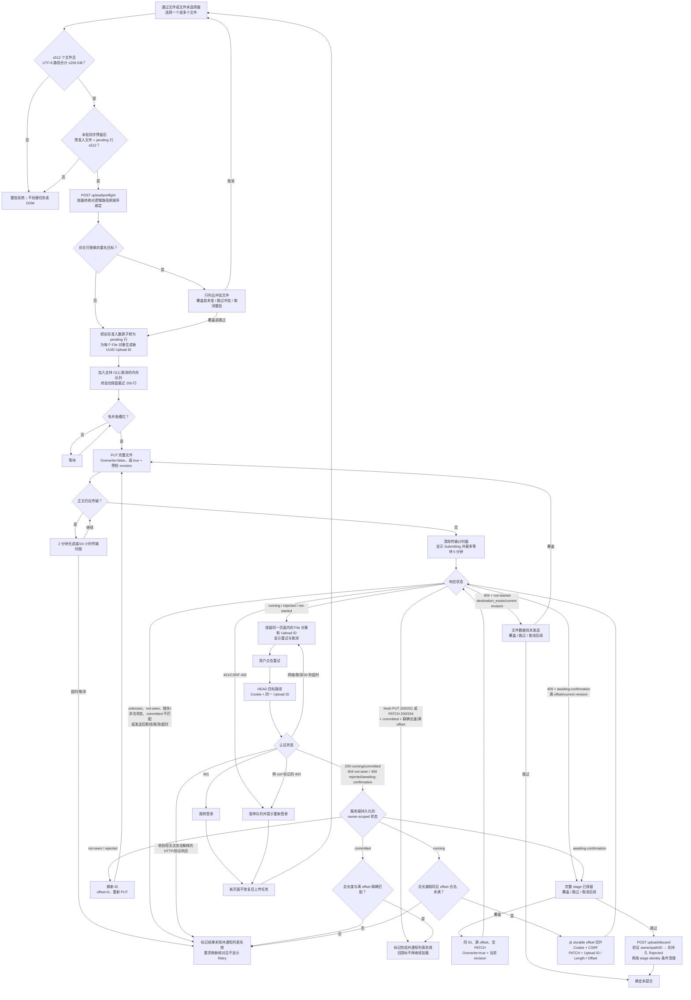

浏览器不再把上传 ID 或续传身份写入 `localStorage`。文件名、相对路径、大小和 `lastModified` 不能证明两个文件内容相同；跨刷新按这些属性复用旧 ID 可能把不同内容拼接成一个最终文件。当前实现只允许同一页面、同一个仍在内存中的 `File` 对象在结果可确认失败后重试。HEAD 只信任服务端已经持久化的 owner、终态、offset 和首次绑定的总长度；记录绑定认证账号摘要，另一个账号查询同一 ID 与不存在一样得到 `404 not-seen`。PUT/PATCH 的 `not-started` 仅证明当前尝试没有进入上传 mutation，不证明旧 ID 没有检查点；它可显示 Retry，但点击后仍先 HEAD 原 ID，HEAD 本身不会返回 `not-started`。

文件选择在创建 uploader、UUID 或 DOM 行之前整体校验：单批最多 512 个文件，全部规范逻辑路径的 UTF-8 字节合计最多 256 KiB；任一无效项或超限会拒绝整批。合法非空选择会在串入异步队列前，按原始 `File` 数同步预留全局容量；预检/覆盖确认中的预准入文件与排队或执行中的 pending 行始终合计不超过 512，失败、取消或全量跳过会释放预留，实际准入则在无异步间隙的片段内把预留原子转为 pending 行。超限的新选择不会加入 Promise 链，也不会保留其 `File` 引用。前端再把最终绝对逻辑路径以相同 512/256 KiB 边界发送到预检 API；服务端还有 2 MiB wire-body 上限，严格拒绝空集、重复路径、非规范或越界路径。响应的数量、顺序和每个 path 必须与请求精确绑定，否则整批不入队。只有预检为已存在、可替换且携带合法 revision 的项才弹覆盖确认；无冲突批次零弹窗。终态历史只保留最近 200 行并通过状态区报告已隐藏数量。DELETE、MOVE、RENAME、MKDIR、空 PUT 和普通上传共用 `committed/outcome-unknown/refresh-required/not-committed` 四值失效契约：前两者分别表示已确认写入和仍可能写入；`refresh-required` 表示服务器已经证明当前 snapshot 陈旧，但不声称本次写入成功；只有 `not-committed` 才确认列表未变。前三者会递增列表 revision、使已有分页视图失效并通过 live status 显示刷新提示。上传每一次可信 target-change/reset-stage 和 tracked DELETE/MOVE/RENAME 的确定 revision 冲突都使用 `refresh-required`；uploader 不缓存“已经失效过”，所以两次冲突之间完成 Refresh 后，第二次响应仍会使新 snapshot 失效。非法名称等能证明目录未变的拒绝及分发前取消才保持 snapshot。用户下一次加载会清空旧页并从第一页请求，迟到的旧 revision 响应也不会提交到 DOM。

刷新、重新登录或关闭页面会失去旧任务关联；重新选择文件始终生成新 ID 并完整 PUT。正文完成发送后，前端会清除传输 idle/total 计时器，进入最长 5 分钟的独立提交等待阶段。XHR 只在 fresh PUT 返回 `200/201` 或 PATCH 返回 `200/204`、状态为 `committed` 且精确长度/满 offset 同时成立时报告成功。XHR 发出后的网络错误、用户停止等待或客户端超时，以及直接响应的 `not-seen`、显式 `unknown`、缺失/非法状态或 committed 不匹配，都显示不可重试的结果未知。直接响应的 `running/rejected/not-started` 可进入人工 Retry，但不在该响应上立即信任长度/offset；Retry 始终先 HEAD 原 ID，只有 HEAD 严格确认 `rejected/not-seen` 才换新 ID，确认部分 `running` 且长度/offset 与原 `File` 一致才从该 offset PATCH，满 offset `running` 则转为 unknown。HEAD 还可以用 `409 awaiting-confirmation`、满 offset、当前 revision 和 replaceable 标志重建二次冲突选择；HEAD 本身的网络、取消或超时失败保留 Retry，已收到却无法安全解释的 HTTP/协议响应转为 unknown 并暂停队列。

二次冲突时已上传字节不会默默丢失：服务端把完整、已同步的 stage 持久化为 `AwaitingConfirmation`。用户选择覆盖时，前端以同一 ID、满 offset、空正文 PATCH 和当前 revision 请求条件发布；目标又次改变会回到同一选择，不会无界自动重试。选择跳过时先调用 discard API；服务端先把完全绑定的行原位 CAS 为 `Rejected`，再根据其中保留的 stage identity 清理。已有 `Rejected` 的重试不续 TTL，仍会继续清理。严格绑定的 `204 + rejected + length + offset` 表示终态决定已持久化且本次安全清理步骤完成；原 stage 可能已删、已不存在，或其路径已被替换而替换物被保留。网络歧义后由 HEAD 看到 `rejected` 足以确认上传未发布并安全换新 ID，但它本身不证明 stage 路径已经物理消失。若原来覆盖的目标在等待确认时消失，stage 上已重放的旧 uid/gid/mode/xattr 不能当作新文件 metadata；服务端因此返回 `upload_metadata_preservation_refused`，前端必须先 discard，再以新 ID、`overwrite=false` 完整上传。只有在正文尚未发送时发现目标消失，才可以复用原 ID 做 create-only PUT。

服务端未完成的持久检查点保持隐藏，达到 TTL 后由维护任务清理。CSRF 或同源来源校验失败使用带机器标记的 `403` 并暂停当前队列；重新登录后用户重新选择文件会建立新任务。拖放不是上传入口，页面只阻止携带文件的 `dragover`/`drop` 触发浏览器默认导航；上传仅由文件和文件夹选择器触发。

### 9.2 服务端暂存与检查点

```mermaid
flowchart TD
    UP(["PUT 或 PATCH"]) --> HEADERS{"ID / Length / Offset / Overwrite<br/>与条件 revision 精确且一致？"}
    HEADERS -- 否 --> BAD["400；无法绑定合法上传身份"]
    HEADERS -- 是 --> PATH{"保留、越界或隐藏路径？"}
    PATH -- 是 --> PATH_REJECT["404/403 + not-started<br/>未进入上传 mutation"]
    PATH -- 否 --> DEADLINE["建立绝对 upload-total-timeout<br/>默认 24 小时"]
    DEADLINE --> LOCK{"同一路径或祖先/后代<br/>已有写租约？"}
    LOCK -- 是 --> WAIT["等待租约释放"]
    WAIT --> LOCK
    LOCK -- 超过总时限 --> TIMEOUT["408 + not-started<br/>尚未进入上传 mutation"]
    LOCK -- 否 --> SLOT{"取得全局上传槽？"}
    SLOT -- 否 --> R429["429 + Retry-After + not-started<br/>不查询或改变旧检查点"]
    SLOT -- 是 --> ROUTE["受跟踪地从根 fd 读取 route metadata<br/>持有路径租约与上传槽"]
    ROUTE -- 超过总时限 --> ROUTE_TIMEOUT["408 + not-started<br/>后台只完成 metadata 收尾"]
    ROUTE -- 隐藏/越界 --> ROUTE_REJECT["404/403 + not-started"]
    ROUTE -- 通过 --> FRESH{"fresh PUT？"}
    FRESH -- PATCH --> TRACK["注册受跟踪上传 task<br/>持有请求体、路径租约、上传槽；此时仍可只读准备"]
    FRESH -- PUT --> OBLIGATION{"目标及后代存在持久<br/>upload/purge 路径义务？"}
    OBLIGATION -- 冲突 --> STATE_CONFLICT["409 upload_state_conflict + not-started"]
    OBLIGATION -- 状态库失败 --> STATE_UNAVAILABLE["503 upload_state_unavailable + not-started"]
    OBLIGATION -- 超过总时限 --> STATE_TIMEOUT["408 request_timeout + not-started"]
    OBLIGATION -- 无 --> TRACK
    TRACK --> STATE{"只读查询 owner-scoped<br/>持久化 state"}
    TRACK -. "边界前未处理 timeout / I/O" .-> PREP_FAILURE["408 request_timeout 或 503 upload_precommit_failed<br/>not-started + retry"]
    STATE -- "committed/rejected/unknown/<br/>不可续传 running" --> REPLAY["回显真实持久状态并停止"]
    STATE -- "不存在或可续传 running/awaiting" --> PRECHECK{"长度上限、metadata<br/>及检查点一致性允许？"}
    PRECHECK -- 否 --> LIMITED["404 not-seen / 409 rejected/running / 413 rejected"]
    PRECHECK -- 是 --> POLICY{"当前目标与<br/>覆盖策略匹配？"}
    POLICY -- "no-replace 但已存在" --> EXISTS["409 destination_exists<br/>revision + replaceable"]
    POLICY -- "if-unchanged revision 过期" --> CHANGED["409 upload_target_changed<br/>未发送为 not-started<br/>满 stage 为 awaiting-confirmation"]
    POLICY -- 是 --> METHOD{"方法"}
    METHOD -- PUT --> PUT_BUDGET{"从最近现有父目录 fd<br/>预留声明空间？"}
    PUT_BUDGET -- 否 --> NO_SPACE["507；未创建祖先/stage<br/>或上传控制记录"]
    PUT_BUDGET -- 是 --> PUT_BOUNDARY{"首次实际 filesystem/state mutation<br/>与总 deadline 原子竞争"}
    PUT_BOUNDARY -- deadline 先关闭 --> BOUNDARY_TIMEOUT["408 request_timeout + not-started + retry<br/>abort task；禁止稍后越界写入"]
    PUT_BOUNDARY -- task 先越界 --> ENSURE_PARENT["原子补建缺失祖先并记录身份<br/>创建 0700 私有 stage 目录及 0600 文件"]
    ENSURE_PARENT --> RESET["清理同 ID 的 DB 记录<br/>及已绑定 stage"]
    RESET --> CREATE["在目标父目录的 0700 私有保留目录内<br/>独占创建并显式 fchmod 为 0600"]
    CREATE --> ZERO["同步空 stage<br/>提交 durable_offset=0 的 Running 记录"]
    METHOD -- PATCH --> LOAD["读取并校验 state 与 stage"]
    LOAD --> OFFSET{"总长度和请求 offset<br/>与 durable state 一致？"}
    OFFSET -- 否 --> CONFLICT["404 或 409"]
    OFFSET -- 是 --> PATCH_BOUNDARY{"首次需要截断、更新 state 或接收正文时<br/>与总 deadline 原子竞争"}
    PATCH_BOUNDARY -- deadline 先关闭 --> BOUNDARY_TIMEOUT
    PATCH_BOUNDARY -- task 先越界 --> TRUNCATE["必要时截断 durable offset 后的未确认尾部<br/>并更新已确认的 resumable state"]
    TRUNCATE --> PATCH_BUDGET{"从已有 stage fd<br/>预留剩余空间？"}
    PATCH_BUDGET -- 否 --> PATCH_NO_SPACE["507；回退到请求前检查点"]
    ZERO --> COPY["按声明剩余长度流式写入<br/>正文空闲/总时限 + force token"]
    PATCH_BUDGET -- 是 --> COPY
    COPY --> IO_OK{"请求体完整写入？"}
    IO_OK -- 否 --> POLICY{"部分文件满足安全续传条件？"}
    POLICY -- 是 --> CHECKPOINT["先同步 stage；首个检查点再同步父目录<br/>然后提交 SQLite 检查点"]
    POLICY -- 否 --> CLEAN["清理会话并同步目录"]
    CHECKPOINT --> ERROR["返回非 2xx，等待重试"]
    CLEAN --> ERROR
    IO_OK -- 是 --> LENGTH{"实际长度等于声明总长度？"}
    LENGTH -- 否 --> CHECKPOINT_OR_RESET["保存可续传检查点或重置会话"]
    CHECKPOINT_OR_RESET --> R409["409"]
    LENGTH -- 是 --> COMMIT["同步 stage 并写 CommitStarted<br/>进入不可取消提交"]
    COMMIT --> CONDITION{"目标在 checked rename<br/>边界仍满足条件？"}
    CONDITION -- 是 --> PUBLISHED["missing: NOREPLACE + 发布后 identity 复核<br/>existing: identity 复核 + 普通 rename<br/>父目录 fsync + Committed"]
    CONDITION -- 否 --> AWAIT["保留完整 durable stage<br/>AwaitingConfirmation + 409"]
```

`PUT` 必须携带恰好一个 UUID 格式的 `X-Dufs-Upload-Id` 和恰好一个十进制 `X-Dufs-Upload-Length`；`PATCH` 还必须携带恰好一个十进制 `X-Dufs-Upload-Offset`。`X-Dufs-Upload-Overwrite` 缺省或精确为 `false` 都表示 no-replace，且不得携带 revision；只有精确为 `true` 时才接受恰好一个 `X-Dufs-Target-Revision`，值必须是 64 位小写十六进制。缺少、重复、宽松变体或自相矛盾的请求头返回 `400`，不会把旧客户端的普通 PUT 默认解释为允许覆盖。合法头已经解析后，保留/越界路径、路径或 route metadata 超时、上传槽满，以及 fresh PUT 的持久路径义务冲突/失败/超时都会回显同一 ID/长度和 response-only `not-started`；槽满为 `429 + Retry-After`，义务检查分别使用 `409 upload_state_conflict`、`503 upload_state_unavailable` 和 `408 request_timeout`。这些分支除只读检查外不会改变旧检查点，也不会创建本次 stage/SQLite 行。进入受跟踪上传 task 后，owner state、目标 identity/metadata、stage identity 与空间探针仍可保持只读；这些准备步骤中未处理的 timeout 映射为绑定的 `408 request_timeout + not-started + retry`，其他未处理 I/O 映射为 `503 upload_precommit_failed + not-started + retry`。首次创建祖先/stage、截断 stage、更新上传记录或接收正文前，task 必须通过原子 mutation boundary；deadline 先关闭边界就 abort task，后续 continuation 无法再越界写入。`not-started` 只证明当前尝试未进入上传 mutation，Retry 必须先 HEAD 才能发现原 ID 是否已有 partial/terminal state。进入上传处理后，状态不存在或属于其他账号时返回不泄露差异的 `404 not-seen`；总长度或 PATCH offset 与持久化状态不一致时返回 `409`。新会话声明长度超过当前上限返回 `413 rejected`；已持久化的 `Running/AwaitingConfirmation` 长度是此前接受的协议契约，即使重启时降低上限也仍允许续传或空 PATCH 确认。保留空间水位无法满足返回 `507`。

上传状态在 SQLite schema revision 1 的 `upload_sessions` 表中以认证账号摘要和 UUID 为键，持久化根内相对目标/stage 路径、声明长度、durable offset、stage dev/inode、target revision 与 `Running/CommitStarted/AwaitingConfirmation/Committed/Rejected/Unknown`。记录容量为全局 16384、每账号 4096，每次实际更新后按 7 天 TTL 计时。对外响应使用 `running/awaiting-confirmation/committed/rejected/not-seen/not-started/unknown`；内部 `CommitStarted` 和 `Unknown` 都对外归为 `unknown`。`committed` 的同长度 PUT/PATCH 可安全重放，`rejected` 的旧 ID 必须换新 ID，部分 `running` 才可续传，`awaiting-confirmation` 只允许满 offset 空 PATCH 条件发布或 discard。服务在 rename 前先同步完整 stage，再持久化 `CommitStarted`；发布及父目录同步后才持久化 `Committed`。该提交边界记录是歧义屏障：重启会把遗留 `CommitStarted` 恢复为 `Unknown`，不会因 stage 已被 rename、缺失或路径被复用而降格为 `not-seen`；`AwaitingConfirmation` 则在重启后保留完整 stage 与条件身份。普通确定的 pre-publication 拒绝会清理旧 stage/控制记录并尽力写入 `Rejected`；显式 discard 是例外，它先原位持久化 `Rejected`，再以保留的 stage identity 做可重入清理。更早的策略拒绝可能只有本次绑定响应，因此前端对任何可重试失败仍先 HEAD。

target revision 是 SHA-256 摘要，绑定 owner 摘要、规范根内相对路径和当前 no-follow 目标的完整 replacement identity（设备/inode/类型/链接数/长度/uid/gid/mode/纳秒时间戳）；它是不透明条件令牌，不是客户端可自行构造的文件版本。预检只改善 UX：上传 admission 会重新校验 revision。目标应不存在时，最终 checked rename 使用 `RENAME_NOREPLACE` 并在发布后核对目的名称与已打开 stage；已有目标覆盖则在普通 rename 紧前复核完整 identity，但不是对外部 writer 的原子 compare-and-replace。因此过期预检不会让另一个 Dufs 请求盲目覆盖，而共享根仍必须由 Dufs 独占写入。

绝对 upload deadline 在等待路径租约之前建立，默认 24 小时，并覆盖路径等待、路由 metadata/根边界检查、fresh PUT 持久路径义务检查、暂存/检查点准备、正文、flush 以及进入最终提交前的全部 HTTP 等待。路径冲突的请求先等待路径租约，取得租约后才尝试全局上传槽，因此一个热点路径不会占住全局槽阻塞其他目录。取得槽后，route metadata 作为受跟踪准备任务持有租约和 permit；通过 metadata 的 fresh PUT 在注册本次 task 前分页检查目标及后代的 durable upload/purge obligations，PATCH 不重复扫描自身会话。这限制慢 FUSE/virtiofs 准备工作的总资源。路径等待、route metadata 或该持久状态检查超时都返回绑定的 `408 not-started`，不会创建 stage、祖先目录或本次 SQLite 行。后续上传 task 虽已进入 `commit_tasks` 跟踪，仍不立即等于结果未知：它与总 deadline 在首次文件系统/上传状态 mutation 处做原子竞争。deadline 先赢会永久关闭该 task 的 mutation boundary 并 abort，返回 `408 not-started + retry`；边界前未处理的 read-only I/O 则返回 `408` 或 `503 not-started + retry`。只有 task 先赢得边界后，外层 deadline 或未处理错误才保守返回 `unknown + query_upload`，并由 task 持有请求体、路径租约、上传槽和清理责任安全收尾。正文写入先完成 Tokio `flush` 和长度检查；metadata 重放可能随后把 stage 改成旧目标的只读 mode，所以 deadline 最后一次检查通过后，metadata 重放、文件 `sync_all`、rename 与父目录同步形成不可取消的连续提交段；不会在只读 stage 上保存一个后续 PATCH 无法打开的伪检查点。idle timeout 只约束正文帧之间的停顿；总时限还约束持续有流量的慢上传及后续步骤。上述 idle、total 和普通请求三个 timeout 配置在启动时均限制为不超过 365 天，并校验 total 不小于 idle。

fresh PUT 先从最近存在的祖先目录 fd 读取 `st_dev`/`fstatvfs`，把全部声明逻辑字节和约 1 MiB + 64 KiB 的 xattr/checkpoint/目录项/文件系统元数据余量分别按 `f_frsize` 向上取整后预留；空间不足在创建任何缺失祖先、stage 或上传控制记录前直接返回 `507`。PATCH 从已有 stage fd 按同一规则预留剩余量。两者都在初始预留成功前不消费请求正文；累计写入约 8 MiB 后，下一次非空写入再次异步检查实际可用空间和同设备全部预留。

`fstat`/`fstatvfs` 不阻塞 Tokio runtime worker；内核查询在 mutex 外完成，返回后只在该 `st_dev` 的 revision 未变化时提交，最多重取 8 次，持续同盘竞争以 `WouldBlock` 失败关闭，其他设备 revision 不会使本次查询失效。文件系统报告的 available blocks 与 fragment size 相乘、分配单元取整或预算相加若发生整数溢出，都会失败关闭而不会把异常大值折返成可用小值。接收器最多写入声明的剩余字节，并继续确认正文确实结束；多出的任意字节返回 `413` 且不发布目标。预留成功后，新 PUT 为目标补建的祖先目录会逐级记录身份；若随后的会话准备或其他正文前步骤失败，服务先持久化移除 SQLite 上传会话并安全清理匹配的 stage，再按逆序只删除仍为空且身份未变的本次新建目录。

上传 stage 使用严格的当前内部名称结构。每个目标父目录下保留精确名为 `.dufs-upload-stages` 的私有目录；它必须是服务 euid 所有的真实目录、与目标父目录同设备且精确为 `0700`。stage 通过该目录 fd 上的 `openat(O_CREAT|O_EXCL|O_NOFOLLOW)` 以 `0600` 原子创建；覆盖上传随后重放旧目标 mode/ACL/xattr 时，即使 stage 文件权限被放宽，未提交内容仍受不可遍历的私有父目录隔离。首个 durable offset 只有在 stage 文件及其父目录依次 `fsync` 后才提交 SQLite。活跃 stage 相对路径在所有 owner 间唯一，UUID 或 owner-scoped DB miss 本身都不构成删除权限；失败清理必须由仍打开的 stage fd 或库中已记录的 dev/inode 证明身份。状态查询只读 SQLite，并把库内根内相对目标/stage 路径当作不可信字节重新解析。部分 offset 的 `Running` 还用 PATCH 实际采用的同一个 `O_RDWR|O_NOFOLLOW` stage fd 校验普通文件、`nlink == 1`、长度不少于 durable offset，并与数据库中最后一次已同步 stage dev/inode 一致，再在该 fd 上截断/seek。启动在打开监听器前分页核验每条记录只引用当前布局，并检查目录权限/owner/设备与活跃 inode；非当前路径失败关闭，不移动文件或更新 SQLite。维护 orphan 扫描也会在下钻前分页快照所有活跃 DB stage 的路径和身份，SQLite TTL 已刷新但 mtime 较旧的 stage 不会被误删。

上传会话的 7 天 TTL 以 state store 的 `expires_at` 为权威值。后台维护在服务启动时立即处理一批过期 DB 会话，此后每小时重试；`Running/AwaitingConfirmation` 只在根内路径、已记录 dev/inode/类型和当前活跃租约均复核通过后才删除 stage。运行期的 `CommitStarted` 不进入过期查询，始终保留发布歧义屏障；文件型 store 重启时先把它转成 `Unknown`，随后 `Unknown/Committed` 到期只移除控制记录，不由 stage 路径推断目标是否已发布。过期 `Rejected` 若保留 stage identity，则先执行与 discard 相同的条件清理，再用原 DB snapshot 且“仍过期”谓词删除控制行；身份不符只保留路径 occupant，不把它当作删除能力。独立的根内扫描器仍以相对目录路径和 `readdir` cursor 分片，每批最多检查 1024 个目录项或运行 100 ms，但它只兜底数据库中没有行的 orphan stage 和 orphan trash，不是新上传/删除的正常状态机制，也不从文件内容恢复控制状态。

持久控制行保存的是根内相对路径，不能随目录 rename 自动获得跨 SQLite/文件系统原子 rebase。为避免 crash gap，服务在现有语义路径租约内、任何提交标记或本次状态创建之前分页检查 namespace obligations：move 和 rename 都检查源与派生目标，DELETE 检查目标，fresh PUT 检查目标及后代；PATCH 不重复扫描自身会话。活跃 upload 的 target/stage、`Prepared` purge 的 target/trash 和 `Ready/Claimed` purge 的 trash 都参与检查，符号链接别名按已解析目录身份匹配。冲突返回确定的 `409`，状态查询失败在尚未 mutation 时返回可重试 `503`；fresh PUT 的检查还受 upload deadline 约束，超时返回绑定的 `408 not-started`。这些分支不会先 rename、unlink、创建 stage 或写本次 purge intent/upload row。

活跃上传以“父目录设备号/inode + 内部文件名”语义键登记，因此经根内符号链接别名发起的上传与维护从真实目录发现的文件仍是同一个键。对每个过期 `Running` 会话，维护会在短暂持锁时复核活跃项并登记 maintenance marker，重读完全相同的 DB 行，再在锁外通过 fd-relative purge capability 仅删除与记录 inode 一致的 stage，最后删除 DB 行。marker 的 RAII 生命周期排斥同一项的新上传和重复清理；上传等待 marker 时同时遵守 deadline 与 force-shutdown。路径无效或 inode 已变时不会删除该文件系统对象。

新 DELETE 不再把内存 channel 当作可靠性边界。服务在 rename 前先向 `purge_jobs` 写入 `Prepared`，记录账号、根内相对目标/trash 路径与源 dev/inode/类型；通过身份复核的 rename 和父目录 `fsync` 成功后，才把覆盖 dev/inode、类型、nlink、size、uid/gid、完整 mode 和纳秒时间戳的 32 字节 trash revision 与 `Ready` 原子写入。outbox 容量为全局 4096、每账号 1024，满载会在移除可见名称前返回 `503 purge_backlog_full`。内存 channel 只传递可合并的 wake 信号，worker 也会定时轮询 SQLite，丢失 wake 不会丢 job。

worker 原子把到期 `Ready` 改为 `Claimed`，重新打开 trash 后同时复核已提交 revision 与持续 `O_PATH` 根锚点，每片最多处理 256 个条目或 25 ms。未完成项在进程内 round-robin；普通 I/O 失败把 job 持久化返回 `Ready`，attempt 计数递增并从 100 ms 指数退避到最长 30 秒，不因固定次数丢弃 job。若 defer/complete 的 state-store 命令失败，当前 worker 有界保留该 job；再次执行前先回读数据库，只有仍为 `Claimed` 才继续，若前次命令实际已提交则直接丢弃本地副本。重启时 `Claimed` 全部恢复为可立即重试的 `Ready`。独立 reconciler 每秒重试 `Prepared`，但 `Prepared` 没有 committed trash revision，不能证明 rename 结果：它始终保留 target，把 trash 路径上的任何 occupant 原子改名为 `.dufs-quarantine-<uuid>.hold`，随后释放 intent。停机只在 job 边界取消 reconciler；一旦某项取得语义路径租约，就继续持有租约和 tracker 身份直到不可取消的 fd-relative rename/fsync 及 SQLite 收尾完成，硬截止仍可最终终止故障内核调用。`Ready/Claimed` 缺失 revision、revision/锚点不一致或递归清理返回 `InvalidData` 时也 quarantine 整棵当前 trash 根并释放 job；quarantine 永不自动清理，必须停服核对日志和对象后人工移除。

根内低频扫描只把跨 SQLite/文件系统提交缝隙中未记账的 orphan trash 交给有界内存兜底通道；通道满、取消或普通 I/O 失败时保留隐藏对象，下一轮重新发现。新 DELETE 的正常恢复由 outbox 驱动，不等待小时级扫描。分片递归删除仍只保存根内相对路径和 `readdir` cursor；每个最终 unlink/rmdir 候选先原子移入随机 quarantine/disposal 名，再用已打开 fd 复核同一 identity。候选消失则视为已无原对象；身份或最终删除异常返回 `InvalidData`，使整棵 trash 根立即进入永久 quarantine。已记账目录最终返回 `ENOTEMPTY/EXIST` 时不再从 cursor 0 重扫，而是 quarantine/release；未记账 orphan 遇到同类 `InvalidData` 也不会再次自动捕获。分片 cursor 本身不写 SQLite，进程重启可从仍有效且有 revision 的 trash 根重新遍历。恶意同 UID writer 若通过 inotify 观察随机工作名并竞争最终微窗，仍超出支持边界。

随机隔离本身也有崩溃标记语义：如果进程在嵌套候选完成 isolation、尚未 unlink 时中断，后续扫描重新捕获外层 orphan trash 后会看到树内严格 quarantine 名。purge 将其判为 `InvalidData`，把整棵外层 trash 根 quarantine，绝不把这个遗留名当普通子项自动递归删除。

### 9.3 持久化提交

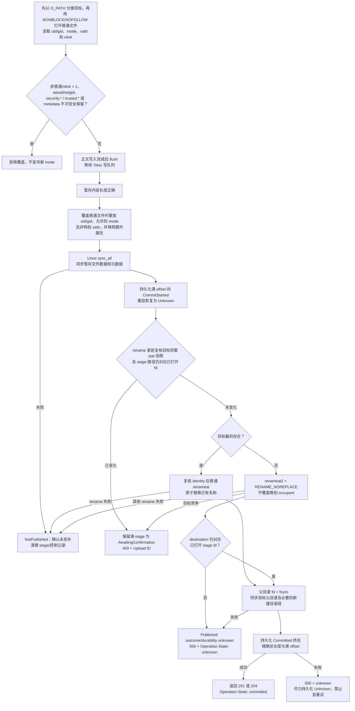

覆盖普通单链接文件时，服务在写正文前先以 `O_PATH|O_NOFOLLOW` 打开目标并用 `fstat` 分类；FIFO、Unix socket、设备、目录等非普通目标因此无需数据打开就会被拒绝。只有普通文件才以 `O_NONBLOCK|O_NOFOLLOW` 重新打开，并核对两次 `fstat` 的 dev/inode 后读取 numeric uid/gid、`mode & 07777` 和扩展属性；非阻塞标志和身份复核分别避免等待特殊文件对端以及检查/打开竞态。

setuid 或 setgid 位会使覆盖被拒绝，而不是复制到由上传内容形成的新 inode。任何 `security.*` 或 `trusted.*` 属性也拒绝覆盖，包括 capability、SELinux、IMA/EVM 和 overlay 元数据；`user.*`、`system.posix_acl_access` 等非特权属性才会被精确重放。xattr 名称列表限制为 64 KiB、条目数限制为 1024、单值限制为 64 KiB；服务先以零长度查询取得每个值的精确长度，再只分配所需缓冲，索引容量、带 NUL 的名称和全部值合计限制为 1 MiB，因此大量空值或短值不会各自占用 64 KiB。读取、删除 stage 多余属性或重放失败均失败关闭。若业务必须保留被拒绝的特权 metadata，应由受控、具备相应权限和策略知识的运维流程处理，而不是通过普通浏览器上传。

写正文前的初始目标 metadata/xattr 读取若失败，会在 stage 准备或修改之前拒绝本次覆盖，不发布替换文件；已有 PATCH 检查点保持原状。正文写入完成后先执行 Tokio `flush` 并确认最终长度；最后一个可取消 deadline 边界通过后，普通文件覆盖流程以 fd-relative `fchown`/`fchmod` 恢复属主和允许的模式，再移除暂存 inode 因父目录策略继承、但旧目标不存在的额外 xattr，最后精确重放允许集合并执行 `sync_all`。进入 metadata 重放后，stage 可能已恢复成只读 mode，因此 metadata 重放、文件同步或普通 rename 系统错误等确定的非条件失败按“确认未发布”处理，清理旧会话并尽力持久化 `Rejected`；不会保存一个后续 PATCH 无法重新写开的伪检查点。最终 source/target identity 或 no-replace 条件冲突则不走这条清理路径，而是按下一段保留满 stage。已知策略、格式或权限冲突返回 `409`，其余基础设施或清理 I/O 故障保留为安全 `5xx`。

文件同步成功后，服务先持久化满 offset 的 `CommitStarted` 状态，再由 checked replace 在 rename 紧前从根 fd 以 nofollow 方式取得目标 metadata，并与初始快照逐项比较 dev/inode、文件类型、nlink、size、uid/gid、完整 `st_mode` 以及纳秒级 mtime/ctime；若原目标是可替换符号链接，则要求该链接本身快照保持不变。它也比较 stage 路径与持续打开 fd，并要求 stage 是单链接普通文件。最终 source/target identity 变化会确认尚未发布、保留完整 stage 并持久化为 `AwaitingConfirmation`；该状态持久化失败，或持久化成功后读取当前目标身份、构造冲突响应失败时，当前请求都会保守报告 unknown，后一种情况下持久记录仍保持 `AwaitingConfirmation`。最初目标不存在时使用 `RENAME_NOREPLACE`；晚到 occupant 不会被覆盖，而是同样保留 stage 等待确认。rename 成功后还要比较 destination 与持续打开的 stage fd，比较失败按发布身份未知处理。最初目标存在时，快照匹配后使用普通 rename；最后一次 `statat` 与 `renameat` 是相邻系统调用，因此复核会收窄但不能消除受信任外部写者制造的新竞争窗口。

如果现有普通目标的 `nlink > 1`，请求返回冲突并拒绝覆盖。原子替换只能让一个目录项指向新 inode，无法同时保持其他硬链接名称的 inode 身份；拒绝比悄悄让不同硬链接看到不同内容更安全。新建目标没有旧元数据可继承，由 Dufs 服务账号创建并使 stage 与最终文件的 permission bits 保持 `0600`；原子替换符号链接时也没有普通目标 metadata 可重放，最终普通文件同样保持 `0600`。若需要给其他本地账号授予读取权限，应在受控运维流程中显式修改，不在未完成上传期间放宽。

原子性和持久性是两个不同目标：

- 同一文件系统内从私有 stage 子目录 rename 到目标父目录，让读者只看到旧文件或完整新文件；
- `flush` 只保证 Tokio 的待处理写入完成，不等于物理落盘；
- Linux `sync_all` 要求操作系统把暂存文件数据和元数据同步到存储；
- Linux 同文件系统 `rename` 原子发布最终文件；
- rename 后对父目录执行 `fsync`，使新的目录项在崩溃恢复后可找回。

成功响应表示元数据重放、暂存文件同步、最终 rename、目标父目录 `fsync` 和 `Committed` 终态持久化均已成功，而不是无条件的绝对物理保证。确定发生在发布前的文件同步失败，或条件复核过程自身的 I/O/系统错误等确定非条件失败，是 `NotPublished`，可以清理会话并记录 `Rejected`；复核发现 source/target identity 不匹配或 no-replace 竞争则不属于 `NotPublished`，而是保留完整 stage 并持久化为 `AwaitingConfirmation`。missing-target rename 成功后若目的名称无法再证明对应已打开 stage，则归为 published identity unknown，不能清理成“未发布”。rename 已成功而父目录同步失败是 `PublishedDurabilityUnknown`，服务尽力把已有 `CommitStarted` 改为 `Unknown`。父目录已经同步但 `Committed` 终态写入失败同样向客户端报告 unknown；即使显式 `Unknown` 写入也失败，原 `CommitStarted` 仍在下次文件型数据库启动时恢复为 `Unknown`，避免将同一 ID 误判为可从零重传。Linux 文件系统、网络存储、磁盘控制器和固件仍必须正确兑现同步命令；介质损坏、后续位腐败仍需可靠存储、校验和与备份处理。

这一提交序列通过 `StorageDurability` 边界注入：生产实现执行文件 `sync_all`、根 fd 内 rename 和父目录同步；边界返回 `Published`、`Rejected`、`NotPublished` 或 `PublishedDurabilityUnknown`，终态记录由上传协议层在它前后持久化。单元测试分别注入文件同步失败、rename 前/rename 失败、发布后父目录同步失败及终态写入失败，验证各分支不会误报可重试性。下载端从根 fd 打开一次文件，并从同一句柄取得 metadata 和正文；覆盖期间已经打开的响应继续读取旧 inode，新请求读取新 inode，不再混合 `Content-Length`、ETag 和正文。

上传 task 从开始处理起就持有请求体和上传路径锁，取得 active stage 租约或建立会话后也负责相应收尾；但在原子 mutation boundary 之前，它只允许执行不会改动共享根或上传状态的准备工作。服务端总 deadline 先关闭该边界时会 abort task，不能把这个分支写成“后台稍后仍可能开始上传”。浏览器断开或网关取消 HTTP waiter 本身没有同样的服务端 deadline 判定能力，已分发 task 仍可能继续；一旦 task 已跨 mutation boundary，外层 deadline/未处理错误也只报告 unknown，由 task 处理正文结束、I/O 错误、检查点或清理，底层阻塞文件操作不会脱离路径租约运行。停机的 30 秒宽限结束时，force token 会中断正文接收；服务最多再给受跟踪收尾 10 秒。最终 rename 与目录 `fsync` 不会被普通取消拆开，但约 40 秒的应用硬截止、第二次停止信号或 SIGKILL 都会强制终止，因此这些边界不能保证卡住提交已经落盘。

## 10. 新建、行内命名与删除

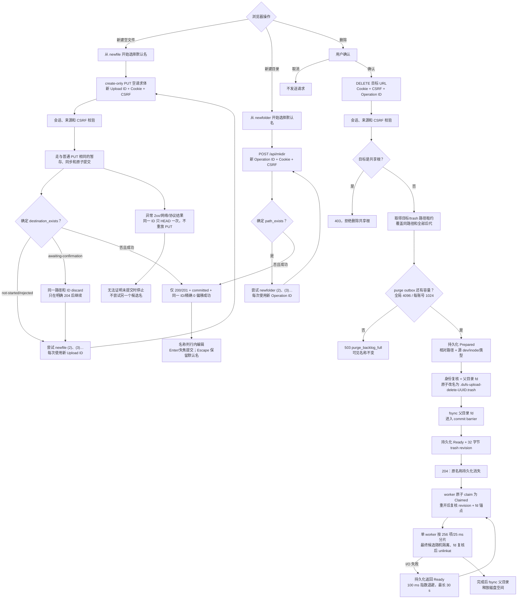

删除路由在文件类型判断前使用与内部浏览器 API 共用的根目录守卫；即使认证和 CSRF 均有效，只要目标等于规范化的 `serve_path` 就返回 `403`。域名根路径、编码等价路径和越界符号链接均有回归测试。

普通子对象删除要求 `If-Match` 携带当前列表 revision；服务在创建 purge intent 前验证 token 的 owner、规范路径和完整 identity，并在紧邻 rename 时再次复核。随后先在 state store 中写入 `Prepared` purge job，再在同一父目录内把同一对象原子移动到 `.dufs-upload-delete-<UUID>.trash`。父目录同步成功后，包含完整 trash identity 的 32 字节 revision 与 `Ready` 才原子持久化并返回 `204`。因此文件或整个目录树会一次从原业务名称下消失；目标路径租约覆盖其后代，子树上传、move、mkdir 或另一个 delete 必须等待可见删除提交完成。outbox 全局最多 4096 项、每账号最多 1024 项，满载在 rename 前返回 `503`，不先消费可见目标。

返回 `204` 后的递归清理只负责释放隐藏暂存项占用的空间，不改变已经提交的可见删除结果。worker 原子 claim 到期 `Ready` job，按 committed revision 和 fd 锚点重开 trash；普通 I/O 失败持久化回 `Ready` 并退避，不因固定次数丢弃。状态转换瞬时失败时会有界保留并回读确认本地 claim，重启则把遗留 `Claimed` 恢复为 `Ready`。`Prepared` 恢复不再推断 rename：保留 target、quarantine 任意 trash occupant、释放 intent。Ready/Claimed 缺失 revision 或出现身份歧义时也 quarantine/release。小时级维护扫描只回收未记账 orphan trash。

目录回收不调用同步 `remove_dir_all`，也不通过 `/proc/self/fd` 还原绝对路径。worker 的深度优先栈只保留根内相对目录路径和各层 `readdir` cursor；每片最多处理 256 项或 25 ms，从 trash 父目录 fd 逐级以 `openat2(..., RESOLVE_NO_XDEV)` 打开当前工作目录。每个最终删除候选先以 `RENAME_NOREPLACE` 移入随机 quarantine/disposal 名，再比较该名称与持续 fd 锚点的完整 identity，匹配后才 `unlinkat`；异常时整棵根保留为 quarantine。嵌套文件系统或 bind mount 是管理边界，worker 不进入其中；普通边界 I/O 故障使 job 回到 `Ready` 并退避，管理员卸载后可继续。未完成的健康 job 在进程内轮转；attempt 持久化递增并从 100 ms 开始指数退避至最长 30 秒，其他 ready job 可越过它。进程内 cursor 不写 SQLite，重启从带 committed revision 的 trash 根重新遍历；最终 `ENOTEMPTY/EXIST` 是身份安全异常，不从 cursor 0 重扫。该机制不提供列出、恢复或撤销接口；大目录 DELETE 的 `204` 也不表示全部块已经释放。同 UID 的恶意 inotify 竞争仍须靠更强身份/目录隔离排除。

## 11. 浏览器操作树

```text
现代桌面浏览器加载目录页
├─ 无有效会话：303 到英文登录页
│  └─ POST `/api/v2/auth/login` JSON → Foundation 同源 + Argon2id → Set-Cookie + session JSON
├─ 携带 __Host-sarmg-dufs-ram-session Cookie
├─ 解码 IndexData → JSON.parse 为 unknown → parseIndexData 严格校验并冻结
├─ 分页 list API → 每页最多 500 项 → DocumentFragment 批量渲染
├─ 使用编译期内置 ES modules/CSS/图标
├─ 显示当前管理员 username 与 Foundation POST logout 入口
└─ 用户操作
   ├─ 进入目录：GET /目录/
   ├─ 搜索：GET ?q=关键词
   ├─ 下载文件：Cookie 直接 GET，可选单段 Range
   ├─ 上传：文件/文件夹选择器 → 当前页内存队列 → Cookie + CSRF + PUT + Upload ID/Length
   │  ├─ 当前页失败重试：Cookie + HEAD 查询持久化 offset → Cookie + CSRF + PATCH + Upload ID/Length/Offset
   │  ├─ 正文完成后显示 Submitting；提交结果未知时要求刷新核对且不允许盲目重试
   │  ├─ 带 csrf 标记的 403：暂停整个队列并禁止继续发请求
   │  └─ 页面刷新或重新登录：不恢复旧 ID；重新选择会创建全新 PUT
   ├─ 新建空文件：立即以 newfile / newfile (N) 发 create-only 空 PUT；每个候选使用新 Upload ID/Length=0；成功后行内改名
   ├─ 新建目录：立即以 newfolder / newfolder (N) 发带新 Operation ID 的 JSON POST /__dufs__/api/mkdir；成功后行内改名
   ├─ 重命名：在原名称位置编辑；Cookie + CSRF + Operation ID + 同源 JSON POST /__dufs__/api/rename，只提交新名称
   ├─ 移动：Cookie + CSRF + Operation ID + 同源 JSON POST /__dufs__/api/move，只提交目标目录
   ├─ 删除：Cookie + CSRF + Operation ID + DELETE → 持久 Prepared → checked rename/fsync → Ready + 204 → worker 释放空间
   │  └─ mutation 传输结果未知：只查询一次当前账号 operation 状态，绝不自动重放
   └─ 退出：Cookie + X-CSRF-Token + POST /api/v2/auth/logout，服务端撤销会话
```

## 12. 响应、日志与停止

### 12.1 响应和日志

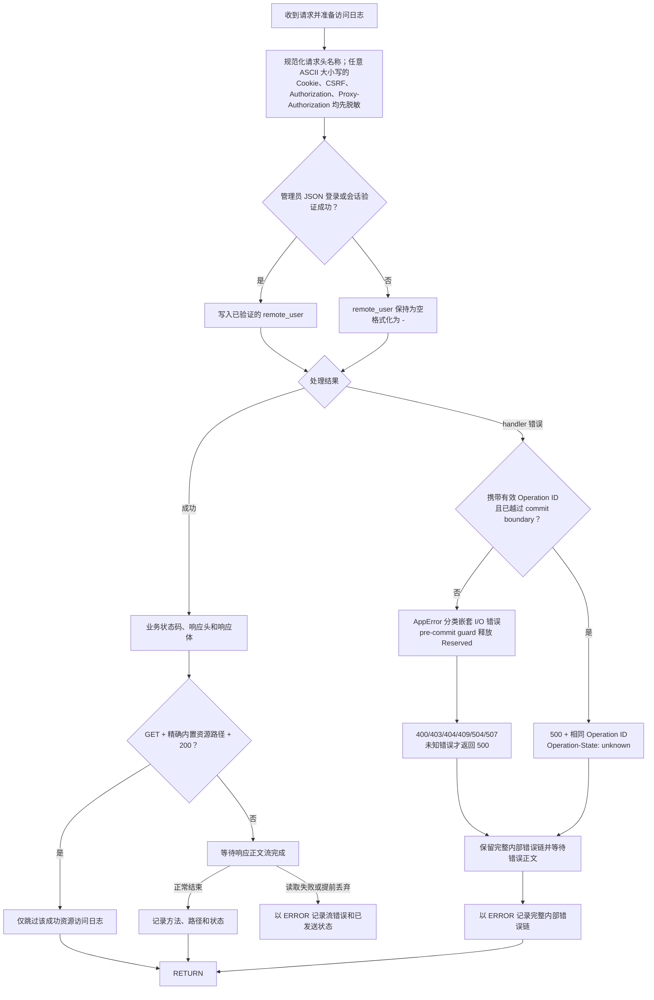

目录列表/搜索 API、浏览器写 API、operation 错误结果与上传错误通过 `server/problem.rs` 的单一渲染边界输出 `application/problem+json`。公开体遵循 RFC 9457 的 `type`/`title`/`status`/`detail` 并保留稳定 `code`，不输出重复的 `message`；`type` 为 `urn:dufs:problem:<code>`，实际 HTTP 状态与响应头始终比体内副本更权威。运行期的路径、底层 I/O 错误和 error chain 仅记录到内部日志。

`recovery` 扩展只有 `retry`、`retry_with_new_id`、`resume_upload`、`query_job`、`query_upload` 和 `refresh_target`；没有该字段就表示服务端没有宣告安全的恢复步骤。`RetryAfterSeconds` 同时输出 `recovery: "retry"`、整数秒 `retry_after` 和 `Retry-After` 响应头。这些建议不会把 `unknown` 变成可重放：未知 operation 只能通过原 ID 查询 job，未知上传只能 HEAD 核对或刷新目标。

operation 错误体可附加平铺的 `operation_id`/`state`/`http_status`，但客户端以 `X-Dufs-Operation-Id` 和 `X-Dufs-Operation-State` 为权威值。上传错误体可附加平铺的 `upload_id`/`upload_state`/`upload_length`/`upload_offset`，但客户端以 `X-Dufs-Upload-Id`、`X-Dufs-Operation-State`、`X-Dufs-Upload-Length` 和 `X-Dufs-Upload-Offset` 为权威值；只有严格绑定的 `409`、精确 upload 状态/长度/偏移和合法 `X-Dufs-Target-Revision`/`X-Dufs-Target-Replaceable` 才能触发覆盖选择。前端不解析旧 `message`、纯文本、vendor JSON 或嵌套/驼峰扩展。详细字段和恢复枚举见 [README 的统一错误反馈](../README.md#统一错误反馈)。

Problem Details 只表示 Dufs 业务 API 失败，不改变成功资源表示；认证/CSRF 失败始终使用 Foundation ErrorEnvelope。客户端按 HTTP 状态和经过共享合同验证的 auth.session_required/auth.csrf_rejected 分类，不使用私有认证响应头。HEAD 不发送正文，204 不增加 JSON。

页面资源与文件接口只按同源方式工作，不生成 `Access-Control-Allow-*` 响应头。只有管理员 JSON 密码校验成功或会话验证成功的请求才把已验证 canonical username 写入 `remote_user`，认证失败或未认证请求在日志中显示 `-`。自定义 `$http_...` 变量中位于固定 `$http_` 前缀后的请求头名称会先统一为 ASCII 小写，再把下划线转换为连字符；因此 Authorization、Proxy-Authorization、Cookie 和 CSRF 的名称部分使用全小写、全大写或混合大小写时都会输出 `[REDACTED]`，普通请求头仍按 HTTP 的大小写不敏感语义记录。

没有有效普通写 Operation ID 的 handler 错误会在统一出口检查完整 error chain 中的 I/O 原因：`NotFound`/`NotADirectory` 映射 `404`，权限映射 `403`，已存在映射 `409`，无效输入映射 `400`，超时映射 `504`，空间或 quota 不足映射 `507`，其余无法安全分类的错误才映射 `500`。响应只包含稳定的公开描述，路径、内核错误和上下文保留在诊断日志；因此普通读取等路径上的 metadata 或最终打开错误不会再一律伪装成“文件不存在”。

携带有效 Operation ID 的 mkdir、move、rename 或 DELETE 只有在已调用 `mark_commit_started` 后让未分类错误传播，才保守返回相同 ID 和 `unknown`；此时 guard 也终结为 `unknown/outcome_uncertain`。仍为 `Reserved` 时的异常丢弃会移除记录，使 pre-commit 取消可以安全重试；handler 内已经明确判定的参数、权限、目标不存在或冲突则完成为稳定的 `4xx` 与 `failed`。这一区分避免把尚未触碰文件系统的取消错误地永久记成“可能已提交”。

访问日志只跳过同时满足三个条件的请求：方法是 `GET`、规范化后的路径精确匹配已知内置 JavaScript/CSS/图标、响应状态是 `200`。内置资源的 `HEAD`、未知资源、资源错误，以及页面、健康检查、登录、下载和 API 请求仍照常记录；处理器返回的内部错误也始终记录。访问日志在响应正文流正常结束、返回读取错误或被提前丢弃时才写出；后两种情况使用 ERROR 级别并保留已经发送的实际 HTTP 状态。socket 写入可能发生在正文生产端已经正常结束之后，无法由访问日志正文包装器证明已送达，仍由独立连接错误记录按错误类型和 TCP peer 地址补充诊断。

HTTP 访问日志从动态字段拼接阶段就使用 16 KiB 有界构造器，重复变量不会先形成巨型临时字符串；请求线程只把已经转义为单个物理行、再次经过 16 KiB 入队硬上限的日志放入容量 4096 的有界 channel，不直接写终端或文件。超长 UTF-8 文本会在字符边界截断并只带一个固定标记；自定义日志格式最多 4096 字节和 128 个解析元素，超限配置会阻止启动。未配置日志文件时，INFO/WARN/ERROR 和访问日志共用 stderr 这一条控制台 sink，stdout 仅在启动后输出监听地址；这样单 writer 不会因为先写或刷新 stdout 而阻止错误日志到达 stderr。`--log-file` 使用 `O_NOFOLLOW|O_APPEND|O_NONBLOCK|O_CLOEXEC` 打开，只接受当前服务用户拥有、仅有一个硬链接的普通文件；新文件原子创建并固定为 `0600`，已有文件必须预先就是精确 `0600`，不安全权限保持不变并阻止启动，避免 chmod 无法撤销的既往泄露或预开 fd 写权限。符号链接、异常文件类型、属主不匹配和多硬链接对象同样都会阻止启动。独立写线程批量写入并每 250 ms 刷新；刷新失败保留 dirty 状态，由下个周期或显式 flush 重试，回退诊断 sink 失败也不会 panic writer。队列满时丢弃最新记录，运行中至多每秒输出一次聚合 `dropped_newest` 告警，显式 flush 和退出仍提交累计数。退出边界调用已有日志刷新队列并最多等待 5 秒，不依赖 Tokio blocking pool；Foundation 内的第二、第三信号只控制尚未结束的停机阶段。请求 URI、请求头、用户名、连接错误和 handler 错误都经过控制字符转义，认证、Cookie 与 CSRF 头继续脱敏。

### 12.2 分阶段优雅停止流程

关闭次序由 Foundation 的有限阶段实现：`Running → Quiescing → DrainingRequests → DrainingCommits → ClosingState → Stopped`。宽限耗尽会先进入 `CancellingOrdinaryWork`；无法完成则返回非成功报告，不越过提交义务关闭状态。

Linux 上首次收到 SIGINT 或 SIGTERM 时，Foundation 进入 Quiescing、立即 ready=false、关闭业务准入并通知已有 HTTP/1 连接 graceful shutdown。已有请求和平台探针仍能登记安全收尾工作；二者必须与连接一起排空，才能关闭普通任务登记入口，再排空提交并关闭 StateStore。晚到嵌入式调用立即返回带日志上下文的 `503 server_stopping`。

30 秒正常宽限后进入最多 10 秒的取消与收尾窗。第二次信号可提前进入取消阶段，第三次信号或硬期限使未完成关闭返回失败；不保留产品自己的第二套信号引擎。运行中的阻塞工作仍持有许可、租约和状态所有者，不能通过 abort 等待者伪造完成。可执行程序记录未完成计数后非零退出，状态所有者保留到进程边界；日志使用已有最多 5 秒的有界刷新。release 仍为 panic=abort，无法依赖 catch_unwind 隔离故障，必须通过真实进程异常退出验证当前状态恢复。

通过 systemd 运行时，`TimeoutStopSec` 应大于应用约 40 秒的硬截止并留出服务管理器余量；仓库基线使用 120 秒。调大 systemd 超时不会延长 Dufs 内建的 30 + 10 秒窗口，慢盘或网络存储必须通过监控、容量规划和停机演练保证常见提交能在窗口内完成。

## 13. 代码阅读与测试顺序

`src/server.rs` 是服务端共享状态和模块协调入口，但不再把所有依赖放在一个扁平结构中：`ContentServices`、`DurableStateServices`、`AdmissionControl` 与 `ServerLifecycle` 分别拥有内容/路径访问、SQLite 控制面、容量与公平准入、停机及任务收束。请求分类/分发、路径身份/策略、公开 wire protocol、SQLite actor/database/model 与 operation/upload/purge 仓储、内置资源、删除回收、列表快照与遍历、上传协议/记录/维护均在对应子模块中实现；各大模块的内联单元测试也已移入同一隐私边界下的 `tests.rs`。此次结构拆分不改变本章前述 HTTP 路径、方法、状态码、响应头或持久化协议，也没有引入新的第三方依赖。

```mermaid
flowchart TD
    T["0. build.rs / rust-toolchain.toml / Cargo.toml<br/>Linux AMD64 GNU、Rust 1.98.0、2024 edition 和编译基线"] --> A["1. main.rs<br/>HTTP/TCP、连接预算和 Linux 信号停止"]
    A --> B["2. args.rs<br/>账号、IP 地址和运行配置"]
    B --> C["3. auth.rs<br/>Argon2id 账号、会话摘要和 CSRF"]
    C --> D["4. server.rs + server/{identity,path_policy,protocol,problem}.rs<br/>内容/状态/准入/生命周期组合，身份与公开协议"]
    D --> R["5. server/router.rs + router/{request,routes,files}.rs + assets.rs<br/>一次请求分类、生命周期/超时策略、端点分发与资源摘要"]
    R --> G["6. Foundation Admin Axum + administrator_web.rs<br/>登录限流、Cookie、注销与写请求同源防护"]
    G --> OP["7. server/operation_registry.rs + state_store/{actor,database,model,operation,upload,purge}.rs<br/>当前 schema 分域仓储、统一 metadata/指纹、live 探针与恢复"]
    OP --> H["8. server/browser_api.rs<br/>mkdir/move/rename 与 upload preflight/discard JSON API"]
    H --> E["9. server/path_coordinator.rs<br/>同路径与祖先/后代写租约"]
    E --> F["10. server/rooted_fs.rs + rooted_fs/{purge,tests}.rs<br/>根 flock、openat2、父 fd、*at、分片递归删除及单元测试"]
    F --> P["11. server/delete.rs + purge.rs<br/>DELETE 提交、durable outbox、reconciliation、claim 与退避"]
    P --> DS["12. server/disk_space.rs<br/>按 st_dev 异步计算上传空间"]
    DS --> I["13. server/listing.rs + listing/{snapshot,walk,tests}.rs<br/>目录/搜索、进程级快照/游标、有界遍历与测试"]
    I --> J["14. server/download.rs<br/>单句柄附件、弱 ETag 和单段 Range"]
    J --> K["15. server/{internal_names,maintenance}.rs + upload.rs + upload/{prepare,target,transfer,commit,failure,protocol,record,tests}.rs<br/>内部名称、维护、目标 inspection 与上传各阶段"]
    K --> L["16. server/storage.rs<br/>可注入的 sync/rename/父目录同步边界"]
    L --> M["17. clients/web/login.html / modules/ 下全部 .js<br/>登录、响应缓冲、分页、operation 协议和上传状态机"]
    M --> N["18. Rust 集成测试<br/>协议、根替换、遍历复核、故障注入、上传与删除"]
    N --> O["19. Playwright<br/>HTTPS 网关下隔离的 Chromium + Firefox 流程"]
```

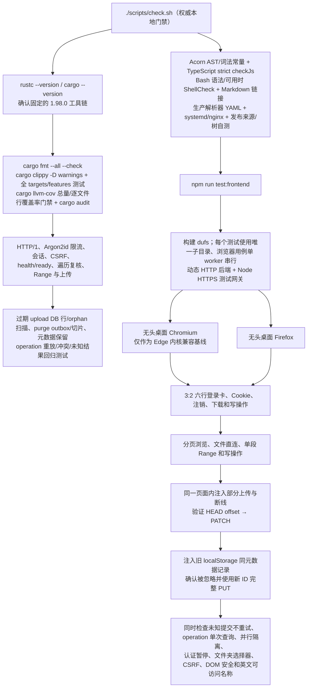

`build.rs` 在 Cargo 构建脚本阶段同时要求目标架构 `x86_64`、操作系统 `linux`、环境 `gnu` 和 64 位指针；只有精确 `x86_64-unknown-linux-gnu` 进入应用编译。它还把构建所对应的 Git SHA 写入 `dufs --version`；正式发布脚本显式传入完整 commit SHA，普通源码目录构建则读取当前仓库引用，无法确定时显示 `unknown`。`rust-toolchain.toml` 让 rustup 在仓库目录中自动选择 Rust/rustc/Cargo 1.98.0，并提供 Clippy 与 Rustfmt；`Cargo.toml` 用 `edition = "2024"` 和 `rust-version = "1.98"` 声明源码 edition 与最低 Rust 版本。项目不提供内置 TLS，唯一 Rust 服务端构建与网关后的 HTTP 后端部署一致。

JavaScript 安全门固定使用 Acorn 8.17.0 解析 AST，并建立有界词法常量模型，识别字符串拼接、模板、数组 `join`、别名、反射和动态全局属性访问；任何 computed 解构在变量声明、赋值表达式及默认参数（包括嵌套和 const alias）中无法静态求值时都失败关闭，内置负例还覆盖运行时把 `globalThis` 传给参数的跨过程旁路。TypeScript 5.8.3 另以 `allowJs + checkJs + strict + noEmit` 检查 `clients/web/index.js`、`clients/web/login.js` 和全部生产模块；外部/解析输入保持为 `unknown` 并经类型守卫收窄，生产源码不保留显式或隐式 `any`。这无需迁移 `.ts`，但也不等价于 ESLint 或完整跨过程污点证明。六个 Bash 源总是先过 `bash -n`；本地存在 ShellCheck 时运行 warning 门，缺失时明确跳过且不联网，远程 CI 则固定安装并强制使用 0.11.0。部署门禁除 `systemd-analyze verify`、`nginx -t` 外，还会从包含空格、`&`、`#` 与反斜杠的真实 checkout fixture 读取部署文件；执行 `nginx -t` 前，生产 upstream 与全部 IPv4/IPv6 `80/443` 监听会一一改写为私有 Unix socket，并核对替换数量且拒绝任何网络监听残留，因此非 root runner 无需占用生产端口。随后检查启动隔离 nginx 与 mock upstream，分别验证规范重定向、未知 SNI、合法 SNI 下未知 Host、固定回源头、伪造入站 XFF 被 `$remote_addr` 覆盖、登录别名正文上限，以及连接/请求限制产生 `429` 后恢复 `200`。

远程反馈由 `.github/workflows/read-only-ci.yml` 分层执行：静态层运行 Bash/ShellCheck、Acorn、TypeScript 和文档门，Rust 层运行 Rustfmt、Clippy 与全 targets/features 测试，浏览器层分别运行 Chromium 和 Firefox；质量层另跑覆盖率、部署行为、release self-test 与 release binary smoke。质量层的四项检查使用各自的明确前置条件；除运行被取消或自身前置失败外，一项检查失败不会跳过其他独立项，单次运行可同时报告更多真实根因而不制造缺少工具的级联错误。`.github/workflows/dependency-audit.yml` 在依赖清单变更及每周计划任务上运行 RustSec/npm audit，并把 yanked crate 作为失败；`.github/workflows/performance.yml` 每周用 release 构建扫描十万真实目录项并对首屏 30 秒宽松基线失败关闭；`.github/workflows/formal-release-e2e.yml` 在 tag、每周及人工触发时用临时 Ed25519 密钥真实执行完整正式包入口并独立复核输出，但不上传制品。这些工作流只有 `contents: read`，checkout 不保留凭据，Action 固定完整 commit SHA；所有 Node 任务只接受 26.7.0，仓库的两个权威入口也会在运行时精确验证 `.node-version` 与 `node --version`，从而在审计、构建和依赖执行前拒绝错误工具链。Rust 1.98.0、ShellCheck 0.11.0 及下载工具归档摘要也均固定。静态、Rust、浏览器、依赖审计、性能和 release binary 继续使用托管 `ubuntu-24.04`；需要 nginx 1.25.1+ 的质量 job 与正式包 E2E 使用 x64 `ubuntu-26.04`。GitHub 当前把 26.04 标为 preview，调度或镜像回归必须阻断门禁而不能触发旧语法 fallback。各 job 都把实际 `ImageVersion` 和工具版本写入日志。这些矩阵不接触生产签名密钥，也不创建或修改远端 tag/GitHub Release；正式包 E2E 只在隔离 clone 中创建临时本地 tag，且不能替代发布者对最终远端 tag 的批准。

正式发布脚本只接受干净且由匹配 Cargo 版本的 tag 精确指向的 HEAD。它先从摘要锁定 bare façade 生成并验证目标 commit archive，在没有 `.git` 的私有副本中用 `env -i`、固定 PATH/工具链和独立 HOME、Cargo home/target、npm cache、XDG/tmp 强制运行完整检查。Cargo 依赖先 vendor 后 offline；npm 播种器只从 lockfile 的 HTTPS URL 与 SHA-512 integrity 接受宿主 cache 内容并重新散列，随后 prefer-offline，缺失包与 npm audit 仍可能联网。宿主 RustSec DB 只有在 canonical origin、`HEAD=FETCH_HEAD`、实体 FETCH_HEAD 不得比当前时间早超过 7 天或晚超过 300 秒，并通过物理/Git/内容封存检查时才可复用；alternates、不安全元数据、symlink/submodule/特殊项、untracked 路径以及 tracked 内容/mode 漂移均拒绝。合格数据库以无硬链接私有 clone 封存 revision、fetch epoch、index/config 校验和；不合格、过期或缺失时，在任何项目或依赖代码前用 dummy lockfile 在私有数据库联网刷新。发布入口先执行 `cargo audit --db ... --no-fetch --no-yanked` sealed pre-audit；随后在私有 Cargo home 以 `cargo fetch --locked` 填充完整锁图所需的 crates.io 索引项，再用同一封存运行 `--deny yanked`，避免 cargo-audit 在空索引上只打印“无法检查”却返回成功。完整 `scripts/check.sh` 必须通过 `DUFS_QUALITY_AUDIT_DB` 使用同一封存，并在其他项目/依赖步骤前先审计。封存时校验 seal 与新鲜度，pre-audit 和 yanked 检查后重验 seal；完整门禁后重验 seal 与新鲜度，随后销毁质量树和该 RustSec 数据库。该私有 Cargo home 每次全新创建，因此正式打包当前要求 registry 网络可达；宿主缓存不能替代锁图索引项抓取，缺失或抓取失败即失败关闭。门禁后用独立 snapshot index 复验 tracked 内容/mode 和非忽略新增路径，再从 commit fresh extract 进行签名构建。检查后、签名前和发布前继续反复确认 exact source。source revision 只接受完整 40 或 64 位小写十六进制 object ID；签名 key 只允许 Ed25519、Ed448、RSA ≥3072 bit 或 `prime256v1`/`secp384r1`/`secp521r1` ECDSA，弱/未知/非签名算法在产生可发布签名前失败关闭，所有关键 Shell 子命令显式传播失败而不依赖 `errexit` 上下文。

源预检、隔离快照和全部解包树拒绝 symlink、submodule 与特殊文件；构建/打包 archive 复核 commit、tree、mode、额外路径与 SHA-256。SBOM、项目 Apache-2.0 许可证、第三方许可证清单、Rust 标准库 notice 和构建环境清单全部进入包内 checksum。

自动 CI、部署样例和正式制品验收以 `x86_64-unknown-linux-gnu` 为基线。版本 tag 工作流只在同一 tag/SHA 的全部质量门成功后运行；构建阶段无写权限，最小写权限阶段发布绑定当前版本和源码提交的确定性说明，并回下载核验远端便捷二进制与 SHA-256。

Playwright 为隔离浏览器测试而使用的端口、证书和密钥环境变量只由 Node 测试进程读取；每个测试在测试共享根下创建随机唯一子目录。Node 测试网关只呈现一个客户端地址，并在启动 Dufs 时显式信任 `127.0.0.1/32`，因此浏览器用例固定为单 worker 串行执行，避免无关用例的登录并发争抢生产全局/来源令牌桶；失败时仍进行一次诊断重试。配置同时启用 `failOnFlakyTests: true`，所以首轮失败、重试通过仍会使质量门失败，重试只用于保留诊断 trace。覆盖多次 Argon2 登录、注销和 Cookie 重放的复合认证场景单独标记为 slow test，扩展的只是该 Playwright 场景总预算，不改变登录正文、计算 admission 或其他产品 deadline。Node 在外部测试端口提供 HTTPS，并把请求代理到 Dufs 动态回环 HTTP 端口。仓库中的固定测试私钥是公开的 localhost 测试材料，绝不能部署为生产网关密钥。Dufs 二进制仍只通过显式命令行参数启动，因此这些变量不属于生产配置入口。

`src/server/maintenance.rs` 的 claim 单测验证 maintenance marker 保持清理排他性但不会跨文件系统 I/O 持有 registry mutex；`src/server/upload/tests.rs` 还验证等待 marker 同时遵守上传 deadline 和 force-shutdown。维护集成测试继续覆盖过期 session/trash 删除、活跃项跳过以及符号链接别名映射，确认实现没有在扫描开始时复制一份可能过期的 active 快照。

阅读代码时重点确认：

1. 页面动作发送的是普通文件方法还是 JSON POST 内部 API；
2. 受保护请求是否先通过会话验证，以及所有受保护的 `POST`、`PUT`、`PATCH`、`DELETE` 是否统一校验会话专属 CSRF 和来源；
3. 逻辑路径如何限制在共享根目录内；
4. 上传的 stage、state、持久化 offset 和最终目标分别在何时变化；
5. 成功状态码是在文件和目录同步之前还是之后返回；
6. 对应行为是否有 Rust 集成测试和桌面浏览器测试覆盖。
